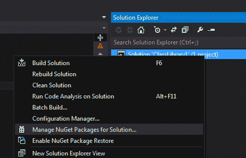
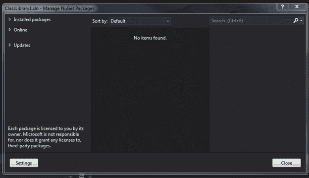
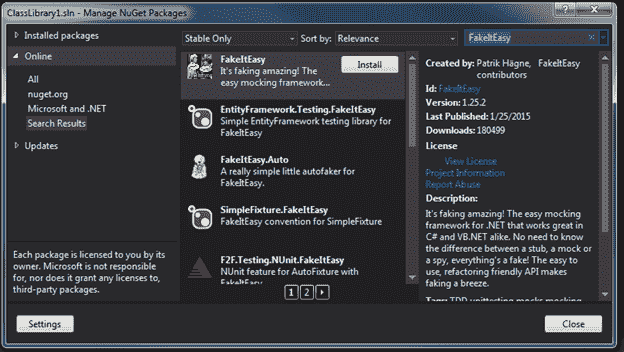
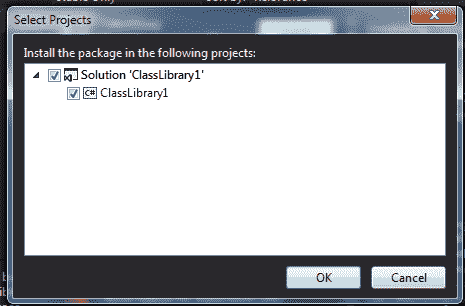
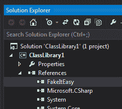
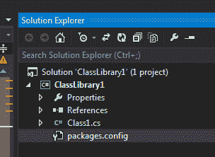
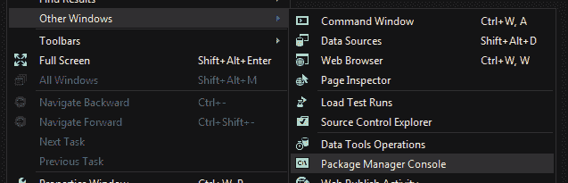
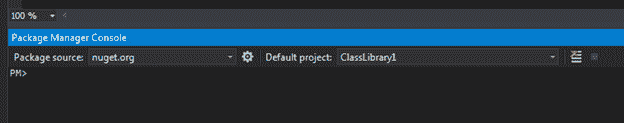
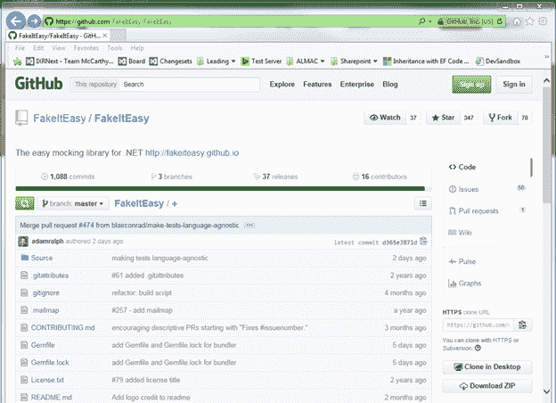

# 第 1 章安装 FakeItEasy

## 简介

FakeItEasy 不需要安装任何机器的软件;你只需要添加适当的程序集作为项目的参考，你就可以了。

您可以通过两种方式获得这些程序集：

*   NuGet 包，使用 Solution 的 Manage NuGet Packages 安装
*   NuGet 包，使用包管理器控制台（首选）

在本书中，我们将使用 FakeItEasy 版本 1.25.2，NUnit 版本 2.6.4，ReSharper 版本 8.2（用于在 Visual Studio 中运行 NUnit 测试），.NET 4.5 和 Visual Studio 2013。

虽然在 Visual Studio 中运行 NUnit 单元测试不需要 ReSharper，但它是执行此工作的最强大工具。你可以在这里获得 ReSharper [的 30 天免费试用版。](http://www.jetbrains.com/resharper/download/)

## 使用解决方案中的管理 NuGet 包安装 FakeItEasy 和 NUnit

对于那些喜欢使用 GUI 的人来说，这是在 Visual Studio 项目中获取 FakeItEasy 和 NUnit 包的最简单方法。从 Visual Studio 中的 New Project 开始，为项目类型选择“Class Library”。

|  | 注意：使用 Solution 中的 Manage NuGet Packages 安装软件包不允许您选择正在安装的 FakeItEasy 或 NUnit 的版本。从 Solution 管理 NuGet 包将始终采用最新版本的软件包。如果解决方案中安装的管理 NuGet 包与本书中指出的版本号之间的版本号差异很大，请稍后跳到使用包管理器控制台安装 FakeItEasy 和 NUnit 部分。 |

准备好新解决方案后，右键单击解决方案资源管理器中的解决方案，然后选择**管理解决方案的 NuGet 包**。

图 1：管理解决方案的 NuGet 包

您将看到 Manage NuGet Packages 窗口。

图 2：管理 NuGetPackages 窗口

如果尚未打开，请单击左侧的**在线**菜单项，然后在**在线搜索**文本框中输入 **FakeItEasy** 。窗口。您应该看到 FakeItEasy 首先出现在列表中;单击**安装**以安装软件包。

图 3：在线搜索 FakeItEasy

您将看到“所选项目”窗口，其中显示您要在其中安装 FakeItEasy 的解决方案中的项目。单击**确定**。

图 4：Selected Projects 窗口

通过在项目的 References 文件夹中添加 FakeItEasy 程序集，您应该看到安装成功。

图 5：参考文献下的 FakeItEasy 装配

您还将看到在项目中添加了 packages.config 文件。

图 6：Packages.config 文件

添加的 packages.config 文件的内容应如下所示：

图 7：添加到 packages.config 的 FakeItEasy

从图 3 开始重复该过程，而不是搜索和安装 FakeItEasy，搜索并安装 NUnit。

## 使用程序包管理器控制台安装 FakeItEasy 和 NUnit

如果尚未打开，请转到 Visual Studio 中的 **View** 菜单打开 Package Manager 窗口。选择**其他 Windows** 并选择**程序包管理器控制台**。

图 8：打开 Package Manager 控制台

您现在应该看到 Package Manager Console 窗口。确保在“程序包管理器控制台”窗口顶部的“默认项目”下拉菜单中选择 **ClassLibrary1** 项目作为默认项目。

图 9：Package Manager 控制台窗口

要安装 FakeItEasy，请在 Package Manager 控制台窗口中键入以下内容：

图 10：通过 Package Manager 控制台安装 FakeItEasy

要安装 NUnit，请在 Package Manager 控制台窗口中键入以下内容：

图 11：通过 Package Manager 控制台安装 NUnit

您可以通过检查 FakeItEasy 和 NUnit 都在项目的 References 文件夹中并且两个引用都已添加到项目中创建的 packages.config 文件来验证安装。这在前一节的图 5,6 和 7 中概述。

## FakeItEasy 源代码

对于那些对 FakeItEasy 的工作原理以及幕后真实情况感到好奇的人，您可以浏览源代码或从 [GitHub](https://github.com/FakeItEasy/FakeItEasy) 进行 Git 克隆。

图 12：GitHub 上的 FakeItEasy