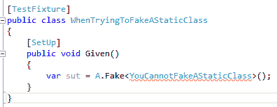
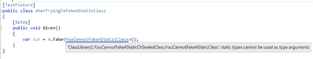
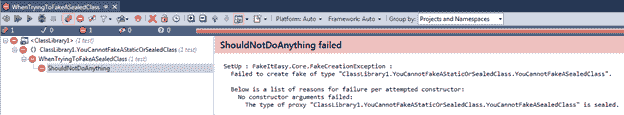
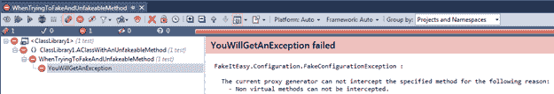
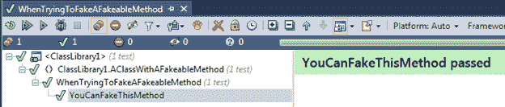

# 第 3 章介绍 FakeItEasy

在我们开始编写单元测试并使用 FakeItEasy 之前，让我们先从对框架的深入了解开始。本章将重点介绍可伪造的内容，如何创建不同的假货，如何向假货提供构造函数参数，FakeItEasy 可以覆盖哪些成员，以及创建假货时“开箱即用”的默认行为。

## 什么可以伪造？

### 接口

由于传递给类的许多依赖项是通过接口完成的，因此大多数情况下，您将为接口创建伪造。

### 课程

有时你想伪造一个类的功能。可以将类作为依赖项注入其他类（尽管首选方法是使用接口）。这些是可以伪造的类的类型：

*   没有密封的类
*   非静态的类
*   具有至少一个公共或受保护构造函数的类，其参数 FakeItEasy 可以构造或获取。

如果我们尝试假冒静态类，我们会看到：



图 13：你不能伪造静态类

请注意，编译器已经向我们显示错误。如果将鼠标悬停在红色带下划线的类名称上，您将从编译器中看到此错误：



图 14：编译器不会让你伪造静态类

如果我们尝试伪造一个密封类，与静态类不同，编译器不会给我们一个错误并允许代码编译。但是，单元测试仍然会失败。这是静态类的类和测试：

```
public sealed class YouCannotFakeASealedClass
{
    public void DoSomething()
    {
        //some implementation
    }
}

[TestFixture]
public class WhenTryingToFakeASealedClass
{
    private YouCannotFakeASealedClass sut;

    [SetUp]
    public void Given()
    {
        sut = A.Fake<YouCannotFakeASealedClass>();
        sut.DoSomething();
    }

    [Test]
    public void ShouldNotDoAnything()
    {
        A.CallTo(() => sut.DoSomething()).MustHaveHappened(Repeated.Exactly.Once);
    }
}

```

代码 15：密封类的单元测试

这是单元测试失败：



图 15：试图伪造密封类的单元测试失败

## 构造函数参数来自哪里？

### WithArgumentsForConstructor

以下是如何使用 WithArgumentsForConstructor ： 将参数传递给假冒

```
public class AClassWithArguments
{
    private readonly string thisIsAnArgument;

    public AClassWithArguments(string thisIsAnArgument)
    {
        this.thisIsAnArgument = thisIsAnArgument;
    }

    public virtual void AFakeableMethod()
    {
        Console.Write(thisIsAnArgument);
    }
}

[TestFixture]
public class WhenFakingAClassWithArgumentsUsingWithArgumentsForConstructor
{
    private AClassWithArguments sut;

    [SetUp]
    public void Given()
    {
        sut = A.Fake<AClassWithArguments>(x => x.WithArgumentsForConstructor(
        () => new AClassWithArguments(A<string>.Ignored)));
        sut.AFakeableMethod();
    }

    [Test]
    public void ACallToAFakeableMethodMustHaveHappened()
    {
        A.CallTo(() => sut.AFakeableMethod()).MustHaveHappened();
    }
}

```

代码 16：将参数传递给伪造的 SUT

注意我们如何使用 A.Fake&lt; T&gt; 使用类构造伪造，但我们的 lambda 使用 WithArgumentsForConstructor ，以便 FakeItEasy 获取传递给伪造构函数的值的“钩子”。

|  | 注意：不要担心 A.string&lt;忽略&gt; 或 MustHaveHappened 尚未发生。我们将在本书后面的方法中传递值。现在，知道将 A&lt; string&gt; .Ignored 传递给 fake 的方法意味着我们要么不关心值，要么不会对被忽略的值可能影响我们的单元测试的任何东西断言。 MustHaveHappened 是一种在配置的假货中断言已经或者没有发生过的方法。 WithArgumentsForConstructor 将在第 9 章“Faking the Sut”中进行深入介绍。 |

## 哪些成员可以被覆盖？

*   虚拟会员
*   抽象成员
*   接口伪造时的接口方法

请注意，此列表中缺少静态成员;他们不是可以覆盖的。

## 默认假行为

这是我们在制作假货时“开箱即用”的行为。我们将在本书后面的第 5 章“配置假冒电话”中学习更多关于假冒行为的信息。现在，以下两节将概述您在创建新假冒时所获得的行为。

### 不可覆盖的成员不能伪造

当我们尝试在类上伪造一个不可覆盖的方法时会发生什么？鉴于以下课程：

```
public class AClassWithAnUnfakeableMethod
{
    public void YouCantFakeMe()
    {
        //some implementation
    }
}

```

代码 17：具有不可靠方法的类

以下单元测试为班级：

```
[TestFixture]
public class WhenTryingToFakeAndUnfakeableMethod
{
    private AClassWithAnUnfakeableMethod sut;

    [SetUp]
    public void Given()
    {
        sut = A.Fake<AClassWithAnUnfakeableMethod>();
        sut.YouCantFakeMe();
    }

    [Test]
    public void YouWillGetAnException()
    {
        A.CallTo(() => sut.YouCantFakeMe()).MustHaveHappened();
    }
}

```

代码 18：不可解决方法的单元测试

|  | 注意：不要担心.MustHaveHappened 或 A.CallTo。我们将在第 7 章“断言”中介绍这两个项目。 |

当我们运行单元测试时，它会失败：



图 16：尝试伪造不可覆盖的成员时单元测试失败

请注意，FakeItEasy 正在执行那些开箱即用的规则，并告诉我们在运行单元测试时我们收到异常的原因：

“由于以下原因，当前代理生成器无法拦截指定的方法：
**- 无法截获非虚方法。** “

### 可覆盖的成员可以伪造

让我们上面的课程，将 YouCantFakeMe 方法更改为 virtual ，并将其重命名为 YouCanFakeMe 。这是我们班上的课程：

```
public class AClassWithAFakeableMethod
{
    public virtual void YouCanFakeMe()
    {
        //some implementation
    }
}

```

代码 19：YouCanFakeMe 现在是一个可伪造的方法，因为它被声明为虚拟方法

并更新了单元测试：

```
[TestFixture]
public class WhenTryingToFakeAFakeableMethod
{
    private AClassWithAFakeableMethod sut;

    [SetUp]
    public void Given()
    {
        sut = A.Fake<AClassWithAFakeableMethod>();
        sut.YouCanFakeMe();
    }

    [Test]
    public void YouCanFakeThisMethod()
    {
        A.CallTo(() => sut.YouCanFakeMe()).MustHaveHappened();
    }
}

```

代码 20：AClassWithAFakeableMethod 的单元测试

当我们运行单元测试时，这是我们的输出：



图 17：当方法声明为虚拟时传递的单元测试

|  | 注意：尽管我们允许单元测试通过将 YouCanFakeThisMethod 声明为虚拟来进行传递，但将类上的方法更改为虚拟以允许它们进行单元测试并不是一个好习惯。如果您希望通过继承类来覆盖方法，则应将方法声明为虚拟方法。如果您发现自己为了单元测试而在课堂上声明了大量的虚拟方法，那么您应该退一步看看您的设计。您是否应该使用接口来表示您当前正在使用的类的合同，并在接口实现中实现以前在您的类中的功能？像往常一样，没有硬性规定，但要注意这类代码爬进你的代码库。 |

## 摘要

在本章中，我们已经介绍了管理 FakeItEasy 如何工作的更高级别的“规则”，并查看了说明如何使用它以及如何不使用它的示例代码。接下来，我们将开始学习如何使用 FakeItEasy 来学习制作假货。