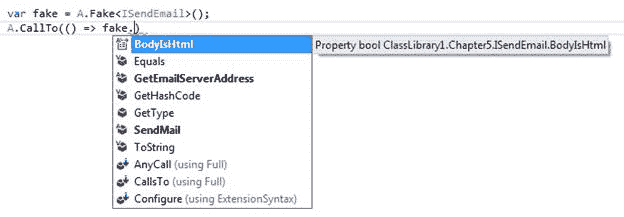
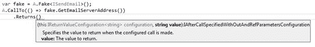
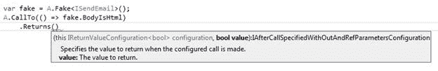
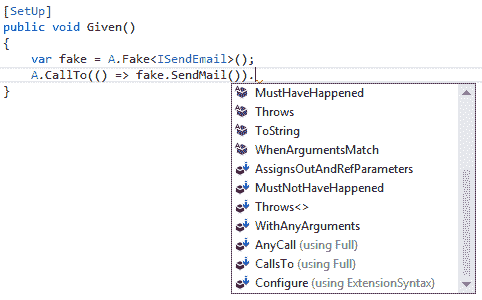

# 第 5 章配置假冒电话

## A.CallTo

现在我们知道如何创建假的，现在是时候开始指定对假配置的调用了。这是什么意思？当我们创建一个假的时候，我们这样做是为了明确目的来定义我们想要或期望在伪造项目上的某种行为。为了获得所需的行为，我们必须配置呼叫。

我们通过在静态 A 类上调用 CallTo 方法来配置调用：

```
A.CallTo(() => [theFake].[aFakesMember])

```

代码 23：CallTo 方法

代码清单 23 中的 theFake 是我们配置的假的。从那里我们应该能够指定假的哪个成员来电话（ aFakesMember ）。如果你看一下当你输入 A.CallTo 时给你的 IntelliSense，你会看到一些重载;让我们探索那些重载。

### 探索过载

如果我们查看 IDE 中 CallTo 的重载，我们将看到以下内容：

```
public static class A
{
    public static IVoidArgumentValidationConfiguration
        CallTo(Expression<Action> callSpecification);
    public static IReturnValueArgumentValidationConfiguration<T>
        CallTo<T>(Expression<Func<T>> callSpecification);
    public static IAnyCallConfigurationWithNoReturnTypeSpecified
        CallTo(object fake); }

```

代码 24：CallTo 重载

暂时不要担心从 CallTo 方法返回的接口，而是查看方法采用的方法。 A.CallTo 是让 FakeItEasy 做任何事情的“门户”。在继续之前，让我们快速探索每个方法调用：

*   CallTo（表达式＆lt; Action＆gt; callSpecification）：我们将使用此 CallTo 重载来配置不返回值的成员。
*   CallTo＆lt; T＆gt; （表达式＆lt; Func＆lt; T＆gt;＆gt; callSpecification）：我们将使用此 CallTo 重载来配置返回值的成员。
*   Call To（object fake）：这是三个重载的最简单签名。我们将使用这个 CallTo 重载来伪造一个类的成员。

|  | 注意：伪造一个类将在第 9 章“伪造 Sut”中介绍。现在，我们将集中讨论采用每个.NET 委托类型的两个重载。 |

在我们继续之前，让我们介绍一下我们将在本书中使用的抽象概念。发送电子邮件是当今大多数系统普遍存在的要求，所以让我们介绍一下发送电子邮件功能的抽象， ISendEmail ：

```
public interface ISendEmail
{   
    string GetEmailServerAddress();
    bool BodyIsHtml { get; set; }
        void SendMail();
}

```

代码 25：ISendEmail 及其成员

ISendEmail 接口有三个成员：两个方法（一个返回一个字符串，一个返回 void）和一个属性 getter / setter。

### 呼叫方法

以下是如何使用 A.CallTo 在伪造的 ISendEmail 界面上配置 GetEmailServerAddress 方法：

```
var emailSender = A.Fake<ISendEmail>();
A.CallTo(() => emailSender.GetEmailServerAddress());

```

代码 26：配置对返回值的方法的调用

|  | 注意：我们故意不在这些代码清单中包含退货行为。我们将在第 6 章“配置假冒电话”中探索返回值。 |

以下是如何使用 A.CallTo 在伪造的 ISendEmail 界面上配置 SendMail 方法：

```
var emailSender = A.Fake<ISendEmail>();
A.CallTo(() => emailSender.SendMail());

```

代码 27：配置对不返回值的方法的调用

请注意，这两种方法的配置相同，但如果按 F12 进入每个配置方法的 CallTo 定义，您将看到不同之处。

当我们设置对 SendMail 的调用时，您将提供 表达式＆lt; Action＆gt; 到 A.CallTo ，当你设置对 GetEmailServerAddress 的调用时，你提供的是 表达式＆lt; Func＆lt; T＆GT;＆GT; 至 A.CallTo 。

|  | 注意：这是因为 SendMail 不返回值，而 GetEmailServerAddress 则返回值，这是 Action＆lt; T＆gt;之间的差异。和 Func＆lt; T＆gt;委托.NET 框架中的类型。更多关于 Action＆lt; T＆gt;之间的区别和 Func＆lt; T＆gt;可以在[找到](http://stackoverflow.com/questions/4317479/func-vs-action-vs-predicate)[。](http://stackoverflow.com/questions/4317479/func-vs-action-vs-predicate) |

### 调用属性

以下是如何使用 A.CallTo 在伪造的 ISendEmail 界面上配置 BodyIsHtml 属性：

```
var emailSender = A.Fake<ISendEmail>();
A.CallTo(() => emailSender.BodyIsHtml);

```

代码 28：配置对属性的调用

|  | 注意：也可以调用受保护的成员。我们将在第 9 章“假装”中讨论如何做到这一点。 |

### 仔细观察 A.CallTo

让我们深入挖掘一下，看看我们在伪造的 ISendEmail 接口上配置调用时会看到的 IntelliSense。

创建假的后，这是我们在开始输入 A.CallTo 时可以看到的假货：



图 18：伪造的成员

我们将一次查看 BodyIsHtml ， GetEmailServerAddress 和 SendMail 方法，看看我们可以使用哪些 IntelliSense。

配置 GetEmailServerAddress

当我们从 out 创建的伪类型中输入 GetEmailServerAddress 时，我们不会提示我们提供任何参数，因为该方法不带任何参数。当我们关闭 A.CallTo 的最后一个括号时，你会看到其他可用的 FakeItEasy 调用的列表。现在，选择返回。当我们选择返回时，我们可以在 IntelliSense 中看到 FakeItEasy 已经知道 GetEmailServerAddress 返回的类型并提示我们输入值。



图 19：配置 GetEmailServerAddress

配置 BodyIsHtml

对于配置 BodyIsHtml，IntelliSense 看起来相同。



图 20：配置 BodyIsHtml

配置 SendMail

当我们配置 SendEmail 时，事情看起来不同：



图 21：配置 SendMail

注意这里缺少返回调用。 FakeItEasy 很聪明，知道不显示在可用选项中返回，因为 SendMail 不返回任何内容。

FakeItEasy 如何做到这一点？如果你再看一下 CallTo ，你会看到三个重载中的两个采用表达式。 FakeItEasy 使用此表达式来根据创建的假设在 IDE 中的 IntelliSense 中为您提供的 API 选项提供支持。

|  | 提示：学习表达式树的一个很好的入门资源是关于 LINQ Fundamentals 的 Scott Allen 的 [PluralSite 教程](http://www.pluralsight.com/courses/linq-fundamentals)。 |

值得庆幸的是，FakeItEasy 做了所有繁重的工作，编写了负责解析表达式的代码，为消费者提供了一个流畅的 API，可以使用它。我们需要做的只是指定假，然后，使用 FakeItEasy 的指导，配置它。

## 摘要

在本节中，我们已经了解了如何配置虚假的，探索过的 A.CallTo 的重载，并展示了针对不同类型成员的假配置。

为了使假货有用，我们希望控制它。我们现在知道如何配置一个假的，但我们真的无法用配置的假装做多少 - 这就是 FakeItEasy 的真正力量所在。我们将在下一章“指定虚假行为”中学习如何做到这一点。