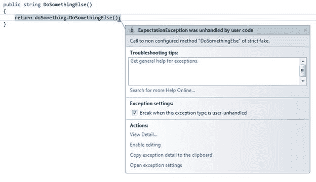
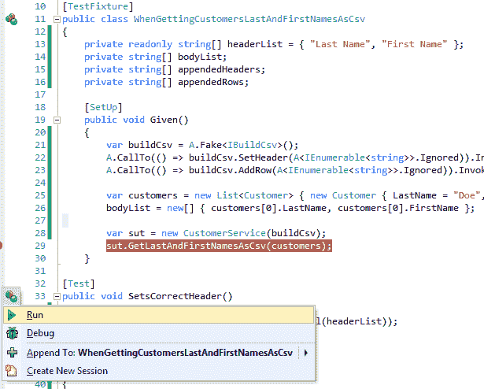
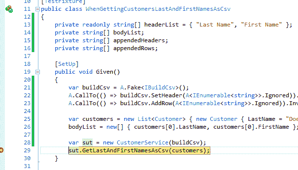
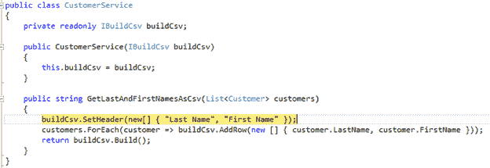
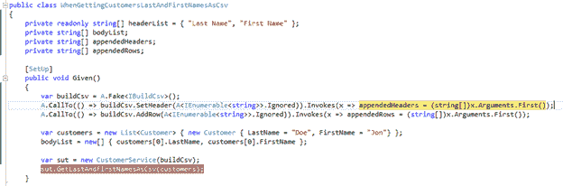

# 第 6 章指定假的行为

为了使任何配置的假货有用，我们将要控制它的一些东西。通过在配置的伪指令上指定行为，我们将能够测试 SUT 中所有可能的执行路径，因为我们使用 FakeItEasy 控制注入 SUT 的依赖关系。

## 返回值

返回值将是您想要控制假冒的最常见行为之一。让我们探索一些常用的方法来指定返回值。

### 返回

返回调用可能是用于指定伪造行为的最广泛使用的调用。让我们改变第 5 章介绍的 ISendEmail 接口。首先，让我们定义一个方法， GetEmailServerAddress ：

```
public interface ISendEmail
{   
    string GetEmailServerAddress();
}

```

代码 29：ISendEmail 接口

以下是如何指定 GetEmailServerAddress 的返回值：

```
A.CallTo(() => emailSender.GetEmailServerAddress()).Returns("SMTPServerAddress");

```

代码 30：返回硬编码值

硬编码值以及您在单元测试中设置的任何变量都可以正常工作：

```
A.CallTo(() => emailSender.GetEmailServerAddress()).Returns(smtpServerAddress);

```

代码 31：返回在单元测试中设置的变量

返回也可以用于集合。让我们的 ISendEmail 接口添加 GetAllCcRecipients 方法，返回 List＆lt; string＆gt; 代表我们想要在 ISendEmail 界面中发送电子邮件的任何电子邮件地址：

```
public interface ISendEmail
{   
    string GetEmailServerAddress();
    List<string> GetAllCcRecipients();
}

```

代码 32：将 GetAllCcRecipients 添加到 ISendEmail 接口

这是返回调用：

```
A.CallTo(() => emailSender.GetAllCcRecipients()).Returns(new List<string> {    
    "CcRecipient1@somewhere.com", "CcRecipient2@somewhere.com" });

```

代码 33：用于测试 GetAllCcRecipients 的 Returns 调用

我们在这里使用硬编码值，但我们可以轻松插入在测试设置中声明和填充的变量。 返回查看已配置调用的返回类型，并强制您提供与该类型匹配的内容。

让我们来看看接下来处理返回值的几种更有用的方法。

### ReturnsNextFromSequence

在使用 FakeItEasy 时，有时在设计时不知道在运行时确定的返回值。实现 IEnumerable 的类型的伪造就是一个例子。另一个例子是多次调用假的同一个实例，并且每次在 SUT 的相同调用上下文中返回不同的结果。

对于这种情况，有 ReturnsNextFromSequence 。要更具体地看一下这个功能，让我们再通过一个例子探讨这个调用。我们将为此示例使用三个独立的接口。

我们将介绍一个名为 IProvideNewGuids 的接口：

```
public interface IProvideNewGuids
{
    Guid GenerateNewId();
}

```

代码清单 34：生成 GUID 的新 ID 的抽象

这种抽象的作用非常简单 - 它从需要该功能的代码中抽象出新的全局唯一标识符（GUID）的创建。这个原因可能是根据环境，使用情况等生成 GUID 的不同方式;但同样，这是示例代码，所以如果这似乎是一个奇怪的抽象，请耐心等待直到样本结束。

下一个接口是 ICustomerRepository ：

```
public interface ICustomerRepository
{
    List<Customer> GetAllCustomers();
}

```

代码 35：ICustomerRepository 接口

ICustomerRepository 只允许我们获取客户列表。最终界面 ISendEmail 允许我们发送电子邮件。

```
public interface ISendEmail
{
    void SendMail(Email email);
}

```

代码 36：ISendEmail 接口

请注意， SendMail 采用电子邮件对象。我们来看看电子邮件：

```
public class Email
{
    public Guid Id { get; set; }
    public string To { get; set; }
}

```

代码 37：电子邮件类

电子邮件采用 GUID 的 ID 和表示“收件人”地址的字符串。为了举例说明，假设企业的要求是能够唯一地识别系统中发送的每一封电子邮件，即使对于同一客户也是如此。在这种情况下， Id 字段采用 GUID，我们将在使用 ISendEmail 发送电子邮件时填充。

现在我们已经了解了此示例中涉及的依赖项以及业务需求，这里有一个 CustomerService 类，它显示了它们的使用情况：

```
public class CustomerService
{
    private readonly ISendEmail emailSender;
    private readonly ICustomerRepository customerRepository;
    private readonly IProvideNewGuids guidProvider;

    public CustomerService(ISendEmail emailSender, ICustomerRepository
        customerRepository, IProvideNewGuids guidProvider)
    {
        this.emailSender = emailSender;
        this.customerRepository = customerRepository;
        this.guidProvider = guidProvider;
    }

    public void SendEmailToAllCustomers()
    {
        var customers = customerRepository.GetAllCustomers();
        foreach (var customer in customers)
        {
            var email = new Email { Id = guidProvider.GenerateNewId(),
                To = customer.Email };
            emailSender.SendMail(email);
        }
    }
}

```

代码 38：使用所有三个依赖项的 CustomerService 类

当我们调用 SendEmailToAllCustomers 时，该方法将触及 ICustomerRepository 上的 GetAllCustomers 方法，并为每个返回的客户创建一个新的电子邮件使用我们的 IProvideNewGuids 提供程序来填充 Id 字段。然后代码使用最终依赖项 ISendEmail 通过调用 SendMail 并将 Email 对象传递给它来发送电子邮件。

在本节的开头，我提到我们可以使用 ReturnsNextFromSequence 来测试仅在运行时可用的值。回顾一下我刚刚提供的示例代码，您能找到仅在运行时可用的值吗？如果您回答“由 IProvideNewGuids 依赖关系生成的 GUID”，那么您是正确的。

现在我们已经确定了在运行时我们必须处理的值，这里是 CustomerService 类的单元测试：

```
[TestFixture]
public class WhenSendingEmailToAllCustomers
{
    private readonly Guid guid1 = Guid.NewGuid();
    private readonly Guid guid2 = Guid.NewGuid();

    [SetUp]
    public void Given()
    {
        var customerRepository = A.Fake<ICustomerRepository>();
        A.CallTo(() => customerRepository.GetAllCustomers()).Returns(new List<Customer>
        {
            new Customer { Email = "customer1email@somewhere.com" },
            new Customer { Email = "customer2email@somewhere.com" }
        });

        var guidProvider = A.Fake<IProvideNewGuids>();
        A.CallTo(() => guidProvider.GenerateNewId())
            .ReturnsNextFromSequence(guid1, guid2);

        var emailSender = A.Fake<ISendEmail>();

        var sut = new CustomerService(emailSender, customerRepository, guidProvider);
        sut.SendEmailToAllCustomers();
    }
}

```

代码 39：使用 ReturnsNextFromSequence

我们在测试设置中预先提供两个 GUID，然后在伪造的 IProvideNewGuids 依赖关系的 ReturnsNextFromSequence 调用中使用这些值。当 CustomerService 类循环通过 ICustomerRepository 返回的每个客户时，将按顺序创建每个 GUID 的新电子邮件。然后，电子邮件将通过 ISendEmail 发送到正确的客户电子邮件地址。

|  | 注意：到目前为止，我们只在测试设置中使用了 FakeItEasy。您可能想知道这个单元测试的断言在哪里。现在，由于本章的重点是指定假的行为，我们在测试设置中关注这一点;我们还没准备好进入断言。我们将在第 7 章中学习使用 FakeItEasy 的断言。 |

### ReturnLazily

ReturnsLazily 是一个非常强大的方法，当 ReturnsNextFromSequence 无法为您提供所需内容时，您可以使用它来配置假行为。 ReturnsLazily 在您尝试测试在同一个 SUT 调用中返回不同对象的代码时派上用场。让我们来探索一个例子。

假设我们希望在给定此接口定义的情况下将客户名称列表作为 CSV 字符串：

```
public interface ICustomerRepository
{
    Customer GetCustomerById(int id);
}

```

代码清单 40：ICustomerRepository 接口

而这个客户类：

```
public class Customer
{
        public int Id { get; set; }
    public string FirstName { get; set; }
    public string LastName { get; set; }
}

```

代码 41：Customer 类

以下是 CustomerService 类的实现，该类显示了如何执行此操作：

```
public class CustomerService
{
    private readonly ICustomerRepository customerRepository;

    public CustomerService(ICustomerRepository customerRepository)
    {
        this.customerRepository = customerRepository;
    }

    public string GetCustomerNamesAsCsv(int[] customerIds)
    {
        var customers = new StringBuilder();
        foreach (var customerId in customerIds)
        {
            var customer = customerRepository.GetCustomerById(customerId);
            customers.Append(string.Format("{0} {1},",
                customer.FirstName, customer.LastName));
        }
        RemoveTrailingComma(customers);
        return customers.ToString();
    }

    private static void RemoveTrailingComma(StringBuilder stringBuilder)
    {
        stringBuilder.Remove(stringBuilder.Length - 1, 1);
    }
}

```

代码 42：CustomerService 类

在 CustomerService 类中，您可以看到我们循环通过提供给 GetCustomerNamesAsCsv 方法的每个 customerId 并调用我们的 customerRepository 通过 foreach 循环中的 Id 获取每个客户。我们将名称格式化为 _FirstName LastName_ ，然后使用 stringBuilder 将格式化名称附加到逗号分隔的字符串中。

|  | 注意：有一种更好的方法来实现 CustomerService 类，即为所有客户调用 ONCE 到存储库，而不是通过 Id 为每个客户调用单独的存储库。这将导致对数据库的读取调用次数减少。此外，我们可以使用 LINQ 投影轻松返回格式化客户的名字和姓氏，而不是使用 StringBuilder 在 GetCustomerNamesAsCsv 方法中将其分开。因为这段代码说明了如何使用 ReturnsLazily，所以我们暂时保持原样。 |

这是使用 ReturnsLazily 的单元测试：

```
[TestFixture]
public class WhenGettingCustomerNamesAsCsv
{
    private string result;

    [SetUp]
    public void Given()
    {
        var customers = new List<Customer>
        {
            new Customer { Id = 1, FirstName = "FirstName1", LastName = "LastName1" },
            new Customer { Id = 2, FirstName = "FirstName2", LastName = "LastName2" }
        };

        var employeeRepository = A.Fake<ICustomerRepository>();
        A.CallTo(() => employeeRepository.GetCustomerById(A<int>.Ignored))
            .ReturnsLazily<Customer, int>(
                id => customers.Single(customer => customer.Id == id));

        var sut = new CustomerService(employeeRepository);
        result = sut.GetCustomerNamesAsCsv(customers.Select(x => x.Id).ToArray());
    }

    [Test]
    public void ReturnsCustomerNamesAsCsv()
    {
        Assert.That(result, Is.EqualTo("FirstName1 LastName1,FirstName2 LastName2"));
    }
}

```

代码 43：使用 ReturnsLazily 对 CustomerService 类进行单元测试

如果对 ReturnsLazily 的调用让你挠头，让我们首先检查我们在这个单元测试中使用的 ReturnsLazily 的签名。

```
// Summary:
//     Specifies a function used to produce a return value when the configured call
//     is made.  The function will be called each time this call is made and can
//     return different values each time.
//
// Parameters:
//   configuration:
//     The configuration to extend.
//
//   valueProducer:
//     A function that produces the return value.
//
// Type parameters:
//   TReturnType:
//     The type of the return value.
//
//   T1:
//     Type of the first argument of the faked method call.
//
// Returns:
//     A configuration object.
public static IAfterCallSpecifiedWithOutAndRefParametersConfiguration ReturnsLazily<TReturnType, T1>(this IReturnValueConfiguration<TReturnType> configuration,
Func<T1, TReturnType> valueProducer);

```

代码清单 44：ReturnsLazily 重载

注意 ReturnsLazily＆lt; TReturnType，T1＆gt; 与.NET Func 委托的工作方式相反; ReturnsLazily 将返回类型（在本例中为 TReturnType ）作为 FIRST 泛型类型而不是最后一个泛型类型。在方法定义中，您可以看到.NET Func 委托类型，指定最后传递的 TReturnType 。在这种情况下， TReturnType 是客户。

回到单元测试代码，我们使用 A＆lt; int＆gt; .Ignored 来配置 GetCustomerById 方法的行为，而是委托如何在运行时使用[确定返回值]。 HTG4] ReturnsLazily 。

看看我们的 ReturnsLazily 代码：
.ReturnsLazily＆lt; 顾客 ， int ＆gt; （id =＆gt; customers.Single（customer =＆gt; customer.Id == id））;

我们正在返回一个客户，并将 int 传递给委托人，该代表将确定每次返回 GetCustomerNamesAsCsv 时返回的客户。在这种情况下，我们的委托是针对 List＆lt; Customer＆gt;的 LINQ 查询。 在单元测试中设置，每次调用 GetCustomerNamesAsCsv 时都会更改 ID。

在运行时发生的事情是，每次调用 GetCustomerNamesAsCsv 时，我们都会使用下一个可用 ID 查询我们的客户列表。基本上，代码使列表中的下一个客户可用，并将其作为 GetCustomerNamesAsCsv 的返回值。

如您所见， ReturnsLazily 可以在测试 SUT 方法时提供强大的功能，在该方法中，从单个调用返回不同的对象。请探索这个非常有用的运算符的其他重载。

## 什么都不做

有时候我们什么都不想做。不，不是你 - 配置的假货！值得庆幸的是，FakeItEasy 开箱即用。

首先，让我们将我们的 ISendEmail 接口更改为：

```
public interface ISendEmail
{
    void SendMail();
}

```

代码 45：ISendEmail 接口

让我们将 CustomerService 定义更改为：

```
public class CustomerService
{
    private readonly ISendEmail emailSender;
    private readonly ICustomerRepository customerRepository;

    public CustomerService(ISendEmail emailSender,
        ICustomerRepository customerRepository)
    {
        this.emailSender = emailSender;
        this.customerRepository = customerRepository;
    }

    public void SendEmailToAllCustomersAsWellAsDoSomethingElse()
    {
        var customers = customerRepository.GetAllCustomers();
        foreach (var customer in customers)
        {
            //although this call is being made, we don't care about the setup, b/c it doesn't directly affect our results
            emailSender.SendMail();
        }
    }
}

```

代码清单 46：CustomerService 类

调用未配置的假冒将导致没有任何事情发生。有两种方法可以解决这个问题。

一个是具体告诉 FakeItEasy 假装应该什么都不做：

```
[TestFixture]
public class ATestWhereWeDontCareAboutISendEmailBySpecifyingDoesNothing
{
    [SetUp]
    public void Given()
    {
        var customerRepository = A.Fake<ICustomerRepository>();
        A.CallTo(() => customerRepository.GetAllCustomers())
            .Returns(new List<Customer> { new Customer() });

        var emailSender = A.Fake<ISendEmail>();
        A.CallTo(() => emailSender.SendMail()).DoesNothing();

        var sut = new CustomerService(emailSender, customerRepository);
    }
}

```

代码 47：明确告诉 FakeItEasy 什么都不做

在这里我们明确告诉 FakeItEasy 我们想要从伪造的 ISendEmail 调用 SendEmail 什么都不做。但正如我之前所说，我们默认从 FakeItEasy 获得此行为，因此我们可以轻松地将上述单元测试设置缩短到下面的设置。

```
[TestFixture]
public class ATestWhereWeDontCareAboutISendEmail
{
    [SetUp]
    public void Given()
    {
        var customerRepository = A.Fake<ICustomerRepository>();
        A.CallTo(() => customerRepository.GetAllCustomers())
            .Returns(new List<Customer> { new Customer() });
        var sut = new CustomerService(A.Fake<ISendEmail>(), customerRepository);
        }
    }

```

代码 48：传递 A.Fake＆lt; SendEmail＆gt;直接进入客户服务

在这里你可以看到我们正在使用 A.Fake＆lt; ISendEmail＆gt; 直接作为新的 CustomerService 的参数。我们不必将 FakeItEasy 告诉 DoNothing ，我们只是传入一个新创建的假冒，让行为默认为空。

|  | 注意：如果在我们的单元测试中没有向依赖于它的类提供伪造的依赖实例，并且如果从单元测试中调用该依赖项的任何成员，则 FakeItEasy 将抛出异常。 |

唯一一次你必须明确地调用 DoNothing ，如果你正在使用严格的假，我们将在下一节中介绍。

## 严格

简而言之，在任何创建的假货上指定 Strict 会强制您配置它们。对未配置成员的任何调用都会抛出异常。让我们看一个简单的例子。

```
public interface IDoSomething
{
    string DoSomething();
        string DoSomethingElse();
}

```

代码 49：IDoSomething 接口

让我们来看看如何为 IDoSomething 配置严格假货：

```
[TestFixture]
public class ConfigureAStrictFakeOfIDoSomething
{
    [SetUp]
    public void Given()
    {
        var doSomething = A.Fake<IDoSomething>(x => x.Strict());
        A.CallTo(() => doSomething.DoSomething()).Returns("I did it!");

        var sut = new AClassThatNeedsToDoSomething(doSomething);
        var result = sut.DoSomethingElse();
    }
    }

```

代码 50：配置 IDoSomething 的严格伪造

在代码清单 50 中，我们使用 x =＆gt;创建严格伪造的 IDoSomething 。 x.Strict（）。我们在假货上配置了对 DoSomething 成员的调用。当我们查看 SUT 的 DoSomethingElse 方法时，您会看到我们正在调用伪造的 DoSomethingElse 方法，该方法尚未在测试设置中配置：

```
public class AClassThatNeedsToDoSomething
{
    private readonly IDoSomething doSomething;

    public AClassThatNeedsToDoSomething(IDoSomething doSomething)
    {
        this.doSomething = doSomething;
    }

    public string DoSomethingElse()
    {
        return doSomething.DoSomethingElse();
    }
}

```

代码清单 51：AClassThatNeedsToDoSomething 正在严格伪造的情况下调用未配置的成员

当我们去运行这个单元测试时，我们会得到这个例外：



图 22：您无法调用严格伪造的未配置成员

## 例外情况

有时我们想要配置一个调用来抛出异常。这可能是因为 SUT 中的执行流程发生了变化，具体取决于调用是成功还是失败。以下是如何配置假冒以抛出异常。首先，我们对目前使用的示例进行了一些代码更新。

同样，我们将使用 ISendEmail 接口来启动示例，但这次，我们的 SendMail 方法将获取客户列表：

```
public interface ISendEmail
{
    void SendMail(List<Customer> customers);
}

```

代码 52：ISendEmail 接口

我们还将使用 ICustomerRepository 界面来访问所有客户的列表：

```
public interface ICustomerRepository
{
    List<Customer> GetAllCustomers();
}

```

代码 53：CustomerRepository 接口

我们添加了一个名为 BadCustomerEmailException 的新类，它继承自异常，代表一个糟糕的客户电子邮件发送尝试：

```
public class BadCustomerEmailException : Exception {}

```

代码 54：BadCustomerEmailException

CustomerService 类接受通过 SendEmailToAllCustomers 方法调用的 ISendEmail 依赖项。

```
public class CustomerService
{
    private readonly ISendEmail emailSender;
    private readonly ICustomerRepository customerRepository;

    public CustomerService(ISendEmail emailSender, ICustomerRepository
        customerRepository)
    {
        this.emailSender = emailSender;
        this.customerRepository = customerRepository;
    }

    public void SendEmailToAllCustomers()
    {
        var customers = customerRepository.GetAllCustomers();
        try
        {
            emailSender.SendMail(customers);
        }
        catch (BadCustomerEmailException ex)
        {
            //do something here like write to a log file, etc...
        }
    }
}

```

代码清单 55：在 CustomerService 类中尝试/捕获 ISendEmail 的 SendMail 方法

在 SendEmailToAllCustomers 方法中，我们将存储库返回的所有客户传递给电子邮件发件人。如果有问题，我们会抓住 BadCustomerEmailException 。

最后，我们的单元测试：

```
public class WhenSendingEmailToAllCustomersAndThereIsAnException
{
    [SetUp]
    public void Given()
    {
        var customerRepository = A.Fake<ICustomerRepository>();
        var customers = new List<Customer>()
            { new Customer { EmailAddress = "someone@somewhere.com" } };
        A.CallTo(() => customerRepository.GetAllCustomers()).Returns(customers);

        var emailSender = A.Fake<ISendEmail>();
        A.CallTo(() => emailSender.SendMail(customers))
            .Throws(new BadCustomerEmailException());

        var sut = new CustomerService(emailSender, customerRepository);
        sut.SendEmailToAllCustomers();
    }
}

```

代码 56：客户服务的单元测试

注意的使用会在 A.CallTo 行的末尾抛出。这允许我们从我们的 ISendEmail 假装中抛出异常，然后编写任何需要为补偿操作而编写的单元测试。

|  | 注意：我在 CustomerService.SendEmailToAllCustomers 方法的 catch 块中的代码中包含了注释，而不是实际的实现。您需要做的是取决于您的代码中捕获此异常时您想要做什么;写入日志，写入数据库，采取补偿措施等 |

## 输出和参考参数

为了说明如何使用 FakeItEasy 处理 Out 和 Ref 参数，让我们继续使用 ISendEmail 和目前使用的当前示例] ICustomerRepository 接口。

而不是 GetAllCustomers 返回列表＆lt; Customer＆gt; ，它现在将使用 out 参数返回列表：

```
public interface ICustomerRepository
{
    void GetAllCustomers(out List<Customer> customers);
}

```

代码 57：客户列表现在是一个 out 参数

CustomerService 类也已更改。它不再使用 try / catch 块;它从 ICustomerRepository 调用 GetAllCustomers ，并且对于每个客户返回，我们发送电子邮件：

```
public class CustomerService
{
    private readonly ISendEmail emailSender;
    private readonly ICustomerRepository customerRepository;

    public CustomerService(ISendEmail emailSender,
        ICustomerRepository customerRepository)
    {
        this.emailSender = emailSender;
        this.customerRepository = customerRepository;
    }

    public void SendEmailToAllCustomers()
    {
        List<Customer> customers;
        customerRepository.GetAllCustomers(out customers);
        foreach (var customer in customers)
        {
            emailSender.SendMail();
        }
    }
}

```

代码 58：CustomerService 类

这是更新的单元测试。特别注意 FakeItEasy 如何处理 out 参数：

```
[TestFixture]
public class WhenSendingEmailToAllCustomers
{
    [SetUp]
    public void Given()
    {
        var customerRepository = A.Fake<ICustomerRepository>();
        var customers = new List<Customer> { new Customer { EmailAddress =    
            "someone@somewhere.com" } };

        A.CallTo(() => customerRepository.GetAllCustomers(out customers))
            .AssignsOutAndRefParameters(customers);

        var sut = new CustomerService(A.Fake<ISendEmail>(), customerRepository);
        sut.SendEmailToAllCustomers();
    }
}

```

代码 59：使用.AssignsOutAndRefParameters 来测试 out 参数

在这里，您可以看到 GetAllCustomers 调用中 AssignsOutAndRefParameters 的使用。

## 调用

有时伪造方法的期望行为不能仅通过 [指定返回值](https://github.com/FakeItEasy/FakeItEasy/wiki/Specifying-return-values) ， [抛出异常](https://github.com/FakeItEasy/FakeItEasy/wiki/Throwing-exceptions) ， [来令人满意地定义] 分配 和 ref 参数](https://github.com/FakeItEasy/FakeItEasy/wiki/Assigning-out-and-ref-parameters) ，或甚至 [无所事事](https://github.com/FakeItEasy/FakeItEasy/wiki/Doing-nothing) 。

Invokes 允许我们在调用假的方法时执行自定义代码。

让我们从我们当前使用 ISendEmail 抽象的样本中休息一下。为了说明 Invokes 的用法，我想介绍一下我们将使用的另一个抽象， IBuildCsv ：

```
public interface IBuildCsv
{
    void SetHeader(IEnumerable<string> fields);
    void AddRow(IEnumerable<string> fields);
    string Build();
}

```

代码 60：IBuildCsv 接口

这个抽象允许我们为 CSV 设置一个标题，在 **n** 行中添加一个到 CSV，最后调用 Build 根据我们的信息返回一个 CSV 文件提供给 SetHeader 和 AddRow 。

为了使这个抽象起作用，让我们首先使用 FirstName 和 LastName 属性创建一个简单的 Customer 类：

```
public class Customer
{
    public string LastName { get; set; }
    public string FirstName { get; set; }
}

```

代码清单 61：Customer 类

为了将它们组合在一起，让我们创建一个 CustomerService 类来获取客户列表，并从该列表中返回“_ 姓氏 _，_ 名字的 CSV 文件 _“使用 IBuildCsv 抽象。

```
public class CustomerService
{
    private readonly IBuildCsv buildCsv;

    public CustomerService(IBuildCsv buildCsv)
    {
        this.buildCsv = buildCsv;
    }

    public string GetLastAndFirstNamesAsCsv(List<Customer> customers)
    {
        buildCsv.SetHeader(new[] { "Last Name", "First Name" });
        customers.ForEach(customer => buildCsv.AddRow(
            new [] { customer.LastName, customer.FirstName }));
        return buildCsv.Build();
    }
}

```

代码 62：CustomerService 类

在这里，您可以看到 buildCsv 依赖关系被传递到 CustomerService 类，以从提供给 GetLastAndFirstNameAsCsv 的客户提供的列表中构建 CSV 文件。

现在我们已经使用了所有项目，让我们编写一些单元测试。让我们从单元测试设置开始。

```
[TestFixture]
public class WhenGettingCustomersLastAndFirstNamesAsCsv
{
    private readonly string[] headerList = { "Last Name", "First Name" };
    private string[] bodyList;
    private string[] appendedHeaders;
    private string[] appendedRows;

    [SetUp]
    public void Given()
    {
        var buildCsv = A.Fake<IBuildCsv>();
        A.CallTo(() => buildCsv.SetHeader(A<IEnumerable<string>>.Ignored))
            .Invokes(x => appendedHeaders = (string[])x.Arguments.First());
        A.CallTo(() => buildCsv.AddRow(A<IEnumerable<string>>.Ignored))
            .Invokes(x => appendedRows = (string[])x.Arguments.First());

        var customers = new List<Customer> {
            new Customer { LastName = "Doe", FirstName = "Jon"} };
        bodyList = new[] { customers[0].LastName, customers[0].FirstName };

        var sut = new CustomerService(buildCsv);       
        sut.GetLastAndFirstNamesAsCsv(customers);
    }
    }

```

代码 63：使用 Invokes 设置 CustomerService 类单元测试

我们来谈谈这个单元测试设置。首先，我们正在进行常规设置项目，例如创建假设置，设置一些测试数据，创建 SUT，最后调用 SUT 的方法 GetLastAndFirstNamesAsCsv 。

这里的不同之处在于我们假货的配置。在这里我们看到 Invokes 的介绍。 调用需要一些解释，所以当我设置我们的假行为使用 Invokes 时，我会告诉你正在发生的事情。

当我们使用 Invokes 时，我们正在“劫持”我们假的方法来执行自定义代码。如果我们在光标结束时点击 **F12** 在 IDE 中调用，我们将看到这个定义：

```
public interface ICallbackConfiguration<out TInterface> : IHideObjectMembers
{
    TInterface Invokes(Action<FakeItEasy.Core.IFakeObjectCall> action);
}

```

代码 64：Invokes 的定义

Invokes 要求动作＆lt; T＆gt; T 是 FakeItEasy.Core.IFakeObjectCall。 但是什么是 FakeItEasy.Core.IFakeObjectCall ？如果我们使用 F12 来查看它的定义，我们将会看到：

```
public interface IFakeObjectCall
{
    ArgumentCollection Arguments { get; }
    object FakedObject { get; }
    MethodInfo Method { get; }
}

```

代码 65：IFakeObjectCall 的定义

查看有关假冒方法的所有可用信息。为简洁起见，我们只会查看 ArgumentCollection 参数 {get;} 属性，因为这就是我们在测试设置中使用的内容。您应该自己探索这里提供的其他属性。

使用 F12 获取 ArgumentCollection 的定义，你会看到：

```
[Serializable]
public class ArgumentCollection : IEnumerable<object>, IEnumerable
{
    [DebuggerStepThrough]
    public ArgumentCollection(object[] arguments, IEnumerable<string> argumentNames);
    [DebuggerStepThrough]
    public ArgumentCollection(object[] arguments, MethodInfo method);
    public IEnumerable<string> ArgumentNames { get; }
    public int Count { get; }
    public static ArgumentCollection Empty { get; }
    public object this[int argumentIndex] { get; }
    public T Get<T>(int index);
    public T Get<T>(string argumentName);
    public IEnumerator<object> GetEnumerator();
}

```

代码 66：ArgumentCollection 的定义

在这里，我们看到了获取有关发送到伪方法的参数集合的各种信息的能力。通过这些方法和属性，我们的示例使用 ArgumentCollection ，然后通过 LINQ，获取第一个集合。

回到我们的例子，让我们分解这一行： buildCsv.SetHeader（A＆lt; IEnumerable＆lt; string＆gt;＆gt; .Ignored））。Invokes（x =＆gt; attachedHeaders =（ string []）x.Arguments.First（）;

我们调用调用，然后使用 Action 委托，我们将伪方法的第一个参数分配给我们在测试方法中声明的名为 attachedHeaders 的局部变量。

所以当这个代码在 CustomerService 中执行时：
buildCsv.SetHeader（new [] {“Last Name”，“First Name”}）;

我们执行的代码将在我们的测试设置中， attachedHeaders 将填充提供给 SetHeader 的参数值。在这种情况下，此值在我们的 SUT 上的 GetLastAndFirstNamesAsCsv 方法中定义。

为了进一步说明，让我们完成单元测试并调试其中一个测试：

```
[Test]
public void SetsCorrectHeader()
{
    Assert.IsTrue(appendedHeaders.SequenceEqual(headerList));
}

[Test]
public void AddsCorrectRows()
{
    Assert.IsTrue(appendedRows.SequenceEqual(bodyList));
}

```

代码 67：客户服务的测试方法

在这里你可以看到我们的断言很简单;我们声称在我们的测试设置中我们在 Invokes 调用中填充的数组等于我们在测试设置中设置的两个列表。

让我们在我们的测试设置中调用 SUT 方法的行上设置一个断点，并在第一个测试方法上选择 **Debug** ， SetsCorrectHeader



图 23：在 sut.GetLastAndFirstNamesAsCsv 上放置一个断点，然后在 SetsCorrectHeader 旁边的 ReSharper 菜单中选择 Debug

当你点击 sut.GetLastAndFirstNamesAsCsv 的断点时，按 **F11** 键（步入），然后按 **F10** 一次，停止[第一行] GetLastAndFirstNamesAsCsv ：
buildCsv.SetHeader（new [] {“Last Name”，“First Name”}）;



图 24：当您点击此断点时，按 F11（步入）以进入 GetLastAndFirstNamesAsCsv 方法

现在我们已经在这一行停止了执行路径，我希望你按 **F11** 。



图 25：在 GetLastAndFirstNamesAsCsv 的第一行停止执行

惊喜;我们回到了测试设置方法，我们为 SetHeader 调用了 Invokes。



图 26：我们在测试设置中回到了 Invokes 调用

我们在这里看到的是我们调用的自定义代码，它将这些头值添加到 attachedHeaders 变量中，我们将在测试断言中使用它们。

如果您希望继续遵循执行路径，直到此测试通过，请继续。你会看到我们如何反弹来调用 AddRow 。我们通过调用定义的操作将填充我们的测试设置中使用的局部变量，以便我们可以正确运行我们的断言。

## 摘要

在本章中，我们已经看到许多不同的方法来指定假的行为。我们从最常用的行为 Return 开始。从那里，我们使用不同形式的返回查看其他场景，然后以如何处理异常和输出和 ref 参数结束。

虽然到目前为止我们已经覆盖了很多，但我们还没有看到使用 FakeItEasy 的整个工具集。我们的单元测试只涉及测试设置或非常基本的断言，而我们的假成员尚未处理参数。

为了最大限度地利用 FakeItEasy，我们不仅需要指定行为，还需要处理那些假货的成员参数。我们将在下一章中探讨断言。