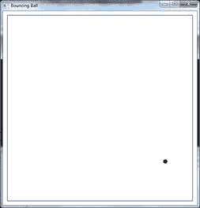
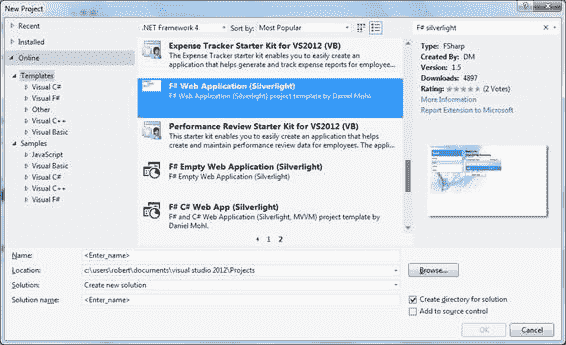
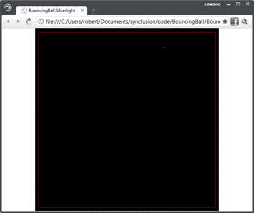

# 第 6 章模拟和图形

我喜欢打破将屏幕上的像素分为两部分的艺术：

*   低级图形编程，程序员负责控制屏幕上显示内容几何的算法。一个例子可能是创建一个游戏，程序员直接负责绘制屏幕上出现的各种元素。
*   高级用户界面创建，程序员负责将标签和文本框等常用元素组合在一起，以快速创建实用的用户界面。

F# 可用于执行这两个部分。在本章中，我们将介绍如何在 F# 中创建图形，在下一章中，我们将介绍如何将表单和其他更高级别的用户界面组合在一起。

我已经将 F# 中的图形创建与模拟的创建配对。这是因为您想要显示的图形很可能是某种模拟的结果。在这种情况下，为了使示例简单，我选择创建一个弹跳球的模拟。从康威的生命游戏到多种分形，还有许多其他可能让你感兴趣的模拟。这些可以用类似于本章讨论的弹跳球模拟的方式实现。即使在 F# 中实现游戏也可能会大量借用本章所述的技术。

弹跳球模拟本身将是一个简短的 F# 模块，它只生成模拟的原始数据。然后我们将展示如何在 WPF 和 Silverlight 中呈现它。

通过以这种方式创建应用程序，我们可以很好地分离关注点。模拟负责应用程序的数学部分 - 尽管在这种情况下数学非常简单 - 图形层只负责渲染模拟生成的数据。

## 弹跳球模拟

我们将要看的弹跳球模拟可能是您可以想象的最简单的模拟。我们的目标只是模拟一个在四个墙壁定义的区域之间无限弹跳的球。要开始我们的球模拟，我们需要选择一种表示球的方法。要做到这一点，我们必须决定哪些关于球的信息对于模拟很重要。在这种情况下，我们关心两件事：球的位置和速度。由于这是一个二维模拟，这些值可以用 X 和 Y 坐标中的四个数字表示：两个代表位置，两个代表球的速度。我们可以包括关于球的许多其他细节，例如摩擦系数，以帮助计算球经受的阻力，或者球的旋转方向和速度的细节，以帮助确定球击中物体时球的移动方式，但是我们的模拟很简单，这些细节不相关，所以我们不包括它们。球可以用简单的 F# 记录表示：

```
/// Represents a ball by its position and its velocity.
type Ball =
    { X: float
      Y: float
      XVel: float
      YVel: float }

```

提供构造对象的新实例的静态方法通常很有用。这为创建对象的新实例提供了方便的简写。在这种情况下，这将是：

```
        /// Convient function to create a new instance of a ball.
        static member New(x: float, y: float, xVel: float, yVel: float) =
            { X = x
              Y = y
              XVel = xVel
              YVel = yVel }

```

现在我们已经展示了我们的球，现在是时候考虑一​​下球的运动方式了。我们将把它实现为一个创建球的新更新版本的函数：X 和 Y 坐标将根据球的行进方向进行更新，如果球撞到墙上，速度值将会更新。要做到这一点，我们需要一组额外的数据：球周围区域的尺寸。这些将作为参数传递给计算球运动的函数。

我们需要进行的计算非常简单。我们更新球的位置，如果球超出界限，我们会反转行进方向并再次更新位置。否则，我们只是将球移到新位置。我已将此算法实现为`Ball`类型的成员方法，并调用`Move`方法。 `Move`方法接受四个参数：`xMin`，`yMin`，`xMax`和`yMax`。这些定义了球移动的区域。由于模拟很简单，因此将其作为成员函数实现是很方便的，其中有关作为单个数字传递的环境的信息。更复杂的模拟可能会以两种方式改变。首先，将关于球正在移动的环境的信息分组的环境类型将被传递给函数而不是单个数字。其次，可能需要在模块中具有集中功能以协调模拟的不同元素。由于模拟很简单，我们将坚持成员和个人参数的便利性：

```
        /// Creates a new ball that has moved one step by its velocity within
        /// the given bounds. If the bounds are crossed, the ball velocity 
        /// is inversed.
        member ball.Move(xMin: float, yMin: float, xMax: float, yMax: float) =
            // Local helper to implement the logic of the movement.
            let updatePositionAndVelocity pos vel min max =
                let pos' = pos + vel
                if min < pos' && pos' < max then
                    pos', vel
                else
                    pos - vel, -vel
            // Get the new position and velocity.
            let newX, newXVel =
                updatePositionAndVelocity ball.X ball.XVel xMin xMax
            let newY, newYVel =
                updatePositionAndVelocity ball.Y ball.YVel yMin yMax

            // Create the next ball.
            Ball.New(newX, newY,newXVel, newYVel)

```

请注意，实际上只有一个计算要做，但我们需要对 X 和 Y 坐标进行两次计算。为了实现这一点而不重复，我们定义了一个局部辅助函数`updatePositionAndVelocity`，它封装了更新坐标的计算。然后我们可以调用这个函数，传递 X 和 Y 坐标的相关细节，函数将返回更新的位置和速度。函数需要做的最后一件事是创建新的球定义并返回它。

这很好地说明了使用 F# 的一些简单但重要的功能，即使用本地函数来避免重复并使用元组返回多个值。在没有本地功能的语言中，可能很容易重复计算位置，因为它非常简短。但是，任何重复都可能导致定义随着代码的维护而发生分歧，这可能会导致错误。通过元组返回多个值的能力也有助于此过程。如果我们无法做到这一点，那么替代方案是直接从我们的计算中更新变量。这将使代码不那么灵活，因为它将耦合到它正在更新的变量定义。

既然我们有一个定义球将如何移动的模型，我们需要测试模型以确保我们有我们期望的行为。

## 测试模型

这种基于模型的方法的一个优点是它使测试变得非常简单。该模型消耗并生成数据，因此可以非常轻松地创建所需的输入并验证模型是否输出了我们期望的值。使用 F# 提供了使用 F# Interactive 创建测试脚本的额外便利，我们可以使用单个键击执行这些脚本。

我们想测试四种情况：

*   球不会在 X 或 Y 方向撞击墙壁，因此不会发生弹跳。
*   球在 X 方向但不在 Y 方向上撞击墙壁，因此在 X 方向上发生弹跳。
*   球不会在 X 方向上撞击墙壁，而是在 Y 方向上撞击，因此在 Y 方向上发生弹跳。
*   球在 X 和 Y 方向上撞击墙壁，因此在两个方向上都会发生反弹。

所有测试都将共享相同的结构;只有数据和断言会发生变化，因此我们可以编写一个通用测试并用它来测试所有四个场景。但首先，要开始我们的测试，我们需要添加一个新的 F# 脚本并添加一些命令来加载要测试的代码：

```
#load "BallModel.fs"
open FsSuccinctly.BouncingBall

```

第一行将包含球模型的文件加载到 F# Interactive 中，然后下一行打开`BallModel.fs`文件中定义的命名空间，以便轻松访问其中包含的类型和函数。现在我们可以访问需要测试的类型和函数，我们可以编写这个通用的测试函数：

```
let genericBallTest name x y shouldBounceX shouldBounceY =
    // Create a ball.
    let ball = Ball.New(x, y, 1., 1.)
    // Move the ball.
    let ball' = ball.Move(0., 0., 100., 100.)
    // Verify we have the movement we expect.
    let xOp = if shouldBounceX then (-) else (+)
    let yOp = if shouldBounceY then (-) else (+)
    if xOp ball.X ball.XVel <> ball'.X then failwith "X value not updated correctly"
    if yOp ball.Y ball.YVel <> ball'.Y then failwith "Y value not updated correctly"
    // Notify the user that the test has passed.
    printfn "passed - %s" name

```

该函数有五个参数：`name`，它定义测试的名称，并允许我们在测试通过时写出有意义的消息; `x`和`y`，用于定义测试球的位置;最后是`shouldBounceX`和`shouldBounceY`，它们定义了我们是否期望球反弹并在测试断言期间使用。之后，测试的结构非常简单。首先，我们创建一个要测试的球对象的实例，然后我们调用我们的移动函数来创建更新的球。接下来，我们验证球是否已正确移动，最后如果球按预期移动，我们会打印成功消息。测试中唯一复杂的部分是验证球是否正确移动。为此，我们测试`shouldBounceX`和`shouldBounceY`参数以查看是否应该增加或减去球的速度，然后我们自己执行加法或减法操作并根据实际结果进行测试。如果结果不如我们所期望的那样，我们调用`failwith`函数 - 一种用适当的错误消息创建异常的简便方法 - 否则我们继续。球是否处于正确位置的计算很容易，因为我们可以访问原始球，这是不可变的，因此不变，以及更新的球实例。

现在我们已经拥有了运行测试的功能，我们很容易为我们感兴趣的四种情况中的每一种创建测试。我们知道每次测试都是在 100×100 网格上进行的，所以我们只需要将球开到合适的位置。以下是测试每种情况的四个函数：

```
let testNoneBounce() =
    genericBallTest "testNoneBounce" 10\. 10\. false false

let testBounceX() =
    genericBallTest "testBounceX" 99\. 10\. true false

let testBounceY() =
    genericBallTest "testBounceY" 10\. 99\. false true

let testBounceBoth() =
    genericBallTest "testBounceBoth" 99\. 99\. true true

```

要执行这些测试，我们需要从顶层调用每个函数：

```
testNoneBounce()
testBounceX()
testBounceY()
testBounceBoth()     

```

当这些测试以交互方式执行时，我们期望看到的结果是：

通过 - testNoneBounce

通过 - testBounceX

通过 - testBounceY

传递 - testBounceBoth

与使用单元测试框架（如 NUnit）相比，以这种基本方式进行测试有一些缺点。两个主要缺点是需要显式调用要测试的函数，并且所有测试都将在第一个错误处停止。但是，这种测试方法的主要优点是不需要依赖外部框架。另外，这两种方法并不相容 - 我经常发现我只是直接使用 F# Interactive 测试项目，然后随着项目的成熟将我的测试迁移到单元测试框架。

## 绘制模拟结果

现在我们确信我们的模拟表现得如预期，现在是时候在屏幕上绘制结果了。我们将使用 WPF 执行此操作，然后使用 Silverlight。尽管 WPF 和 Silverlight 中可用的控件相似，但是低级 API 有很大不同，因此这将是在 GUI 库之间移植模拟的一个有趣的练习。

WPF 有一套很好的绘制形状的方法。要访问这些方法，程序员只需创建一个派生自`System.Windows.FrameworkElement`的类型，并覆盖传递`DrawingContext`参数的`OnRender`方法。我们将创建一个类型`BallRender`，它将负责运行模拟并呈现结果。这就是我们如何声明类型：

```
type BallRender() as br =
    inherit FrameworkElement()

```

为了渲染我们的模拟结果，我们需要对它们进行缩放。我们选择模拟球在 100×100 网格上弹跳，球的宽度只有一个点。如果我们试图在没有缩放的情况下渲染它，即使在今天的最低分辨率屏幕上，它也会显得很小。这正是 UI 应该关注的那种几何计算。模拟应该可以自由地使用便于进行模拟的值和表示。 GUI 负责将其转化为对最终用户有吸引力的东西。为了进行这些计算，我们需要一些与控件布局相关的常量，因此我们将在类型定义之后直接在类的隐式构造函数中声明它们：

```
    // Ball size and limits.
    let size = 5.0
    let xMax = 100.0
    let yMax = 100.0

    // Offset to give a nice board.
    let offset = 10.0

```

我们还需要一些笔和画笔对象来定义我们的线条和填充区域的外观：

```
    // Pen and brush objects.
    let brush = new SolidColorBrush(Colors.Black)
    let pen = new Pen(brush,1.0)

```

要运行模拟，我们需要两件事：对当前球对象的引用，其位置将随时间更新，以及将负责执行模拟和更新球位置的计时器。当前的球将被保存在参考单元中。引用单元格是 F# 中内置的可变类型，用于支持可随时间变化的值。参考单元由`ref`功能创建：

```
    // A reference cell that holds the current ball instance.
    let ball = ref (Ball.New(50., 80., 0.75, 1.25))

```

对于计时器，我们将使用 WPF 的`DispatcherTimer`。这是`Tick`事件在 GUI 线程上执行的时间，因此无需担心将数据从模拟封送回 GUI 线程。这适用于我们的简单模拟，其中计算执行得如此之快以至于在后台线程上执行`Tick`事件实际上会损害性能，因为线程同步的开销将比模拟本身的成本更高。这将是您创建的许多模拟的情况;但是，随着模拟的复杂性和执行时间的增长，有必要在后台线程上运行它以保持 GUI 响应。当模拟变得如此昂贵以至于运行它需要后台线程时，可能值得引入新的抽象 - 通常是新类 - 来运行它。但是，对于许多情况，一个简单的时间就可以了，这可以声明为类成员，如下面的示例所示：

```
    // Timer for updating the ball's position.
    let timer = new DispatcherTimer(Interval = new TimeSpan(0,0,0,0,50))

```

要创建平滑的动画，您每秒至少需要 12 帧，因此球的位置必须每秒至少更新 12 次。初始化计时器每 50 毫秒运行一次。这应该给我们每秒 20 帧，所以我们应该总是有漂亮，流畅的动画。

我们在构造函数中需要做的最后一件事是调整控件的大小以对应于我们绘制的区域的大小并初始化计时器的`Tick`事件。为此，创建一个内部函数`init()`并在构造函数的末尾调用它：

```
    // Helper function to do some initialization.
    let init() =
        // Set the control's width and height.
        br.Width <- (xMax * size) + (offset * 2.0)
        br.Height <- (yMax * size) + (offset * 2.0)

        // Set up the timer.
        timer.Tick.Add(fun _ ->
            // Move the current ball to its next position.
            ball := ball.Value.Move(0.,0., xMax,yMax)
            // Invalidate the control to force a redraw.
            br.InvalidateVisual())
        timer.Start()

    do init()

```

让我们仔细看看定时器`Tick`事件的初始化。这是通过向事件添加匿名 lambda 函数进行初始化。在这个函数中，我们首先通过调用当前球上的`Move`将球移动到新位置，然后将得到的球存储在`ball`参考单元格中。其次，我们调用控件的`InvalidateVisual()`方法 - 这将导致重绘控件，以便用户可以看到球的新位置。

为了允许我们在控件上绘制，我们需要覆盖它的`OnRender`方法。这将使我们能够访问`DrawingContext`参数，该参数具有一组很好的方法来绘制基元，例如直线，矩形和椭圆。这使得球的绘制非常简单。只需通过将模拟的输出乘以适当的比例因子，然后为边界添加偏移量来计算其当前位置。然后我们可以通过调用`DrawEllipse`方法来绘制球。我们还绘制了一个边框，以便用户更容易看到球移动的区域：

```
    /// The function that takes care of actually drawing the ball.
    override x.OnRender(dc: DrawingContext) =
        // Calculate the ball's position on the canvas.
        let x = (ball.Value.X * size) + offset
        let y = (ball.Value.Y * size) + offset

        // Draw the ball and an outline rectangle.
        dc.DrawEllipse(brush, pen, new Point(x, y), size, size)
        dc.DrawRectangle(null, pen, new Rect(offset, offset, size * xMax, size * xMax))

```

现在可以看到查看控件所需的代码。剩下的就是一个小的 WPF 管道来创建一个窗口，它将托管控件并创建一个显示窗口的事件循环：

```
module Main =

    // Create an instance of the new control.
    let br = new BallRender()
    // Create a window to hold the control.
    let win = new Window(Title = "Bouncing Ball",
                         Content = br,
                         Width = br.Width + 20.,
                         Height = br.Height + 40.)

    // Start the event loop and show the control.
    let app = new Application()
    [<STAThread>]
    do app.Run win |> ignore

```

在这里，我们看到第一个`let`绑定创建了一个球渲染控件的新实例，下一个创建了一个将托管控件的窗口，在创建时设置窗口的一些属性。最后，我们创建一个 WPF 应用程序类的新实例，并使用它来通过调用其 run 方法来启动 WPF 事件循环。最值得注意的是，我们将`STAThread`属性附加到 run 方法的调用，以确保将正确的线程模型用于事件循环。下图显示了执行程序时窗口的外观：



图 3：弹跳球模拟

现在，我们将快速了解如何将控件移植到 Silverlight，以利用 Silverlight 在 Web 浏览器中轻松下载和执行的功能，从而允许您创建的模拟或游戏轻松分发给用户。

Silverlight 的低级接口与 WPF 的接口不同;没有用于绘图的 API。如果要创建自定义形状，最好将形状写入可写位图，然后使用用户控件显示位图。

Visual Studio 2012 附带了一个用于创建已安装的 F# Silverlight 应用程序的模板。但是，使用在线提供的模板之一创建 Silverlight 应用程序更容易。我将此示例基于 Daniel Mohl 的 F# Web 应用程序（Silverlight），可以从 [http://visualstudiogallery.msdn.microsoft.com/f0e9a557-3fd6-41d9-8518-c1735b382c73](http://visualstudiogallery.msdn.microsoft.com/f0e9a557-3fd6-41d9-8518-c1735b382c73) 下载或找到通过在 **New Project** 对话框中在线搜索，如下图所示：



图 4：F# Web 应用程序

此应用程序附带了许多预定义的 XAML 页面，您需要将其删除。仅保留模板附带的 **AppLogic.fs** 文件的骨架。

我们将代码的结构与我们为 WPF 版本所做的类似。我们将创建一个控件来负责渲染弹跳球，然后添加在 Silverlight 中显示它的样板代码。球渲染控件首先声明一个继承自`UserControl`的新类型：

```
type BallRender() as br =
    inherit UserControl()

```

然后我们将添加一些常量来控制整体控件的显示方式：

```
    // Ball size and limits.
    let size = 5.0
    let xMax = 100.0
    let yMax = 100.0

    // Offset to give a nice board.
    let offset = 10.0

    // Calculate total width and height of the area.
    let xTotalWidth = (xMax * size) + (offset * 2.0) |> int
    let yTotalWidth = (yMax * size) + (offset * 2.0) |> int

```

接下来我们需要声明一个可写的位图，我们将在其上绘制弹跳球，并且位图需要包装在图像控件中，以便显示：

```
    // The writable bitmap which will allow us to draw pixels onto it.
    let bitmap = new WriteableBitmap(xTotalWidth, 
                                     yTotalWidth)

    // The image control that holds the bitmap.
    let image = new Image(Source = bitmap)

```

不幸的是，可写位图不支持任何简单的写入方式;它只有一个平面的整数数组，代表位图的颜色。为了更容易在位图上绘图，我们需要一些抽象，以便我们更容易地设置位图的像素。这采用两种函数的形式：将 Silverlight `Color`值转换为`System.Int32`的函数，以及可以通过 x 坐标和 y 坐标设置像素颜色的函数，而不是它在平面数组中的位置可写位图用于表示其像素的整数。

```
    // Convert an RBG color to the int format used by the bitmap.
    let colorToInt (c: Color): int =
        [c.A, 24; c.R, 16; c.G, 8; c.B, 0]
        |> List.sumBy (fun (col, pos) -> (int col) <<< pos)

    // Function to set a pixel by its x-coordinate and y-coordinate to the given color.
    let setPixel x y c =
        bitmap.Pixels.[y * xTotalWidth + x] <- colorToInt c

```

`colorToInt`功能取`Color`值并返回`int`。 `Color`值具有`byte`成员，表示颜色的 alpha，红色，绿色和蓝色成分。为了将这些值拟合为单个整数，每个组件需要移位多个位-0 为蓝色，8 为绿色，16 为红色，24 为 alpha。该函数通过创建元组列表来完成此操作，这些元组将颜色的 alpha，红色，绿色和蓝色分量与它们必须移位的位数配对。然后我们可以使用`List.sumBy`函数，它将一个函数应用于列表中的每个项目，然后将应用于列表中每个元素的函数的结果相加。因此，传递给`List.sumBy`的 lambda 函数执行位移，而`List.sumBy`将结果累积为单个整数。 `setPixel`函数采用要设置的像素的 x 坐标和 y 坐标以及要设置的颜色。然后，该函数使用一个简单的公式来查找要设置的相应像素，然后将给定的颜色转换为整数，并将该像素设置在位图的`Pixel`数组属性中。

现在我们可以轻松地将像素写入位图的表面，我们可以创建一个绘制球的函数。最简单的方法是使用描述球的布局的字符串列表的模板。字符串中的每个字符代表球的一个像素。星号（`*`）表示像素应该是彩色的。任何其他字符意味着它应该保持原样。这可能看起来很奇怪，但是这是一种非常方便的方法，可以在获得易于使用的数据结构时直观地描述代码中的球。一旦我们定义了这个球模板，只需要创建一个带球的函数，枚举模板的行，然后枚举每行中的字符，看看应该填充哪个像素的球。

```
    // Template that describes what the ball should look like.
    let ballTemplate =
          [ "     "
            " *** "
            "*****"
            " *** "
            "     " ]

    // Draws the ball on the bitmap.
    let drawBall ball c =
        // Calculate top corner of the ball.
        let xBall = (ball.X * size) + offset
        let yBall = (ball.Y * size) + offset
        // Iterate over the template, setting a
        // pixel if there is an asterisk.
        ballTemplate
        |> Seq.iteri(fun x row ->
            row |> Seq.iteri (fun y item ->
                if item = '*' then
                    setPixel (int xBall + x)  (int yBall + y) c))

```

`drawBall`功能采用球和颜色绘制它。该函数使用 F# 的`Seq.iteri`函数枚举`ballTemplate`，该函数枚举任何`IEnumerable<T>`集合并将给定函数应用于集合的每个成员。应用于每个成员的函数也传递一个表示当前值索引的整数（`iter`是迭代的缩写，`iteri`末尾的`i`是索引的缩写）。因此，我们首先枚举行，然后列出各列，并在每次使用两个索引找到星号时绘制一个像素，作为给定球位置的偏移量。您可以尝试通过更改球中的星号来尝试不同的球布局，看看是否可以找到更令人愉悦的球形。

现在我们可以绘制一个球，我们需要能够在球将反弹的区域周围绘制边界。我们将通过创建`drawSquare`函数来实现：

```
    // Draws a square around the border of the area.
    let drawSquare c =
        // Calculate where sides should end.
        let xSize = xMax * size + offset |> int
        let ySize = yMax * size + offset |> int
        // Convert the offset to an int.
        let offset = offset |> int
        // Draw the x sides.
        for x in offset .. xSize do
            setPixel x  offset c
            setPixel x  ySize c
        // Draw the y sides.
        for y in offset .. ySize do
            setPixel offset y c
            setPixel xSize y c

```

画广场很容易;我们只需要知道左上角将开始的像素和右下角将结束的位置。对于 x 和 y 方向，左上角将从`offset`开始，左下角将具有`offset + xMax * size, offset + xMax * size`的坐标。一旦我们计算了这些值，我们就可以通过从最小 x 坐标迭代到最大 x 坐标来绘制正方形的水平线;将像素设置为当前 x，最小 y 和当前 x，最大 y;然后在最小 y 和最大 y 之间做同样的事情来绘制垂直线。

我们现在能够绘制球和包围它的边界。现在我们必须使用这两个函数来显示球随时间的移动。为此，我们使用与 WPF 相同的技术：我们在参考单元格中创建球以跟踪随时间的变化，我们使用时间来更新球并绘制结果。初始化球和计时器的代码如下例所示。

```
    // A reference cell that holds the current ball instance.
    let ball = ref (Ball.New(50., 80., 0.75, 1.25))

    // Timer for updating the ball's position.
    let timer = new DispatcherTimer(Interval = new TimeSpan(0,0,0,0,50))

```

事件处理程序必须用黑球替换球的旧位置，将球移动到新位置，绘制新球和边界，最后调用位图的`Invalidate()`方法进行重绘。执行此操作的代码非常简单：

```
    // Handler for the timer's tick event.
    let onTick() =
        // Write over the old ball.
        drawBall !ball Colors.Black
        // Move the current ball to its next position.
        ball := ball.Value.Move(0.,0.,xMax,yMax)

        // Draw ball and square.
        drawBall !ball Colors.Red
        drawSquare Colors.Red

        // Invalidate the bitmap to force a redraw.
        bitmap.Invalidate()

```

之后剩下的就是将所有东西连在一起。我们将定义并调用`init()`函数来执行此操作。 `init()`函数将使用黑色填充位图，将图像分配给用户控件的`Content`属性，以便在用户控件中看到它，最后将`onTick`函数添加到计时器的`Tick`事件中然后开始吧。

```
    // Helper function to do some initialization.
    let init() =
        // First color our bitmap black.
        Array.fill
            bitmap.Pixels
            0 bitmap.Pixels.Length
            (colorToInt Colors.Black)

        // Make the image the user control's content.
        br.Content <- image

        // Set up the timer.
        timer.Tick.Add(fun _ -> onTick())
        timer.Start()

    do init()    

```

这完成了我们在控制上的工作，以显示弹跳球。剩下的就是 Silverlight 管道，它将在应用程序启动时显示控件。这非常简单：

```
type App() as this =
    inherit Application()

    do this.Startup.Add(fun _ -> this.RootVisual <- new BallRender())

```

当然，仍然需要创建一个测试 HTML 页面，它将加载 Silverlight 运行时以及我们刚创建的应用程序，但我们使用的模板应该处理这个问题。查看结果模拟应该只是按下 F5。您可以在下图中看到我的机器上运行的模拟。



图 5：弹跳球模拟

尽管 Silverlight 的 API 提供的低级绘图功能明显减少，但我们已经看到，通过创建一些简单易用的抽象，使用自定义图形创建应用程序仍然相当容易。

## 摘要

在本章中，我们已经了解了如何在 F# 中构建简单的模拟，以及如何使用低级绘图 API 在 F# 中创建自定义图形。