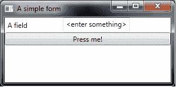
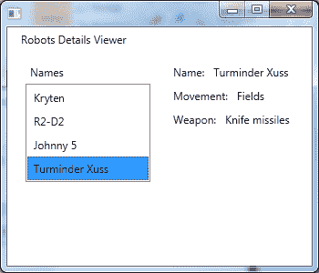

# 第 7 章表单用户界面

前一章介绍了如何使用 F# 创建自定义图形。在本章中，我们将讨论如何在 F# 中创建基于表单的应用程序。在.NET 中创建基于表单的应用程序有许多不同的技术，包括 Windows Forms，WPF，Silverlight 和 GTK# 。由于这些技术都基于类似的想法，我们将坚持看一个：WPF。

## 一个简单的表格

WPF 允许您以两种方式定义表单：首先通过直接操作 WPF 对象，然后通过在称为 XAML 的 XML 方言中定义表单。 XAML 很有用，因为有几种不同的用户界面设计包可供设计人员在 XAML 中创建丰富的用户体验。然后，设计人员可以将这些内容传递给开发人员，将其连接到应用程序中我们将在本章后面看一下 XAML;现在我们来看看如何直接使用 WPF 对象创建表单。

当您想要创建仅包含少量控件的简单表单时，直接使用对象是一种很好的方法。在这种情况下，表单的创建可能很简单，不值得使用设计器。此外，以这种方式创建表单是一种很好的学习体验，因为它可以帮助您更好地理解每种控件类型如何组合在一起。

我们想要创建一个包含三个控件的表单：文本框，文本框前面的描述性标签以及紧邻其下方的按钮。为了创建我们想要的布局，我们将使用两个堆栈面板：一个用于固定标签和文本框的水平面板，另一个用于固定水平堆叠面板和垂直位于其下方的按钮。

要创建应用程序，我们将启动一个新的 F# 项目并添加对 **PresentationCore.dll** ， **PresentationFramework.dll** ， **System.XAML.dll** 的引用（即使我们在这个阶段没有使用任何 XAML 也需要），最后是 **WindowsBase.dll** 。然后，我们需要一些开放语句来提供对命名空间的轻松访问：

```
open System
open System.Windows
open System.Windows.Controls

```

我们几乎已经准备好创建我们的控件了，但首先我们需要整理 WPF 的一个有点烦人的方面。在 WPF 中，有一个名为`UIElementCollection`的集合，用于存储子控件。此集合具有`Add`方法，该方法既有副作用 - 将控件添加到集合中 - 又返回值 - 新添加的控件的索引。我们几乎从不对控件的索引感兴趣，所以我们可以忽略返回值;但是，F# 会给我们一个警告，我们忽略了一个返回值，因为这通常表示函数式编程出错。要解决这个问题，我们需要添加一个简短的辅助函数来将项添加到控件集合而不返回索引。在 WPF 中，并非所有控件都可以包含子集;只有从`Panel`继承的控件才有`Children`集合。这就是为什么我们将一个类型约束添加到以下示例中显示的辅助函数的第二个参数。该函数仅接受从`Panel`派生的控件作为其第二个参数。 `addChild`辅助函数的实现也在以下代码中显示。它只是将给定的控件添加到`Children`集合中并忽略结果。

```
// Adds a child to a panel control.
let addChild child (control: Panel) =
    control.Children.Add child |> ignore

```

现在我们可以开始创建控件了。我们将定义一个`createForm`函数来处理创建控件。这真的没有魔力。我们只需创建水平堆栈面板，然后为其添加标签和文本框。接下来，我们创建垂直堆栈面板并添加水平堆栈面板，然后是垂直堆栈面板，然后是按钮控件，同时不要忘记连接按钮的事件处理程序。

```
// Function to create the form interface.
let createForm() =
    // Horizontal stack panel to hold label and text box.
    let spHorozontal =
        new StackPanel(Orientation = Orientation.Horizontal)

    // Add the label to the stack panel.
    spHorozontal |> addChild (new Label(Content = "A field",
                                        Width = 100.))

    // Add a text box to the stack panel.
    let text = new TextBox(Text = "<enter something>")
    spHorozontal |> addChild text

    // Create a second stack panel to hold our label
    // and a text box with a button below it.
    let spVert = new StackPanel()
    spVert |> addChild spHorozontal

    // Create the button and make it show the content
    // of the text box when clicked.
    let button = new Button(Content= "Press me!")
    button.Click.Add(fun _ -> MessageBox.Show text.Text |> ignore)
    spVert |> addChild button

    // Return the outermost stack panel.
    spVert

```

这就是创建表单的全部内容。要显示表单，我们需要在窗口中托管它，然后创建一个 WPF 应用程序来创建一个事件循环并显示控件。执行此操作的代码如下：

```
// Create the window that will hold the controls.
let win = new Window(Content = createForm(),
                     Title = "A simple form",
                     Width = 300., Height = 150.)

// Create the application object and show the window.
let app = new Application()
[<STAThread>]
do app.Run win |> ignore

```

正如我们在前一章中看到的，当在 WPF 事件循环中启动时，我们需要确保`STAThread`属性附加到起始方法调用。在执行此应用程序时，我们应该看到以下形式：



图 6：在 F# 中创建的 WPF 表单

## 使用 XAML 的表格

虽然自己创建用户界面的方法可以很好地适用于简单的应用程序，但如果我们想要更复杂的样式和效果，通常使用 XAML 会更好。在这个例子中，我们将看一下创建一个与前一个表单完全相同的布局和功能的表单。唯一改变的是现在将在 XAML 中定义布局，并使用 F# 定义表单的行为。我们表单的 XAML 定义如下：

```
<Window xmlns="http://schemas.microsoft.com/winfx/2006/xaml/presentation"
        xmlns:x="http://schemas.microsoft.com/winfx/2006/xaml"
        Title="A XAML Form" Height="350" Width="525">
  <StackPanel>
    <StackPanel Orientation="Horizontal">
      <Label Width="100">A field</Label>
      <TextBox x:Name="MessageTextBox">&lt;enter something&gt;</TextBox>
    </StackPanel>
    <Button x:Name="PressMeButton">Press me!</Button>
  </StackPanel>
</Window>

```

从 XAML 定义中可以很容易地看出，布局包括两个堆栈面板，一个标签，一个文本框和一个按钮。我们为文本框和按钮指定了名称，因为这些是我们需要从代码访问的对象。文本框称为`MessageTextBox`，该按钮称为`PressMeButton`。与 C# 相比，F# 与 XAML 的集成略少，因此我们需要定义一些辅助函数来帮助我们加载 XAML 并访问其中定义的控件。在这样的小例子中，这些助手所需的额外代码看起来像很多开销，但是在更实际大小的应用程序中，这些额外函数的成本将很快摊销，因为辅助函数在整个应用程序中被重用。

我们刚刚看到的 XAML 定义需要作为`MainWindow.xaml`添加到 F# 项目中。在此文件的属性窗口中，您需要将构建操作设置为`EmbeddedResource`，以便将其作为资源流嵌入到程序集清单中。这几乎是我们需要为 XAML 部分做的全部事情。

在我们开始使用 F# 部分之前，我们需要引用与前一个应用程序相同的程序集（ **PresentationCore.dll** ， **PresentationFramework.dll** ， **System.XAML.dll）** 和 **SystemXML.dll** ）我们需要以下`open`语句。

```
open System
open System.Reflection
open System.Windows
open System.Windows.Markup
open System.Windows.Controls

```

我们需要两个辅助函数：一个加载 XAML 窗口的函数，以及一个帮助我们访问窗口中定义的控件的运算符。第一个功能很简单。要访问清单资源流，我们需要访问包含资源的程序集对象。在这种情况下，由于我们的辅助函数是在嵌入资源的同一程序集中定义的，因此我们可以使用`Assembly.GetExecutingAssembly()`来获取对程序集对象的引用。例如，如果辅助函数与资源文件不在同一个程序集中，它可能已被移动到另一个程序集中，因此可以更容易地在项目之间共享它。我们需要将程序集对象作为参数传递给函数。一旦我们有资源流，我们就可以使用作为 WPF 框架一部分的`XAML` `Reader`类加载它。这就是我们的功能：

```
// Load a XAML file from the current assembly.
let loadWindowFromResources name =
    let currentAssem = Assembly.GetExecutingAssembly()
    use xamlStream = currentAssem.GetManifestResourceStream(name)
    // Resource stream will be null if not found.
    if xamlStream = null then
        failwithf "The resouce stream '%s' was not found" name
    XamlReader.Load(xamlStream) :?> Window

```

关于这个功能，有几点值得注意。首先，我们使用`use`关键字而不是`let`来创建表示资源流的`xamlStream`标识符的绑定。 `use`关键字相当于 C# 中的`using`，意味着一旦流退出范围，流就会调用其`Dispose`方法。其次，我们对`xam` `lStream`标识符进行空检查，如果值为 null 则引发异常。这是因为如果找不到与该名称匹配的资源流，方法`GetManifestResourceStream`将返回 null，并且通过引发异常，在这种情况下，我们将获得更有意义的异常。最后，我们使用`XAML` `Reader.Load`方法加载 XAML 文件。此方法返回一个对象，因此我们需要转换为我们期望的对象的实际类型，在本例中是`Window`类。我们可以轻松选择从磁盘上的文件加载 XAML，而不是嵌入清单中的文件;在清单中使用文件的优点是我们可以确保它随程序集一起分发。

我们需要定义的第二个函数是一种访问位于窗口内的控件的方法。 `Window`继承自的基类`FrameworkElement`提供`FindName`方法来查找我们的命名控件。一种可能性是直接使用此方法来查找我们感兴趣的控件：

```
let pressMeButton = win.FindName("PressMeButton") :?> Button

```

虽然这是一种完全可以接受的方式，但 F# 提供了一个有趣的替代方案，可以为您节省一些打字。 F# 允许您定义自定义动态运算符，其行为方式与 C# 中的 dynamic 关键字类似。动态运算符是一个问号（`?`），它允许您进行看起来像方法或属性调用的方法，但是将方法或属性名称恢复为字符串，以便您可以进行动态查找。以下是我们如何定义动态运算符：

```
// Dynamic lookup operator for controls.
let (?) (c:obj) (s:string) =
    match c with
    | :? FrameworkElement as c -> c.FindName(s) :?> 'T
    | _ -> failwith "dynamic lookup failed"

```

在这里，我们看到一个自定义运算符后跟两个参数：第一个是 type 对象，第二个是 string 类型。第一个对象是我们动态调用的对象，第二个对象是被调用的属性或方法的名称。运算符模式的实现与对象匹配，以检查它是否为`FrameworkElement`类型。如果不是，我们抛出异常。如果是，我们调用框架元素的`FindName`方法。如果目前还不是 100% 明白，请不要担心;动态自定义运算符是 F# 的更高级功能之一。要保留的是现在定义此运算符可以让您在窗口上进行动态查找，可以使用它来查找我们感兴趣的按钮：

```
let pressMeButton: Button = win?PressMeButton

```

现在我们已经有了这两个辅助函数，我们已经准备好创建基于 XAML 的窗口了。为此，我们将实现一个函数`createMainWindow`，它将负责创建窗口并将事件连接到相关控件。

```
// Creates our main window and hooks up the events.
let createMainWindow() =
    // Load the window from the resource file.
    let win = loadWindowFromResources "MainWindow.xaml"
    // Find the relevant controls in the window.
    let pressMeButton: Button = win?PressMeButton
    let messageTextBox: TextBox = win?MessageTextBox
    // Wire up an event handler.
    let onClick() =
        MessageBox.Show(messageTextBox.Text) |> ignore
    pressMeButton.Click.Add(fun _ -> onClick())
    // Return the newly created window.
    win

// Create the window.
let win = createMainWindow()

// Create the application object and show the window.
let app = new Application()
[<STAThread>]
do app.Run win |> ignore

```

`createMainWindow`的实施非常简单。我们使用辅助函数`loadWindowFromResource`加载窗口本身。一旦我们有了窗口，我们就会获取对它包含的两个控件的引用：按钮，`pressMeButton`和文本框`messageTextBox`。一旦我们有了这些引用，就很容易向按钮的 click 事件添加一个事件处理程序，并从该事件处理程序访问文本框的`Text`属性。要完成我们的功能，只需返回我们新创建的窗口即可。

要显示窗口，我们只需要调用`createMainWindow`函数然后启动 WPF 事件循环来显示窗口，就像我们在前面的例子中所做的那样。该窗口看起来与前一个示例中的完全一样，但是现在窗口的布局在 XAML 中定义，很容易添加更多样式，因此控件看起来不会很简单。

## 使用 MVVM 的表格

在 WPF 中实现表单的常用方法是使用 MVVM 设计模式。对于那些可能不熟悉 MVVM 的人，让我们快速回顾一下这个设计模式是什么。 MVVM 代表 Model-View-ViewModel。在此设计模式中，Model 是表示数据或域的对象。 View 是用户界面 - 在这种情况下我们将使用 XAML，但如果我们这样选择，我们可以直接使用 WPF 对象。 ViewModel 是位于 View 和 Model 之间的对象层，用于提供它们之间的映射并响应 GUI 中的事件和更改。 View 通过 WPF 强大的数据绑定机制与 ViewModel 进行通信。

我们将看一下在 MVVM 风格中实现一个简单的表单。 MVVM 是一个很大的主题，本示例并不是为了展示实现 MVVM 设计模式所涉及的所有技术。相反，它旨在让您体验在 F# 中执行 MVVM 并允许您将现有的 MVVM 知识或来自其他 MVVM 文章的信息应用于 F# MVVM 实现。我们将要看的示例是如何在 MVVM 样式中实现一个简单的主详细信息页面。我们正在构建的应用程序将用于查看我们的机器人库存。我们将看到一个机器人列表，并允许您点击机器人以查看有关它的更多详细信息。

正如我们已经说过的，MVVM 将代码分成三个不同的组件：模型，视图和 ViewModel。除此之外，我们还将添加一个“存储库”，它将抽象数据访问逻辑。我们将按以下顺序浏览应用程序的各个部分：我们将查看模型和存储库，然后是 ViewModel，最后是视图。

因为我们的应用程序是一些简单的只读数据视图，所以没有域逻辑。这意味着应用程序的模型部分非常简单 - 只需要一个数据容器。对于数据容器，我们将使用 F# 记录类型：

```
type Robot =
    { Name: string
      Movement: string
      Weapon: string }

```

如您所见，我们只会存储有关我们机器人的三条信息：它的名称，移动方式和武器。我们的应用程序非常简单，这就是我们对模型所需的全部内容。为了简单起见，我们将对存储库中的数据进行硬编码，但在更现实的示例中，这将来自数据库。

```
type RobotsRepository() =
    member x.GetAll() =
        seq{ yield {Name = "Kryten"
                    Movement = "2 Legs"
                    Weapon = "None" }
             yield {Name = "R2-D2"
                    Movement = "3 Legs with wheels"
                    Weapon = "Electric sparks" }   
             yield {Name = "Johnny 5"
                    Movement = "Caterpillars"
                    Weapon = "Laser beam" }
             yield {Name = "Turminder Xuss"
                    Movement = "Fields"
                    Weapon = "Knife missiles" }
           }

```

现在我们有了模型和存储库，我们已经准备好查看 ViewModel 了。 ViewModel 的主要目的之一是为视图提供可以绑定数据的一些属性。这意味着 ViewModel 类由许多相互交互的小方法和属性组成，因此我认为向您展示整个 ViewModel 然后讨论构成它的各个部分会很有帮助。

```
type RobotsViewModel(robotsRepository: RobotsRepository) =  
    // Backing field of the on property change event.
    let propertyChangedEvent =
        new DelegateEvent<PropertyChangedEventHandler>()

    // Our collection of robots.
    let robots =
        let allRobots = robotsRepository.GetAll()
        new ObservableCollection<Robot>(allRobots)

    // The currently selected robot
    // initialized to an empty robot.
    let mutable selectedRobot =
        {Name=""; Movement=""; Weapon= ""}

    // Default constructor, which creates a repository.
    new () = new RobotsViewModel(new RobotsRepository())

    // Implementing the INotifyPropertyChanged interface
    // so the GUI can react to events.
    interface INotifyPropertyChanged with
        [<CLIEvent>]
        member x.PropertyChanged = propertyChangedEvent.Publish

    // Helper method to raise the property changed event.
    member x.OnPropertyChanged propertyName =
        let parameters: obj[] =
            [| x; new PropertyChangedEventArgs(propertyName) |]
        propertyChangedEvent.Trigger(parameters)

    // Collection of robots that the GUI will data bind to.
    member x.Robots =
        robots

    // Currently selected robot that the GUI will data bind to.
    member x.SelectedRobot
        with get () = selectedRobot
        and set value =
            selectedRobot <- value
            x.OnPropertyChanged "SelectedRobot"

```

关于`RobotsViewModel`的第一件事就是两个构造函数。第一个构造函数接受`RobotsRepository`参数，以便类可以访问机器人数据。该构造函数的其余部分初始化了其他类方法可访问的字段。在初始化这些字段之后，我们然后定义第二个构造函数，一个没有参数，必须调用第一个构造函数。我们调用第一个构造函数并将其传递给我们的存储库的新实例：

```
    // Default constructor, which creates a repository.
    new () = new RobotsViewModel(new RobotsRepository())

```

现在我们已经看到了两个构造函数，让我们看看我们定义的每个字段以及它们在类中的使用方式。首先，我们定义一个字段，为我们的事件处理程序提供后备存储。需要一个事件处理程序来实现`INotifyPropertyChanged`接口，这是 ViewModel 通知视图变化的方式。创建后备存储很简单，我们只需要创建一个`DelegateEvent`对象并将其绑定到一个字段。

```
    // Backing field of the on property change event.
    let propertyChangedEvent =
        new DelegateEvent<PropertyChangedEventHandler>()

```

比事件的后备存储更有趣的是我们如何使用`properyChangedEvent`字段。我们以两种方式使用此字段：实现事件本身，以及创建引发事件的方法。这是我们通过公开`DelegateEvent.Publish`属性来创建事件的方式：

```
    // Implementing the INotifyPropertyChanged interface
    // so the GUI can react to events.
    interface INotifyPropertyChanged with
        [<CLIEvent>]
        member x.PropertyChanged = propertyChangedEvent.Publish

```

我们在这里看到事件是作为`INotifyPropertyChanged`接口实现的一部分公开的，它只有一个成员：事件`PropertyChanged`。我们需要用`[&lt;CLIEvent&gt;]`属性标记`PropertyChanged`，以便 F# 编译器知道它应该生成与其他 CLR 语言兼容的事件，例如 C# ，因为 F# 有自己的优化事件系统。现在我们已经公开了事件，我们需要能够调用该事件。我们通过创建将触发事件的`OnPropertyChanged`方法来实现此目的。

```
    // Helper method to raise the property changed event.
    member x.OnPropertyChanged propertyName =
        let parameters: obj[] =
            [| x; new PropertyChangedEventArgs(propertyName) |]
        propertyChangedEvent.Trigger(parameters)

```

这三个类的成员，`propertyChangedEvent`字段，`INotifyPropertyChanged`的接口实现和`OnPropertyChanged`方法通常会放在基类中，以便它们可以在应用程序的所有 ViewModel 之间共享。出于简化此示例的目的，我将它们保存在与 ViewModel 相同的类中，因为我们在此应用程序中只有一个 ViewModel。接下来的两个字段与将公开的属性相关，以允许视图绑定到 ViewModel。第一个字段`robots`包含所有机器人数据的集合：

```
    // Our collection of robots.
    let robots =
        let allRobots = robotsRepository.GetAll()
        new ObservableCollection<Robot>(allRobots)

```

我们使用了一个可观察的集合来表示机器人列表。如果我们在集合中添加或删除项目，此集合类型将自动通知视图。然后我们通过属性公开这个集合：

```
    // Collection of robots that the GUI will data bind to.
    member x.Robots =
        robots

```

此`Robots`属性将绑定到 GUI 中的列表视图控件，该控件将显示机器人列表。下一个字段`selectedRobot`表示当前选择的机器人。

```
    // The currently selected robot
    // initialized to an empty robot.
    let mutable selectedRobot =
        {Name=""; Movement=""; Weapon= ""}

```

该领域需要是可变的，因为它会随着时间的推移而变化。当用户选择机器人时，将更新该字段。此更新将发生，因为我们将在检查视图的实现方式时查看数据绑定。同样，我们使用一个字段来公开这个属性，但这次我们需要同时提供一个 getter 和一个 setter：

```
    // Currently selected robot that the GUI will data bind to.
    member x.SelectedRobot
        with get () = selectedRobot
        and set value =
            selectedRobot <- value
            x.OnPropertyChanged "SelectedRobot"

```

getter 只返回我们的字段，但 setter 必须做两件事。它必须首先更新字段`selectedRobot`，然后调用`OnPropertyChanged`方法以引发属性更改事件，该事件将通知 GUI 更改。

我们已经查看了构成 ViewModel 的所有内容，现在我们将看一下视图本身。由于这个视图比我们之前看到的以前的 XAML 视图更复杂，我认为首先查看布局图像会有所帮助，然后看看完整的 XAML 列表，最后浏览一下重点 XAML。 XAML 列表很长，但不要太担心。大多数 XAML 只描述了控件的位置;我们需要更详细地研究一些重要的部分。

首先，让我们看一下应用程序的屏幕截图：



图 7：机器人库存应用程序

在这里，我们看到应用程序由左侧的列表框和一些标签组成，这些标签显示右侧的机器人的详细信息。当用户更改选择时，机器人的细节会发生变化。

这就是完整视图列表的样子：

```
<Window xmlns="http://schemas.microsoft.com/winfx/2006/xaml/presentation"
        xmlns:x="http://schemas.microsoft.com/winfx/2006/xaml"
        xmlns:mc="http://schemas.openxmlformats.org/markup-compatibility/2006"
        xmlns:d="http://schemas.microsoft.com/expression/blend/2008"
        xmlns:ViewModel="clr-namespace:FsSuccinctly.RobotsMvvm.ViewModel;assembly=Form_MVVM"
        mc:Ignorable="d"
        Width="350"
        Height="300">

  <!-- Create and data bind the ViewModel. -->
  <Window.DataContext>
    <ViewModel:RobotsViewModel></ViewModel:RobotsViewModel>
  </Window.DataContext>

  <Grid Margin="10,0,10,10" VerticalAlignment="Stretch">

    <Grid.Resources>
      <!-- Name item template. -->
      <DataTemplate x:Key="nameItemTemplate">
        <Label Content="{Binding Path=Name}"/>
      </DataTemplate>
    </Grid.Resources>

    <Grid.ColumnDefinitions>
      <ColumnDefinition />
      <ColumnDefinition />
    </Grid.ColumnDefinitions>
    <Grid.RowDefinitions>
      <RowDefinition Height="auto"/>
      <RowDefinition Height="auto"/>
      <RowDefinition Height="auto"/>
    </Grid.RowDefinitions>
    <!-- Robots list. -->
    <Label Grid.Row="0" Grid.ColumnSpan="2">
      Robots Details Viewer
    </Label>
    <Grid Margin="10" Grid.Column="0"
          Grid.Row="1" VerticalAlignment="Top">
      <Grid.RowDefinitions>
        <RowDefinition/>
        <RowDefinition Height="Auto"/>
        <RowDefinition Height="Auto" />
        <RowDefinition Height="Auto"/>
      </Grid.RowDefinitions>

      <Border Grid.Row="1">
        <Label>Names</Label>
      </Border>

      <ListBox Name="robotsBox" Grid.Row="2"
           ItemsSource="{Binding Path=Robots}"
           ItemTemplate="{StaticResource nameItemTemplate}"
           SelectedItem="{Binding Path=SelectedRobot,Mode=TwoWay}"
           IsSynchronizedWithCurrentItem="True">
      </ListBox>

    </Grid>
    <Grid Margin="10" Grid.Column="1" Grid.Row="1"
          DataContext="{Binding SelectedRobot}" VerticalAlignment="Top">
      <Grid.ColumnDefinitions>
        <ColumnDefinition Width="57*" />
        <ColumnDefinition Width="125*" />
      </Grid.ColumnDefinitions>
      <Grid.RowDefinitions>
        <RowDefinition Height="Auto"/>
        <RowDefinition Height="Auto"/>
        <RowDefinition Height="Auto" />
      </Grid.RowDefinitions>
      <!-- Name -->
      <StackPanel Grid.Column="0" Grid.ColumnSpan="2"
                  Grid.Row="0" Orientation="Horizontal">
        <Label>Name:</Label>
        <Label Content="{Binding Path=Name}"></Label>
      </StackPanel>
      <!-- Movement -->
      <StackPanel Grid.Column="0" Grid.ColumnSpan="2"
                  Grid.Row="1" Orientation="Horizontal">
        <Label>Movement:</Label>
        <Label Content="{Binding Path=Movement}"></Label>
      </StackPanel>
      <!-- Weapon -->
      <StackPanel Grid.Column="0" Grid.ColumnSpan="2"
                  Grid.Row="2" Orientation="Horizontal">
        <Label>Weapon:</Label>
        <Label Content="{Binding Path=Weapon}"></Label>
      </StackPanel>
    </Grid>
  </Grid>
</Window>

```

正如您所看到的，XAML 视图的列表很长，但不要担心，只需要注意几个关键点。首先，让我们看一下 ViewModel 如何绑定到视图。首先，我们需要`Window`标签中的属性来创建别名，以便我们可以访问 ViewModel 的命名空间：

的 xmlns：视图模型= “CLR-名称空间：FsSuccinctly.RobotsMvvm.ViewModel;装配= Form_MVVM”

我们现在可以使用前缀`ViewModel`让我们在`FsSuccinctly.RobotsMvvm.ViewModel`中访问类作为 XAML 文档中的标记。这意味着我们可以创建一个 ViewModel 实例并将其绑定到 XAML 中的视图数据上下文，如下所示：

```
  <!-- Create and data bind the ViewModel. -->
  <Window.DataContext>
    <ViewModel:RobotsViewModel></ViewModel:RobotsViewModel>
  </Window.DataContext>

```

视图的下一个重要部分是显示机器人的列表框，其编码如下：

```
      <ListBox Name="robotsBox" Grid.Row="2"
           ItemsSource="{Binding Path=Robots}"
           SelectedItem="{Binding Path=SelectedRobot,Mode=TwoWay}"

           ItemTemplate="{StaticResource nameItemTemplate}"

           IsSynchronizedWithCurrentItem="True">
      </ListBox>

```

此列表框充分利用了 WPF 强大的数据绑定。我们将`ItemsSource`属性绑定到 ViewModel 的`Robot`属性，以便列表框将显示机器人列表。 `SelectedItem`属性绑定到`SelectedRobot`属性。这利用了 WPF 的双向绑定，这意味着当用户更新用户界面中的选定项时，列表视图的`SelectedItem`也会更新，并且由于双向绑定，`SelectedRobot`属性为也更新了。 `ItemTemplate`属性允许您控制列表框中每个项目的呈现方式。在这种情况下，我们引用我们之前定义的模板：

```
    <Grid.Resources>
      <!-- Name item template. -->
      <DataTemplate x:Key="nameItemTemplate">
        <Label Content="{Binding Path=Name}"/>
      </DataTemplate>
    </Grid.Resources>

```

现在我们已经看到了列表框的工作原理，我们只需要看一下机器人细节的显示方式。这里我们展示了关于机器人的三个信息领域，但是显示的每个领域都具有相同的实现，因此我们只需要看看如何实现一个领域。三个字段显示在网格中;我们将此`Grid`标记绑定到 ViewModel 的`SelectedRobot`属性。这将使我们可以轻松访问我们想要在显示所选机器人详细信息的标签中显示的字段。以下显示了网格的实现方式。这里要注意的重要属性是`DataContext`属性：

```
    <Grid Margin="10" Grid.Column="1" Grid.Row="1"
          DataContext="{Binding SelectedRobot}" VerticalAlignment="Top">

```

现在让我们看一下网格中的一个字段。在这里，我们看到`Name`字段的实现：

```
      <!-- Name -->
      <StackPanel Grid.Column="0" Grid.ColumnSpan="2"
                  Grid.Row="0" Orientation="Horizontal">
        <Label>Name:</Label>
        <Label Content="{Binding Path=Name}"></Label>
      </StackPanel>

```

我们可以看到第二个标签的`Content`属性如何绑定到机器人的`N` `ame`属性。这是视图的所有重要细节，我们几乎完成了 XAML 表单的实现。唯一剩下的就是加载 XAML 视图并显示它。我们可以使用本章前面定义的辅助函数来完成此操作。如您所见，加载 XAML 窗口并显示它非常简单：

```
// Create the window.
let win = loadWindowFromResources "RobotsWindow.xaml"

// Create the application object and show the window.
let app = new Application()
[<STAThread>]
do app.Run win |> ignore

```

无需连接任何事件或进行任何其他类型的配置。 XAML 视图负责将自身绑定到驱动其余交互的 ViewModel。

## 摘要

我们现在已经看到了如何使用 WPF 以多种不同的方式使用 F# ，包括使用 WPF 强大的 MVVM 设计模式。希望这能让您了解如何在创建需要用户输入结构化数据的业务应用程序时使用 F# 。我们专注于 WPF，但.NET 框架上还有许多其他 GUI 库。虽然我们还没有看到这些库的具体示例，但它们中的大多数都与 WPF 具有相似的概念。希望您会发现本章中的一些想法可用于其他库。