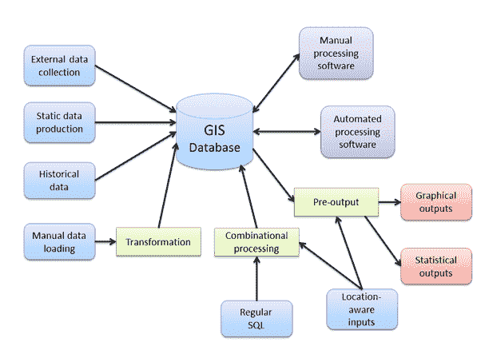
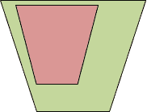
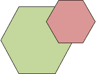
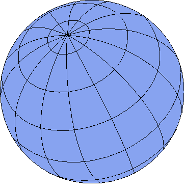

# 第 1 章那么，究竟什么是 GIS？

对于大多数人来说，他们所看到的 GIS 实际上只是前端输出层，例如 Google 地图中生成的地图或 TomTom 导航设备上的屏幕。这一切的现实远远超出了这一点;输出层通常是许多互连程序以及大量数据的最终结果。

典型的 GIS 将包括用于可视化，编辑和管理数据的桌面应用程序，用于存储数据的几种不同类型的后端数据库，以及在许多情况下大量自定义编写的软件工具。实际上，GIS 是程序员可以期望编写大量其他公司无法提供的自定义工具的顶级行业之一。

我们很快就会详细探讨一些应用程序，但是现在我们将继续使用 100 英尺的视图。典型的 GIS 处理设置如下所示：

图 1：典型的 GIS 处理设置

正如您在图中看到的那样，中心部分通常是数据库本身，具有大量的输入和处理步骤。最后，输出层（以红色显示）是人们通常与 GIS 相关联的。

基于此，我们可以看到数据库在 GIS 方面是宇宙的中心。

## 组件的细分

看一下图 1 中的图表，我们可以看到有许多部分具有特定的含义。我们有输入（蓝色），输出（红色），就地处理（绿色）和结束处理（紫色）。此时你可能会问自己，“这与我处理的任何其他以数据为中心的系统有什么不同？”你这样做是对的。这里的主要区别在于，在典型的 GIS 中，您必须从一开始就设计每个组件中的所有内容。使用常规的以数据为中心的系统，许多组件通常是可选的或组合成多功能组件。

对于典型的 GIS，除了可能的输入之外，您在图 1 中看到的都不是可选的。即使这样，您最有可能看到的组件也是手动和历史数据。

那么这些独立的实体需要做什么，为什么它们通常不是可选的？

### 外部数据收集

顾名思义，这是收集特定于所设计系统的外部数据的过程。通常，这将来自运行定制软件（通常是嵌入式或小规模）的定制设备，旨在为其正在使用的系统以非常特定的形式创建输入数据。缺少任何就地处理通常意味着生成的数据是以一种在设置中已经可以接受的格式。

该组件通常受到许多不同技术的满足，并且在大多数情况下需要一些培训才能正确使用。您经常会看到诸如数字测量设备或安装在车辆上的专用 GPS 设备之类的东西，在许多情况下，这些设备通常会使用某种无线电连接实时提供数据。

### 静态数据制作

与外部数据一样，此过程通常以特定格式收集正在使用的系统的数据。然而，与外部数据不同，您通常会发现静态数据是通过扫描现有纸质地图或现有建筑物的数字化功能在内部生成的。例如，计划。

与外部输入一样，静态数据通常使用特定于业务的自定义软件和流程生成。

### 历史数据

由于在典型的 GIS 设置中生成的数据的大小和数量，通常需要将数据备份到单独的归档系统中，同时仍然保持在需要时使用它的能力。通常，这种性质的数据是由规划当局创建的，这些数据显示土地使用随着时间的推移或记录特定兴趣点的位置。这被视为单独的输入，因为数据通常是只读的，并且类似于外部和静态数据，一次专门为系统生成。

### 手动数据加载

虽然此类输入的名称可能与外部数据相同，但在此步骤中获得的实际数据通常非常不同。通过此输入进入系统的数据通常采用来自 GIS 数据提供者的预先提供的数据。在英国，这通常意味着由军械测量局等公司提供的数据。在美国，这可能意味着由美国地质调查局等机构提供的数据或美国人口普查局的 TIGER 数据。

在此步骤中，无论从何处获取数据，都几乎可以保证它将需要转换为可在其注定的 GIS 中使用的格式。通常情况下，它需要经过某种就地过程才能以任何方式使用。

### 常规 SQL 查询

由于大多数 GIS 在其中心都有一个大型数据库，因此 SQL 仍然扮演着重要的角色，而且可能总是如此。但是，在 GIS 术语中，这些查询不仅涉及您以前在数据库管理系统中看到的普通 SQL，还涉及地理空间 SQL。稍后我们将介绍特定于 GIS 的 SQL;目前，这里的输入通常是从搜索查询等内容生成的。

例如，当您在 Google，Bing 或 Yahoo 地图中键入地点或邮政编码的名称时，您正在查看的 Web 应用程序很可能会将您的搜索转换为使用地理空间 SQL 检查数据的查询。核心数据库。反过来，这将与其他过程组合以产生输出，在这种情况下，输出通常是显示您搜索的位置的地图。另一个例子可能是紧急服务控制室中的操作员进入事故的位置，并将其与附近的紧急车辆的已知位置相结合，以帮助确定将哪个车辆发送到事故。

### 位置感知输入

最后一种输入类型可能是大多数人都熟悉的输入类型。位置感知数据通常来自移动电话或其他支持 GPS 的设备上的 GPS 输入。它通常是常见的纬度和经度信息。在讨论 NMEA 数据时，我们将更多地介绍这一点。

### 图形输出

现在我们转到输出层，第一个是图形输出层，大多数人都熟悉它们。此处的输出数据通常采用基于栅格的映射的形式，执行所有操作以生成标准位图（例如.jpeg）形式的单个输出磁贴。但是，涉及的内容远远多于简单的地图图块。图形输出可以并且通常以各种矢量格式生成，或者像 AutoCAD 图形一样用于加载到 CAD 或建模包中。实际上，即使在人们习惯于查看位图图块的 Web 环境中，图形输出通常采用 SVG 或 KML 数据的形式与自定义 Google Maps 对象相结合。光栅瓷砖只是冰山一角。

### 统计输出

该组中的输出与图形输出完全相反。数据通常是基于输入数据和系统内进程的几个 GIS-SQL 操作的副产品。就像一般数据库数据一样，您可以从此输出中获得可用于向管理或营销团队报告统计数据的事实和数据。然而，我们单独处理这个问题的原因是因为信息的性质。

虽然您可能只想说“它只是数字”，但在某些情况下，除非涉及一些 GIS 输入，否则它的数字没有任何意义。例如，假设我们有许多代表土地的地理区域，并且每个区域我们都有该地块的货币价值。

我们可以很容易地说，“按降序给出每个地块的价值”，让您可以看到哪个是最昂贵的土地。然而，这是差异停止的地方。假设我们现在知道，一个地区的所有土地对每平方米的地块消耗​​1％的税。我们知道，通过查看地图的图形输出，视觉上更大的区域将更加昂贵，但您无法将其传达给计算机。

但是，您可以要求使用 GIS-SQL 进行统计分析，该分析基于土地的绘图值的百分比乘以但是在定义的区域边界中有许多平方米。

### 手动处理软件

系统中需要操作员和某些软件进行更改的任何内容都属于手动处理软件的范畴。通常，这既是输入也是输出，因为在大多数情况下，这涉及手动更改基础数据。

这通常是您将看到使用 ESRI，DigitalGlobe 和 MapInfo 等大型 GIS 软件包的区域。我们稍后将介绍其中一些内容。在此阶段可能执行的操作的示例是边界编辑。假设您在几年前添加了一些城镇边界作为区域定义，并且自从它们首次添加以来，城镇的规模已经增加。然后，您将找到一位 GIS 专家，通过他或她选择的软件和一些卫星图像，您可以编辑边界数据，使其定义更适合新扩展的图像。

### 自动处理软件

在此阶段运行的操作通常与手动运行的操作没有太大差别。我们看到明确分离的原因是因为某些流程根本无法实现自动化，需要人眼来挑选细节。回到我们之前关于城镇边界的例子，可以定义一个过程来分析航拍图像并确定是否需要删除边界，这并非超乎想象。

然而，大多数情况下，自动编辑用于执行诸如漂移校正或由于地球移动引起的高度和轮廓变化之类的任务。

### 转型任务

如在手动数据输入的讨论中所提到的，当获得用于并入 GIS 的数据时，数据将很少以适合包含在系统中的格式。

使数据可用可能涉及像坐标变换这样简单的事情，或者像基于公共属性等组合多个数据集那样复杂的事情。转换过程通常会严重影响整体数据质量，许多系统最终会在转换数据时因错误而导致许多根深蒂固的问题。

在英国，当使用纬度和经度坐标时，几乎总能看到这些过程，因为英国当局提供的几乎所有数据都将以原点为单位，而不是围绕中心的度数。

### 组合处理

组合处理通常是就地处理，这是各种输入操作的结果。它与在常规数据库操作中使用连接没有太大区别。结果是流程和输入数据步骤的组合，最终实时工作以生成定义的输入数据集。

### 预输出

最后但并非最不重要的是预输出步骤。顾名思义，这是输出可用之前所需的最终处理。预输出过程可以包括将内部坐标系变换为更全局的坐标系;例如，英国米回到全球范围，或将一批统计数据转换为不同的值范围。位置感知输入通常包括在此步骤中，通常在导航系统中。例如，位置的图形表示可以与当前映射组合以产生跟踪图的视觉输出。

## 数据库

那么究竟是什么让 GIS 数据库与普通数据库如此不同？老实说，并不多。 GIS 数据库仅适用于特定任务。

更好地说明 GIS 数据库的独特之处在于了解不断增长的大数据世界。目前，很难不注意 NoSQL 和以文档为中心的数据库提供商产生了多少噪音。这些新品种数据库从根本上做与普通数据库相同的事情，但使用专门的流程，以更好，更有效的方式执行特定操作。

通过非 GIS 连接的镜头观察 GIS 数据库，几何数据只不过是一个自定义二进制字段或 blob，与系统一起工作的软件和进程知道如何解释。实际上，可以使用普通的数据库引擎并在数据库或外部代码中编写自己的例程，以执行您期望但使用 GIS 数据的所有常规操作。

通常，当数据库在空间上启用时，它不仅仅具有理解添加到其中的二进制数据的能力。将会有用于执行专门的 GIS 数据操作的 SQL 语言扩展，用于帮助加速查找的新类型索引，以及用于管理与您可能需要存储的各种类型的 GIS 数据相关的元数据的各种新表。

我不打算列出本书中的所有可用操作，只列出开始时需要了解的最重要的事项。然而，最后一次计算，在最近公布的 OGC 标准中有超过 300 种不同的功能。

### OGC 什么？

OGC 标准是开放地理空间联盟设定的建议。它们定义了一个通用 API，一组最小的 GIS-SQL 扩展，以及任何支持 GIS 的数据库必须实现的其他相关对象才能被归类为符合 OGC 标准。由于 GIS 及其数据的多样性，这些标准得到了严格执行。这使得地球上几乎所有支持 GIS 的软件都可以使用通用语言与任何支持 GIS 的数据库进行通信，反之亦然。

请注意，在选择要使用的数据库时，有许多声称具有空间感知但不符合 OGC 的数据库。主要的例子是 MS SQL 和 MySQL。

通常，MS SQL 具有 OGC 批准的最小 GIS-SQL 和功能实现，但其调用模式与大多数 GIS 软件有很大不同。 MS SQL 还具有对某些元数据表中列名称的更改，这意味着大多数标准 GIS 软件无法与 MS SQL 服务器通信。另请注意，MS SQL 直到 2008 年才添加任何类型的 GIS 可扩展性，即使在较新的 2008 R2 和 2012 版本中，GIS 方面仍然不完全符合 OGC 标准。

MySQL 具有类似的限制，但也会以非常不同的方式处理许多核心数据类型，在执行坐标转换时经常会导致舍入错误和其他异常。您可以在 OCG 网站 [http://www.opengeospatial.org/standards/is](http://www.opengeospatial.org/standards/is) 上找到 OGC 标准文件的完整列表。

查找比较各种数据库的信息的好地方在 BostonGIS 网站 [http://www.bostongis.com/?content_name=sqlserver2008r2_oracle11gr2_postgis15_compare#221](http://www.bostongis.com/?content_name=sqlserver2008r2_oracle11gr2_postgis15_compare#221) 上。

网站上还有许多其他好的入门文章。缺点是该网站混乱，有时很难阅读。

### 元数据表

所有符合 OGC 标准的 GIS 数据库必须支持两个核心元数据表，称为 **geometry_columns** 和 **spatial_ref_sys** 。大多数支持 GIS 的软件将使用这些表的存在来确定它是否与真正的 GIS 数据库系统进行通信。如果这些表不存在，则软件通常会退出。

一个很好的例子是 MySQL 的早期版本，其中表名由数据库引擎保留，但实际上并不作为表存在。这将导致 MapInfo 应用程序尝试创建缺少的表，但在尝试这样做时会收到错误，从而阻止软件正确使用数据库。

**geometry_columns** 表用于记录数据库中哪些表列包含地理空间数据及其数据类型，坐标系，维度和一些其他相关信息项。

**spatial_ref_sys** 表包含已知空间参考系统或坐标系统的列表，因为它们可能更为人所知。这些坐标系统定义了任何 GIS 数据库中的地理位置;它们是允许所有功能完美协作的粘合剂，即使数据可能来自不同来源或使用不同的地理坐标系统记录。

**spatial_ref_sys** 表中的条目由称为 EPSG ID 的数字索引。 EPSG 或欧洲石油调查小组是石油和天然气行业能源供应商的工作组，他们面临着在调查世界海洋石油储备时出现的一个共同问题：在全球范围内定位。有些公司使用一种规模，有些则使用不同的规模;一些使用全球坐标系，而另一些则使用本地坐标系。

该小组的解决方案是记录每个比例之间的差异以及从一个比例转换到另一个比例所需的信息，而不会有任何精度损失。

今天，声称符合 OGC 标准的每个 GIS 数据库都包含此表的副本，以确保尽可能准确地执行从一个系统到另一个系统的数据转换。

我们将在本书稍后介绍实际的坐标系。现在，您真正需要注意的是，如果 **spatial_ref_sys** 表不存在或者没有数据，您将无法准确地映射或进行任何数据的真实翻译具有。

另请注意，可以通过从此表中删除不必要的条目来节省空间。如果您的数据仅使用两个或三个不同的坐标系，则删除其余条目以减小表的大小是完全可以接受的。在使用移动设备时，这尤其有用。

如果您只处理自己的值范围内的数据，可以说 **spatial_ref_sys** 表中根本没有数据。但是，我会提醒你不要完全取下桌子。如前所述，大多数 GIS 软件将查找此和 **geometry_columns** 表的存在，以表示存在启用 GIS 的数据库。

### 元数据表中究竟是什么？

**geometry_columns** 表包含与您的数据相关的数据，并包含以下字段：

| f_table_catalog | 表中定义的数据库名称。 |
| f_table_schema | 表中定义的模式空间。 |
| f_table_name | 保存数据的表的名称。 |
| f_geometry_column | 包含实际数据的列的名称。 |
| coord_dimension | 坐标维度。 |
| srid | 正在使用的坐标系的空间参考 ID。 |
| 类型 | 存储在此表中的几何数据类型。 |

**目录**，**模式**和**名称**字段由不同的数据库以不同的方式使用。例如，Oracle Spatial 有一个 **geometry_columns** 表用于整个服务器，因此**目录**字段用于命名实际数据库。但是，Postgres 每个数据库存储一个 **geometry_columns** 表，因此**目录**字段通常为空。另一方面，**模式**字段用于 Postgres 和 MS SQL。在 Postgres 中，字段通常设置为 **public** ，而在 MS SQL 中，通常设置为 **dbo** 用于可公开访问的表集。

表名和列名非常明显。大多数情况下的坐标尺寸为 **2** ，这意味着坐标系只有 x 坐标和 y 坐标。 Postgres 和 Oracle Spatial 确实具有 3-D 功能，但我还没有看到它们在非常特殊的情况下使用它们，我从未见过 **coord_dimension** 字段设置为**以外的任何其他字段] 2** 。

我们将在短时间内介绍 **srid** 字段。然而，**类型**需要进一步解释。

### 数据库几何类型

任何符合 OGC 标准的数据库都必须能够存储三种不同类型的基元。他们是：

*   点
*   线
*   多边形

这些名称本身就是相当明确的。点是单个 _x_ ， _y_ 位置。线是由两个 _x_ ， _y_ 端点连接的单个区段。多边形是一个封闭区域，其中许多 _x_ ， _y_ 点形成一个封闭的周长。

但是，三种基本类型不是您将使用的唯一几何类型。有变化，如：

*   线串
*   MULTILINESTRING
*   MULTIPOLYGON

还有一些很少使用的其他产品。

线串可以被认为是线对象的集合，其中除了起点和终点之外的每个点与相邻线的起点或终点相同。例如：

1,2 2,3 3,4

将是一个从 1,2 开始的线串，经过两个段，结束于 3,4。

多线串可以被认为是线串的集合。例如：

（1,2 2,3 3,4）（6,7 7,8 8,9）

将是从 1,2 到 3,4，从 6,7 到 8,9 的两个线串，每个由两个段组成。两个线串之间会有间隙。

多边形，顾名思义，是一个多边形的集合，但有一个扭曲。如果多边形定义位于同一图形对象中，则它们不能重叠。这在图 3 和 4 中示出。

|  |  |
| 图 2：有效的多面体 | 图 3：无效多边形 |

多面必须包含至少一个包围集合中所有其他多边形的多边形。这被称为**外环**。在该边界内，其他多边形通常在外环中形成孔。这用于带有庭院的建筑平面图，带有环形交叉口的道路布局，以及需要从定义的形状的内部区域移除封闭部分的任何东西。

然而，许多空间数据库甚至将单个多边形定义为多重多边形。这样做是为了在以后需要时插入切口很容易。

### 我的数据应该使用哪些类型？

您使用的数据类型取决于您的数据所代表的内容。如果您有一系列代表商店的位置，您很可能只想将它们定义为点。另一方面，如果您的数据表示这些点之间的道路，则多线串可能是更好的选择。如果要标记每个商店的建筑轮廓，则需要使用多边形或多边形，具体取决于结构的复杂程度。

数据类型没有严格的规则。您只需要记住，如果您不使用适合您期望执行的操作的数据类型，那么您几乎肯定会在您执行的任何计算中遇到错误。

回想一下我们的商店。如果您正在搜索最大的一个，则需要测试区域，并且无法使用单个点测试区域。另一方面，如果您想要做的就是为客户提供可搜索的地图以找到他或她最近的商店，您不需要存储超出您需要的数据，因此一个简单的观点就可以了。

现在有足够的数据布局。我们会在一段时间内回到它。让我们继续使用元数据表。

### 元数据表，第 2 部分

如前所述， **spatial_ref_sys** 元数据表保存转换数据，以允许从一个坐标系转换到另一个坐标系。

此表中的每个条目都包含特定信息，例如测量单位，原点所在的位置，甚至测量的起始偏移量。

我们大多数人都熟悉看到如下的坐标对：

54.852726，-1.832299

如果您的手机内置 GPS，请将其启动并观看显示屏。你会看到类似于这个坐标对的东西。请注意，在某些设备和应用上，可以交换坐标。

该坐标对称为纬度和经度。第一个数字，纬度，是赤道北或南的度数，北部为正，南部为负。第二个数字，经度，是本初子午线以东或以西的度数，西部为负，东部为正。该坐标系的正确地理空间名称为 **WGS84** 。它的 SRID 号是 **spatial_ref_sys** 表中的 **4326** 。

我们将回到不同的坐标系，以及为什么它们只是片刻存在。现在，让我们继续描述空间参考表。 **spatial_ref_sys** 表包含以下字段：

| srid | OGC 标准定义的空间参考编号。 |
| auth_name | 此 SRID 的验证主体，通常是 EPSG。 |
| auth_srid | 由身份验证主体定义的 SRID，通常与 OGC 标准定义的 SRID 相同。 |
| srtext | 定义文本用于映射 projcs 格式的空间差异。 |
| proj4text | 定义文本用于映射 proj4 格式的空间差异。 |

空间参考表中的所有内容都是整数和字符串的简单类型。 **srtext** 和 **proj4text** 具有不同的含义，具体取决于读取它们的软件。

**srtext** 字段保存投影，椭圆体，椭球体和其他基本信息的信息，这些信息允许任何软件能够从一个坐标集转换为另一个坐标集。我们稍后会介绍这一点，但是对这一领域中所有内容的完整描述远远超出了这本小书的范围。事实上，我见过的最小的书籍描述了基础知识超过 500 页！

**proj4text** 字段用于类似目的，但是由使用开源 Proj.4 库的应用程序使用。

Proj.4 和 Geos 是许多不同空间数据库和 GIS 应用程序使用的第一个开源库中的两个。这两个库现在用于所有商业和开源软件的近 100％，用于任何类型的空间或 GIS 工作。这两个库仍然是主动维护的，并且可用于您期望使用的每个平台。稍后我们将简要介绍一下.NET 开发人员可用的一些 GIS 软件。

目前，您需要注意的是，为了支持不同的空间坐标系，您必须在 **spatial_ref_sys** 表中包含条目。

如前所述，您不需要表中的每个条目;您只需使用几何，数据库和软件使用的 SRID 即可获得。由于我住在英国，我通常使用：

OSGB36，SRID：27700-军械测量，在原点处具有错误偏移的仪表。

和

WGS84，SRID：4326-全球纬度/经度，度数与分钟/小时/秒偏移，原点在 0 度纬度（赤道）和 0 度经度（Prime Meridian）。

对于其他地区，您可以导入整个表格并查看最佳表格，或者您可以在 [http://www.epsg-registry.org/](http://www.epsg-registry.org/) 的 EPSG 网站上查找您的区域并仅获取你需要的定义。如果您使用 Postgres 或 PostGIS 作为空间数据库，则在安装数据库时， **spatial_ref_sys** 表将填充到数据库模板中，并且所有已知的 SRID 都可用。创建自己的数据库只需使用此模板从一开始就拥有一个完全填充的表。

在我们继续之前要注意一点：一些数据库虽然支持 **geometry_columns** 和 **spatial_sys_ref** 元数据表，但默认情况下不会创建它们。 MS SQL 2008 因此而闻名;它使用自己的方法存储空间元数据。您可能会发现在某些情况下，您需要手动创建其中一些表，然后才能使用数据库。此外，您可能还会发现某些数据库创建表但使用稍微不同的命名约定，尤其是对于 **geometry_columns** 表。因此，使用官方符合 OGC 标准的空间 SQL 命令集（可以从 [http://www.opengeospatial.org/standards/sfs](http://www.opengeospatial.org/standards/sfs) 下载）来操作这些中的数据总是更好。表，而不是试图直接操纵条目。

## 坐标和空间定位系统

在我们开始学习技术有趣的东西并开始发挥之前，我们必须涵盖更多的理论。您必须了解为什么存在所有这些不同的 SRID 和坐标系。

我现在快乐地送你进入你的第一次 GIS 探险之旅，并说这些东西真的没关系;然而，事实是我做不到而且确实重要。事实上，这很重要。

如果你没有正确理解这个坐标，那么可以将汽车的轨迹映射到大西洋中部。虽然这对您正在处理的应用程序可能无关紧要 - 例如，您可能正在查看客户分散的一般概述 - 您仍应尝试确保您的应用程序尽可能准确。

因此，这个价值数百万美元的问题的答案是：“为什么我们必须处理所有这些坐标？”归结为一件事，只有一件事：

_ 地球不平坦。_

在那里，我说了。而那些仍然认为需要建立自己的顶级 GIS 并查看它的所有反对者。

但是，除了笑话之外，我们的行星是一个导致所有这些坐标系统头痛的球体。更糟糕的是，我们卑微的家庭甚至不是一个完美的圆形球体。它的轴线略微伸长，有点像橄榄球，但不太明显。这导致了进一步的复杂化，因为当我们查看靠近极点的位置时我们需要使用的数学运算必须补偿地球曲率的差异。

### 度，分钟和 GPS

那么，我们究竟如何处理这种曲率呢？必须有一个在全球范围内有意义的测量，对吗？如果没有，那么地球上的飞机和船只如何在不丢失或不必跟踪所有这些不同的 SRID 的情况下从一个国家导航到另一个国家？

你会很高兴知道它有，但它并不像在地球上的某个地方映射 _x_ 位置和 _y_ 位置那么简单。

如果您查看任何地理教科书或世界地图，您会看到地球被划分为矩形。这些矩形由纬度和经度线组成，构成了我们星球的线框模型。它看起来像下面这样：

图 4：地球线框模型

每条水平和垂直线代表一个或多个整体度，取决于所使用的比例因子。然后使用分钟来偏移该网格方格内的位置。

当我们表达纬度为 50°25'32“N 时，我们实际上说的是纬度为 50 度，加上该方块向北 25 分 32 秒，简单来说。如果真相被告知它会有一点复杂性但是，除非你在公海航行或驾驶商用客机，否则你可能不需要深入细节。

同样适用于经度。所有东西都表示为正数，因此 Prime Meridian 的西部以 W 为后缀，东部的所有部分都以 E 为后缀。将这些与北部和南部经度名称相结合将行星划分为四个 180 度的象限。 。

#### 这与 GIS 开发人员有什么关系？

如果您希望从任何商用级 GPS 中检索数据，特别是那些内置于手机中的 GPS，您几乎总会面对国家海洋电子协会及其电子导航设备的通信标准，称为 **NMEA 0183** 标准。在任何设备上打开 GPS 端口将产生一个恒定的数据流，看起来非常类似于以下内容：

$ GPGGA，092750.000,5321.5802，N，00630.3372，W，1,8,1.03,61.7，男，55.2，M，* 76

$ GPGSA，A，3,10,07,05,02,29,04,08,13 ,,,,, 1.72,1.03,1.38 * 0A

$ GPGSV，3,1,11,10,63,137,17,07,61,098,15,05,59,290,20,08,54,157,30 * 70

$ GPGSV，3,2,11,02,39,223,19,13,28,070,17,26,23,252，04,14,186,14 * 79

该数据流是设备中的 GPS 电路响应于它能够从绕地球轨道运行的 GPS 网络接收的数据而发出的导航数据。我们将在后面的章节中更详细地回顾这一点。现在，我想提请您注意这些数据的第一行，特别是以下条目：

**5321.5802，N** 和 **00630.3372，W**

这些是 GPS 的当前位置，以度和分钟表示。一旦你习惯了解它们并不难，但一开始它可能有点奇怪。

字符串的格式是 **DDMM.mmmm** 用于纬度（垂直）方向， **DDDMM.mmmm** 用于经度（水平）方向。

从字符串中的北（纬度）测量开始，前两位数是度数，其余数字是分钟。小数点后的数字是一分钟的分数。这给了我们：

**53 度，北纬 21.5802 分**

对于经度测量，第一个 _ 三个 _ 数字是度数，其余数字是分钟。小数点后的所有数字都是一分钟的分数。这给了我们：

**6 度，西 30.3372 分**

因为这些数据是字符串数据，所以它本质上是在特定点剪切字符串以获得所需值的练习。一旦你拥有它们，将它们转换为更熟悉的纬度和经度（如果你还记得 WGS84）格式的数学运算非常简单。

首先，您需要将前两个数字与纬度字符串分开，前三个数字与经度分开。这给出了以下内容：

**53** 和 **21.5802** 为北方向

西方的 **006** 和 **30.3372**

因为在一定程度上有 60 分钟，我们必须将分钟数除以 60 来找出它们的程度，然后将它们与我们的整个度数相结合。所以，对于我们的纬度：

**53** **+（21.5812 / 60）**会给你 **53.359686** 度。

而对于我们的经度：

**6 +（30.3372 / 60）**会给你 **6.505620** 度。

你从数字中得到简单的位置。要完成转换，您需要将北向和西向应用为正数或负数。管理哪些方向为正或负的最简单方法是将任何西或南测量值更改为负值。因此，对于我们的数字，WGS84 纬度和经度的最终坐标是：

**53.359686，-6.505620**

WGS84 是一个全球坐标系标准，虽然它被广泛使用，但将它用于一切都会导致一些问题。由于 WGS84 设计用于覆盖地球，因此它的设计也非常宽松地适应行星的曲率。回想一下图 4 中的线框球体。注意它们靠近地球顶部的矩形形状。

您可以在图表中看到矩形变得更长更窄。这种拉伸也必须在坐标系中考虑。在很长的距离内，它可能会导致数据出现舍入和偏差。

如果您正在处理只有一个已定义操作区域的区域，则使用更适合该区域的坐标系是首选的工作方式。正如我之前提到的，对于我来说，在英国这里，将这些 WGS84 坐标转换为 OSGB36，然后将它们存储到我的数据库中通常会更好。正如我们稍后将看到的那样，当我们开始查看空间 SQL 时，您的 GIS 数据库可以在正确设置时动态执行此操作。

这几乎是您作为开发人员需要了解的全部内容。你可以挖掘更深层次的东西，比如球体和通风计算，大地测量以及学校里的许多三角函数。事实上，您的 GIS 数据库和您将使用的许多工具实际上将为您完成绝大部分繁重的工作。因此，虽然对系统使用的实际公式和 Proj.4 字符串有很好的了解，但我向你保证一件事：它最终会给你一个脑痛。

在下一章中，我们将开始介绍更有趣的事情，从我们将要使用的软件开始。