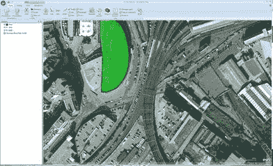
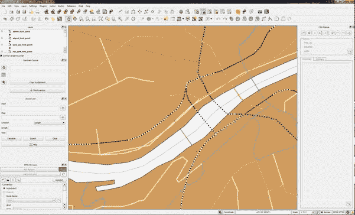
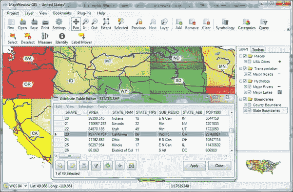

# 第 2 章软件

拥有一个设计良好的 GIS 数据库是很棒的，但除此之外你还需要什么软件？

除非你从头开始做所有事情，否则你需要某种编辑应用程序，某种方式来加载你的数据，而且很可能也需要某种实时数据。

主要问题是费用。您很快就会发现 GIS 软件可能是地球上最昂贵的软件市场之一。以美元计算，大多数这些应用程序的总体成本远远超过了小型办公室的典型年度操作系统站点许可证成本 - 通常仅在一个应用程序中为一个用户提供 6 个月。

对我们来说幸运的是，围绕 GIS 的巨大开源和自由软件运动主要由开源地理空间基金会（OSGeo）运营和管理。

OSGo 网站 [www.osgeo.org](http://www.osgeo.org) 是寻找当今市场上所有开源和空间工具链接的主要枢纽，以及指向教程，新闻和付费的许多链接供应商。他们是赞助商资助的组织，并依靠使用该软件的团体来改进它并将其反馈回系统。

对于那些不喜欢开源并且需要服务和支持合同的公司，许多可用的开源产品确实以较低的成本提供此类软件包。

让我们看看一些可用的选择。

## 数据库软件

### Postgres 和 PostGIS

这个组合是开源 GIS 场景教父对黑手党的看法。它是所有 GIS 数据库的祖父。它完全符合 OGC 标准，绝对坚如磐石，经过时间考验，并且得到了地球上每一位 GIS 软件的支持。

知道他们数据库的人会知道 Postgres 已经存在了很长时间。它最初是加州大学伯克利分校的产品，于 1986 年由计算机科学教授 Michael Stonebraker 创立。 1995 年，Stonebraker 的两名学生将 Postgres 扩展为 SQL，并于 1996 年将他们的创新留给了开源世界。

Refractions Research 意识到 Postgres 具有巨大的潜力，并且在 2001 年开始着手为服务器创建一个开源附加组件，以便为它们提供完整的地理和空间功能，最终生成 PostGIS。从那里，它已经发展成为企业的顶级数据库系统，并没有显示出放缓的迹象。

### MySQL

MySQL 从最初开发为一个简单易用的开源数据库，至少从 v3.23 开始包含基本的几何类型。它们可能早先存在，但在 3.23 之前没有它们的文档，并且在数据库的历史中没有提及它们。

版本 3.23 文档明确指出数据库不完全符合 OGC。特别是，不支持 **geometry_columns** 元数据表，并且例如，许多标准函数被重命名为以 G- **GLength** 为前缀，以免引起问题标准**长度**功能。不同版本的 MySQL 对 GIS 的支持水平值得怀疑。

在更新的版本中 - 我正在阅读 5.6 版文档，因为我输入了这个 - 核心引擎似乎更符合 OGC，我当然知道有人将它用作某些复杂 GIS 的核心组件。鉴于这是支持 GIS 操作的少数几个系统之一，因此无需安装第三方组件即可在空间上启用它。

MySQL 是一个非常强大和快速的系统。管理起来非常容易，并且在社区中获得了巨大的支持，尽管最近被甲骨文收购，因为它收购了 Sun Microsystems。它的未来仍然有点不确定，但有一件事是肯定的：它将在未来一段时间内保持在大多数 LAMP 和 WAMP 开源 Web 堆栈安装的中心。您可以在 [www.mysql.com](http://www.mysql.com/) 上了解有关 MySQL 的更多信息。

### SQL Server

由于本书适用于.NET 和 Microsoft 开发人员，因此我不打算深入研究 SQL Server，因为大多数读者已经了解了系统的许多功能。

核心产品中的 GIS 功能是一个相对较新的东西，直到 SQL Server 2008 才完全引入。在此之前，有一些非官方的第三方附加组件在空间上启用了 SQL Server 2003 和 SQL Server 2005，但这些从未真正实现过交付。我记得尝试过 SQL Server 2005 的附加组件，只有在调用某些函数时才会反复崩溃服务器！

即使 SQL Server 2008 具有 GIS 功能，但它可能是我在任何产品中看到的最符合 OGC 标准的 OGC 兼容性。

让我解释一下：SQL Server 2008 实现了 OGC 规范中所需的所有功能，如 **ST_GeomFromText** 或 **ST_Polygonize** 等功能。但是因为 SQL Server 是基于 CLR 的程序集，所以它不允许以相同的方式访问函数。我稍后会更深入地讨论 SQL;现在，请考虑以下事项：

**符合标准 OGC 标准的 SQL**

```
SELECT id,name,ST_AsText(geometry) FROM myspatialtable

```

**SQL Server 2008 符合 OGC 的 SQL**

```
SELECT id,name,geometry.astext() FROM myspatialtable

```

这种微小的差异会导致各种各样的问题。特别是，这意味着任何使用 SQL Server 2008 作为其后端的软件都需要专门的数据适配器（通常基于 ODBC），以符合 OGC 的方式将调用转换为服务器。实际上，大多数 GIS 软件最近才开始通过 ODBC 提供内置支持。

使用 SQL Server 的.NET 开发人员的一个积极方面是通过实体框架及其`Geometry`和`Spatial`类在.NET 中直接支持。如果你只是在.NET 平台上工作，那么就不需要使用除 SQL Server 之外的任何东西了。但是，如果您需要访问 GIS 以及基础 SQL 来操作它，那么 SQL Server 不是最佳选择。

官方 SQL Server 网站是 [www.microsoft.com/sqlserver/en/us/default.aspx](http://www.microsoft.com/sqlserver/en/us/default.aspx) 。

### SQLite 和 SpatiaLite

SQLite 不是严格意义上的数据库服务器，而是新一代单文件数据库引擎之一，旨在直接嵌入到您的应用程序中。 SQLite 在大量平台上提供了惊人的支持，可能是我有幸使用的最跨平台的工具包之一。

与已经提到的三巨头相比，SQLite 是一个相对较新的场景，但它运行得非常好并且非常高效，特别是在移动平台上。事实上，它在移动平台上非常好，它被选为 Android 设备和 Apple iOS 上的首选数据库引擎，并通过使用完全托管的.NET 界面在 Windows Phone 上提供全面支持。

SpaiteLite 是 SQLite 引擎的空间扩展，并不是那么幸运。它的源代码可用，但仅为 Windows 平台提供了构建的二进制文件。对于任何其他平台，您需要下载源，然后将其移植到您选择的平台。虽然这并不困难，但源代码都是标准的 ANSI C，并且可能有点棘手，特别是如果你的本机 C 或 C ++经验很少。

有一些二进制版本可用于 Windows 以外的平台，但这些版本非常分散且经常过时。还要记住，SpatiaLite 与许多基于 GIS 的开源软件一样，依赖于 Proj.4，GEOS 和其他库来提供其许多高级功能。如果您必须为您的平台自定义构建 SpatiaLite，您可能还必须自定义构建依赖库。

这会将 SQLite 和 SpatiaLite 排除在外吗？并不是的。我还没有找到任何可以在这么多不同的移动平台上使用这种一致的 API 的东西。虽然涉及一些工作，但在大多数情况下，为您的平台构建非常简单，当然也不比安装 Postgres / PostGIS，MySQL 或 SQL Server 时需要执行的工作复杂。但是，除非您需要具有普遍移动性的空间功能，否则 SQLite 和 SpatiaLite 可能不值得付出努力。

SQLite 网站是 [sqlite.org](http://sqlite.org/) 。其 .NET 界面可在 [http://system.data.sqlite.org/index.html/doc/trunk/www/index.wiki](http://system.data.sqlite.org/index.html/doc/trunk/www/index.wiki) 上找到。

SpatiaLite 网站可在 [www.gaia-gis.it/gaia-sins/index.html](http://www.gaia-gis.it/gaia-sins/index.html) 找到。

### Oracle Spatial

除非您是一家价值数百万美元的企业，否则您很可能无法访问 Oracle Spatial。 Oracle Spatial 对于商业世界来说是 Postgres 对开源世界的看法。

它很大，很饿，需要一条胳膊和一条腿才能获得许可证，学习曲线可能比攀登珠穆朗玛峰更陡峭。

英国的许多政府机构将其用于绘图和规划工作，而石油和天然气巨头等大型公司则在其周围部署数十亿美元的基础设施，以支持他们的调查工作。如果您处于使用此位置的位置，那么您很可能不会直接与系统通信;您已经为您设置了管理数据库可以执行的所有操作的软件。围绕 Oracle 构建的系统通常由 Oracle 顾问专门为特定目的而设计，并且同时具有围绕它们构建的完整工具包。我在本书中提到的大多数软件都不是 - 据我所知 - 能够连接到 Oracle Spatial;或者如果是这样，这样做的设置和操作非常复杂。

官方 Oracle Spatial 网站可在 [www.oracle.com/us/products/database/options/spatial/overview/index.html](http://www.oracle.com/us/products/database/options/spatial/overview/index.html) 上找到。

### 其余的怎么样？

那里有更多的数据库包。有些支持 GIS 开箱即用，有些则没有。其中一些需要第三方附加组件或涉及复杂的设置。

让其他人离开的原因是因为本书中没有足够的空间。如果您决定浏览其他数据库，可能需要查看以下内容：

*   MongoDB 在 [www.mongodb.org](http://www.mongodb.org/)
*   [paralleluniverse.co](http://paralleluniverse.co/) 的 SpaceBase
*   CouchDB 在 [couchdb.apache.org](http://couchdb.apache.org/)
*   [cartodb.com 上的 CartoDB](http://cartodb.com/)

特别是 SpaceBase 看起来很有趣。其主要目标是在多玩家游戏的近实时 3D 世界中跟踪和存储基于 MMO 的在线游戏角色和资产。

## GIS 桌面软件

为了操纵您的 GIS 资产，您需要一个良好的桌面应用程序 - 最好不仅允许您查看和操作数据，还允许您相对轻松地导入和导出数据。

后一点也很重要，因为某些应用程序的唯一目的是将数据移入和移出系统，而其他应用程序仅用于查看数据。移动数据的应用程序通常称为 ETL（提取，转换和加载）包。 ETL 软件包通常可用于许多数据库引擎，而不仅仅适用于那些用于操作地理空间数据的软件包。

幸运的是，大多数软件都可以让你做到这两点。从这些软件包开始，以下是一些比较知名的软件包：

### ESRI ArcGIS

作为市场上的重要参与者之一，ESRI 已经提供 GIS 和绘图软件已有 20 多年的历史。该软件就像许多 GIS 软件包一样：相当昂贵，而且对于大多数业余爱好者和中小型企业而言，其价格范围肯定超出了它。但是，ESRI 提供了一个名为 ArcGIS Explorer Desktop 的免费产品，可用于制作基本地图并生成您自己的地图数据。

有关 ArcGIS Explorer Desktop 的一点需要注意的是，它可用于查看 Bing 和 Google 的地图服务中的图像。正如您在下面的屏幕截图中看到的，我在英格兰纽卡斯尔市中心标记了一些功能：



图 5：ArcGIS Explorer 桌面中修改的现有地图

您可以在 [www.esri.com/software/arcgis/explorer](http://www.esri.com/software/arcgis/explorer) 上找到有关 ArcGIS Desktop Explorer 和其他 ESRI 软件的更多信息。

### Pitney Bowes MapInfo

与 ESRI 套件一样，MapInfo 是一个大型商业软件包，专为企业而设计。根据我自己的经验，我知道很多公用事业公司（如手机运营商）都在使用它来管理网络地图资产。与 Oracle Spatial 一样，除非您拥有适用于地理空间数据的专业管理系统，否则很少会遇到此程序包。

虽然它可以加载和使用 Bing，Google 等所有常见的地图格式和服务，但 MapInfo 的主要设计是处理大型，高度定制的 GIS 数据库中的非标准数据。它的优势在于能够使用自己的 MapBasic 编程语言进行扩展，该语言通常部署在许多自定义配置中。例如，它可以部署在无线服务的运营商控制台中，用于显示网络故障的位置，或者部署在用于跟踪其车辆的交付服务。

你可以在 [www.pbsoftware.eu/uk/products/location-intelligence/](http://www.pbsoftware.eu/uk/products/location-intelligence/) 找到更多关于 Pitney Bowes MapInfo 的信息。

### OpenJUMP

现在我们来到第一个开源桌面产品 OpenJUMP。它从一开始就设计为开源，它是使用 Java 平台构建的，正如预期的那样，它可以与当今使用的大多数 GIS 数据库进行通信。

它允许您加载和查看自己的空间数据，处理 shapefile 和 GML 文件，并将地图导出为 SVG 以便在 Web 上显示。

其主要目的是编辑映射数据，为 Web 使用创建矢量地图做准备。我个人从未使用 OpenJUMP，但它似乎是一个非常强大的包从头开始创建 Web 地图。


图 6：使用 OpenJUMP

您可以在 [www.openjump.org](http://www.openjump.org/index.html) 找到更多关于 OpenJUMP 的信息。

### 量子 GIS

我无从谈论量子 GIS（QGIS）的正义性。这个包可以做任何事情。它与 ESRI 和 MapInfo 等应用程序相同，完全开源，并得到 OSGeo Foundation 的正式支持。

主应用程序是使用 Python 编写的，因此可以在 Linux，Mac OS，Windows 以及桌面环境中支持 Python 的任何其他应用程序上运行。

现在，在 1.8.0 版本中，量子 GIS 的开发在相对较短的时间内建立了强大的实力。系统公开的扩展 API 简直令人惊叹，并且可以在每个级别进行自定义 - 从重新设计主 UI，到实时 GPS 跟踪之类的插件，再到应用算法创建全新的矢量图层到包中的不同层。

它是 OSGeo4W 的标准配置，它是 Windows 的开源地理空间软件集合，以及 Grass，MSYS，OpenEV 和许多其他软件。在 GDAL，pg2mysql 和其他许多工具的支持下，我发现这个包的唯一限制是你的想象力。

在处理所有可用的不同类型数据时，Quantum 是我的首选桌面工具。它可以轻松处理 Postgres 和所有其他主要数据库，导入和导出几乎所有已知的 GIS 文件格式。

它也是少数能够导入和导出 Google Earth（KML）文件的软件包之一，可直接用于使用 Google 的映射 API 的项目。当前版本现在还包括一个方便的地理空间文件资源管理器，这意味着您可以浏览和查看本地文件系统资源，而无需启动完整的 GUI。

在下面的屏幕截图中，您可以看到 QGIS 加载了一个多层矢量地图（英国的 Ordnance Survey Strategi 地图），放大了泰恩河畔纽卡斯尔市中心：



图 7：QGIS 中的多层矢量地图

在这个图中，您可以清楚地看到泰恩河的路径，当地的公路和铁路连接，甚至电力电缆等公用设施。加载的地图集即使放大，也包括整个英国的这些数据。

我可以单独写一本关于 QGIS 的书，但是现在如果你想了解更多，可以在官方 QGIS 网站 [www.qgis.org](http://www.qgis.org/) 上找到。

### MapWindow

MapWindow 的设计非常类似于以与 QGIS 类似的方式使用。其主要目的是通过各种功能完成桌面 GIS 应用程序可以执行的所有操作。

它也是唯一专门为 Windows 平台编写的，旨在通过其丰富的开发人员 API 和工具集来包含 Windows 开发人员社区。

MapWindow 有两个版本：MapWindow 4 和 MapWindow 6\. MapWindow 4 是原始的第一代 C ++版本，MapWindow 6 是最新的，最先进的重写，完全使用 C＃和标准.NET 编写运行。

目前，根据应用程序的 Codeplex 页面，两个版本都会更新并一起发布。这是因为 MapWindow 6 尚未达到与 MapWindow 4 相同的功能级别。正如您在下面的屏幕截图中看到的，它与 QGIS 非常相似：



图 8：MapWindow GIS 界面

要了解更多信息，请访问项目主页 [mapwindow4.codeplex.com](http://mapwindow4.codeplex.com/) 或 [mapwindow6.codeplex.com](http://mapwindow6.codeplex.com/) 。

### GeoKettle

值得一提的另一个应用是 GeoKettle。虽然这不是一个与其他应用程序在同一意义上的桌面 GIS 应用程序，但它同样重要。

GeoKettle 是一个 ETL 工具。其主要目的是在多种格式和多种类型的数据库之间转换然后加载数据。 GeoKettle 源于一个名为 Pentaho 数据套件的软件包，经过增强，可支持行业标准的 shapefile，KML 文件以及所有前面提到的数据库的空间特征。

一个简单易用的开源应用程序如何做得很好的一个光辉的例子是我的经验，看到许多人用基于 GeoKettle 的解决方案替换安全 FME 等高价位应用程序。

它采用 Java 编写，具有易于扩展的插件体系结构，可以轻松使用未来的文件格式和数据库。它也可以处理数据库和文件中的普通数据，而不仅仅是地理空间数据。如果您曾经使用过 Microsoft Business Intelligence Development Studio，那么使用 GeoKettle 会让您感到宾至如归，您将在下面的屏幕截图中看到：


图 9：GeoKettle 接口

如果您想了解更多信息，可以访问 GeoKettle 网站 [www.spatialytics.org/projects/geokettle](http://www.spatialytics.org/projects/geokettle) 。

### 剩余包裹

与数据库引擎一样，有太多的 GIS 桌面包供我列出。维基百科在 [en.wikipedia.org/wiki/List_of_GIS_software](http://en.wikipedia.org/wiki/List_of_GIS_software) 中有一个很好的地理空间和 GIS 软件列表，从高价到免费，包括我在这里介绍过的那些。

我个人最喜欢的是 QGIS 和 GeoKettle，但我鼓励你尝试所有你能做到的。多年来，我使用了许多桌面 GIS 软件包;有些人的学习曲线非常陡峭，有些人可以在不到五分钟的时间内完成学习。与任何事情一样，您应该选择能够以最佳和最简单的方式完成所需工作的工具。

另请注意，我列出的申请主要用于英国和欧洲。应用程序的普及程度因全世界而异。例如，我认为 IDRISI 是加拿大使用的流行包。本节中列出的应用程序是我在日常 GIS 工作中使用的应用程序。

正如我已经提到的，除了您选择的软件之外，您还有很多其他的东西需要处理。

## 开发套件

由于本书针对.NET 开发人员，因此我们在您自己的.NET 应用程序中包含可用于使用地理空间数据的工具包的部分是正确的。

我们稍后将介绍一些实际示例，但是现在我将列出我使用或使用过的套件。但请注意，这不是一份详尽的清单。我描述的工具包都是为在 Windows 平台上的.NET 下使用而设计的。正如我所提到的，像 QGIS 这样的应用程序可以大大扩展，Linux 和 Mac 系统下有许多工具包，我还没有，也可能不会涉及。如果您正在开始一个项目，您知道自己将要编写自定义用户界面，请事先进行研究。而不是从头开始编写它们，您可以根据自己的需要修改现有应用程序。

### MapWinGis

MapWinGis 是 MapWindow 4 和 MapWindow 6 背后的中心 GUI 组件。它是一个用 C ++编写的 OCX 控件，可以在 Windows 平台上支持 OCX 的任何语言中使用。

过去，我使用了此组件的原始版本。自从我使用它进行任何开发以来，已经有一段时间了。与许多这些组件一样，它在 [mapwingis.codeplex.com](http://mapwingis.codeplex.com/) 上有一个永久的 Codeplex。

它旨在为您完成大部分繁重工作，让您可以专注于应用程序的 GUI 方面。请注意，它设计用于桌面应用程序，而不是基于 Web 的应用程序，据我所知，不能在 WPF 或 Silverlight 中使用。

### DotSpatial

DotSpatial 是 MapWindow 稳定版的姐妹项目，实际上构成了新 MapWindow 6 .NET 重写的大部分核心。 DotSpatial 也在其引擎盖下引入了一些其他的 Codeplex 项目，最着名的是 GPS.Net 和 GeoFramework。两者仍然是单独提供的。

有关 DotSpatial 的一点值得注意的是，像 QGIS 一样，这个工具包得到了 OSGeo Foundation 的支持。作为其套件的一部分，它还将整个开源 GIS 开发人员库（包括 GEOS，Proj.4，GDAL 等）打包为即用型 Windows DLL，以直接包含在您的项目中。

项目主页可以在 [dotspatial.codeplex.com/](http://dotspatial.codeplex.com/) 的 Codeplex 上找到。

### SharpMap

SharpMap 是.NET 的旧工具包之一。它比 DotSpatial 要长一点。

它可以处理大多数类型的矢量和栅格数据，包括适用于整个地球的 NASA 蓝色大理石瓷砖。

根据其文档，SharpMap 库支持桌面和基于 Web 的项目（后者通过使用 AJAX Map 控件）。它还可以通过组合许多不同类型的叠加来创建自定义专题地图样式。

项目主页可在 [sharpmap.codeplex.com](http://sharpmap.codeplex.com/) 中找到。

### BruTile

虽然不是一个与其他人完全相同的完整 GIS 库，但 BruTile 做了一件事，做得非常好：它提供光栅切片和动态重组，以便平滑滚动和缩放库处理的任何输入。

实际上，SharpMap 和 DotSpatial 都使用 BruTile 为其栅格磁贴组件提供输出支持。它还用于显示在 [brutiledemo.appspot.com](http://brutiledemo.appspot.com/) 的 Silverlight 地图内运行的开放街道地图数据。

BruTile 可用于任何类型的项目，从 Web 和 Silverlight 到高端桌面应用程序。它还有一个适配器，允许它在自定义 ArcGIS 部署中使用。

项目主页位于 [brutile.codeplex.com](http://brutile.codeplex.com/) 。

### 还有更多......

与前面提到的其他软件一样，只有很多，更多可用。我在这里没有开始讨论的事实是 ESRI 和 Pitney Bowes 等所有主要参与者都提供了他们自己的 SDK。事实上，ESRI 的大部分利润来自提供 GUI 工具包，其使用方式与 MapWindow 大致相同。不幸的是，尽管我想这么多，但在这本短篇小说中还有太多内容。

### 演示

所以现在我们开始讨论这个非常重要的问题：我将在本书的演示中使用什么？

我已经有了 PostgreSQL 和 PostGIS 的设置，我的大多数空间 SQL 示例都将使用它来完成。您可以连接到 Postgres 的任何数据库管理工具都可以使用。但是，我将使用服务器附带的那个：pgAdmin。

除此之外，我将使用 Quantum GIS 来管理和显示数据，并演示如何使用 GeoKettle 加载一些数据。

对于编程示例，我将在 C＃语言中使用 Visual Studio 2010 Professional 中的 SharpMap。样本可以从 [bitbucket.org/syncfusion/gis-succinctly](https://bitbucket.org/syncfusion/gis-succinctly) 下载。

请注意，我不会介绍如何安装和初始设置任何这些应用程序。在大多数情况下，这是一个相当简单的操作，而且我认为这本书的读者很熟悉。如果您在安装软件时遇到任何问题，本书中提到的所有应用程序都有非常活跃的社区和帮助论坛。

对于那些熟悉 Stack Overflow 的人，可以在 [gis.stackexchange.com](http://gis.stackexchange.com/) 找到其特定于 GIS 的站点。

许多常客都有专业的 GIS 用户，他们对此有着非常深刻的理解。如果没有提供的帮助，本书的某些部分是不可能的，并回答我在那里提出的问题。我强烈建议任何在.NET 中使用 GIS 的人都会在网站上添加一个书签，并将书签添加到主 Stack Overflow 页面。