# 第 3 章将数据加载到数据库中

在我们开始探索 GIS 可以做什么之前，我们需要做的第一件事就是加载一些数据。

在本章中，我将在 Postgres 中加载三个 ESRI shapefile，以便稍后使用演示。其中前两个是基于点的文件，显示英国城镇的位置。第三个文件将是一个多边形文件，显示构成英国的所有县和自治市镇边界的轮廓。

对于那些不熟悉英国地理的人来说，县界在逻辑上将国家划分为行政区域，类似于美国各州或中国省份。

## 创建空间数据库

在我们开始向系统添加任何数据之前，我们首先需要创建一个用于存储数据的数据库。对于本书中的示例，我将创建一个简单的三表数据库，而不是如前所述的整个 GIS 模型。

如果您正在开发大型企业应用程序，我无法强调规划和设计在 GIS 数据库解决方案中的重要性。在许多方面，计划部分比普通数据库中的相同步骤更重要。对于 GIS 解决方案而言，进一步下线的故障和更改往往比一般的企业数据解决方案更昂贵，更复杂。

要创建数据库，我们将使用 Postgres 提供的数据库管理工具 pgAdmin。要启动 pgAdmin，请单击桌面上的 **pgAdmin III** 图标。如果没有看到图标，请确保在安装服务器时安装了管理工具。

一旦安装了应用程序并创建了与数据库服务器的初始连接，就可以开始在该服务器连接中创建数据库，如下图所示。

请注意，出于安全原因，我已从本书中显示 pgAdmin 的许多图中删除了服务器和表名，只留下了解您需要的那些。在您使用 pgAdmin 时，您将在完成我在此处介绍的步骤时看到更多信息。

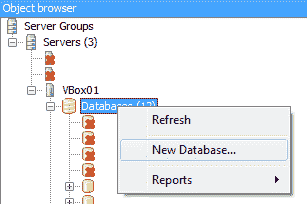

图 10：创建新数据库

右键单击服务器树中的**数据库**项目，然后选择**新数据库**。这将启动**新数据库**对话框。

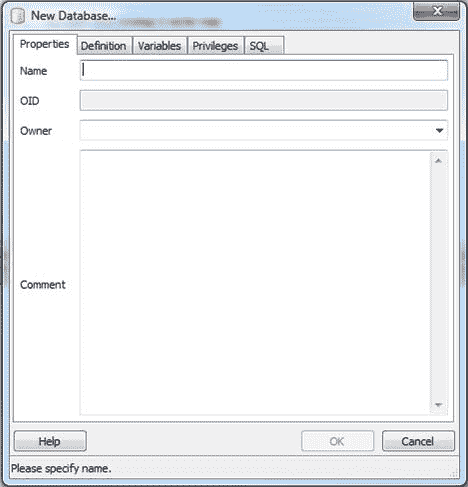

图 11：命名新数据库

很容易看出需要去哪里。我们需要做的就是为数据库提供名称和所有者。如果您愿意，可以填写**评论**字段;其余的你通常可以使用默认设置离开。填写完字段后，对话框应如下所示：

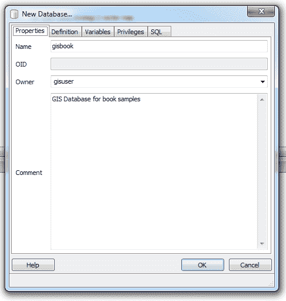

图 12：完成的新数据库对话框

大多数 Postgres 安装程序创建一个模板，以便在使用此类或类似对话框时帮助创建空间数据库表。在我们点击 **OK** 之前，我们需要导航到 **Definition** 选项卡并选择要使用的模板，如下图所示：

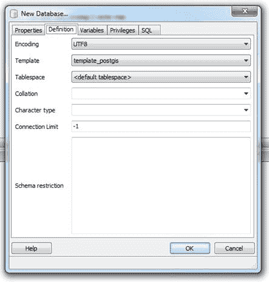

图 13：从定义选项卡中选择模板

此选项卡中的所有其他选项可以保留原样。单击**确定**后，pgAdmin 将返回主显示屏，您将看到新数据库出现在服务器树中。

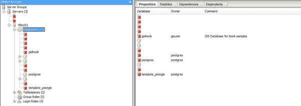

图 14：添加到服务器树的新数据库

也可以使用标准 SQL 命令手动创建数据库，例如`Create Database`和`Create Table`;但是，使用这些可能是一个漫长的过程。

Postgres **Contrib** 目录（位于您选择安装 Postgres 的位置）中有脚本，您可以加载和运行这些脚本以创建所需的所有空间函数和元数据表。由于我已经完成的 Postgres 的每次安装都包含了 pgAdmin，因此我发现使用 GUI 更容易，更快捷。另请注意，即使您在 Ubuntu 等平台上安装数据库，也可以从 Postgres 网站单独下载 pgAdmin 工具，并将其安装在标准 Windows 计算机上以管理服务器。

创建数据库后，可以展开服务器树中的对象以显示新空间数据库中的不同表和对象。

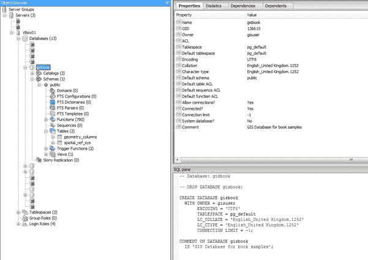

图 15：探索新数据库

### 关于 Postgres 用户的附注

阅读此内容的许多人可能习惯于将 MS SQL Server 用于您的数据任务。 Postgres 与 SQL Server 一样，支持多个用户帐户。但是，您需要小心使用 root 管理员帐户。

在 MS SQL 中，超级用户帐户（通常是 **sa** ）可以最终控制整个数据库。在 Postgres 下，等效的超级用户帐户被称为 **Postgres** ，但与 MS SQL 不同，可以防止 Postgres 用户与其他表进行交互。

如果使用 Postgres 帐户创建所有表，则不会出现问题，但如果您创建数据库，然后将这些数据库的所有权分配给您在服务器中创建的其他用户名，则可能会发现 **Postgres** 用户帐户无法使用它们。

在 QGIS 中打开数据库层时，很可能会出现此问题。如果使用给定的一组凭据创建数据库连接，并使用 **Postgres** 用户帐户在 pgAdmin 中创建数据库，您会发现空间元数据表将 **Postgres** 为他们的主人。发生这种情况时，QGIS 将无法打开元数据表，并且不会显示可供您在应用程序中使用的任何层。

解决方案非常简单。使用 pgAdmin，右键单击其中一个元数据表，然后选择 **Properties** 选项，如下图所示：

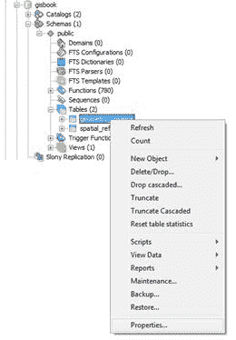

图 16：编辑元数据表属性

将出现表格的**属性**对话框。

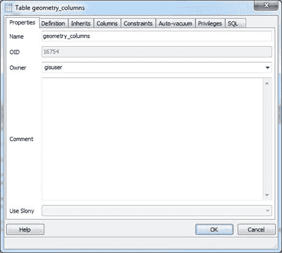

图 17：编辑 geometry_columns 表属性

**Owner** 字段提供服务器中定义的用户的下拉列表。选择您在应用连接中使用的所有者。

### 重访元数据表

如果你还记得我们在本书前面的讨论，我们讨论了空间元数据表以及它们在宏观方案中的重要性。

如果您已正确创建空间数据库，则应在服务器树中看到两个表： **geometry_columns** 和 **spatial_sys_ref** 。右键单击它们并选择**查看数据**将允许您检查其中的内容，如下图所示。

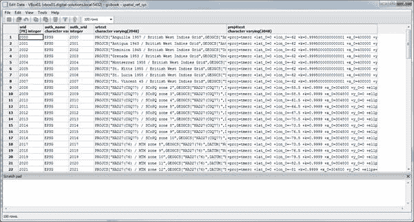

图 18：spatial_sys_ref 表

图 19：geometry_columns 表

如您所见，geometry_columns 表最初为空。当我们将数据加载到我们的数据库中时，这将开始填满。

## 使用 QGIS 加载点

Quantum GIS 有一个很棒的小工具，叫做 **SPIT** （Shapefile 到 PostGIS 导入工具），其唯一目的是将 ESRI shapefile 插入 Postgres。

在实践中，我发现如果您尝试导入的 shapefile 中有一点点损坏或非标准数据，它会很容易让人感到沮丧。尽管它很脆弱，但它仍然是 QGIS 用户将数据导入数据库的最常用工具。

通过单击 QGIS 工具栏上的小蓝象图标激活 SPIT，如下图所示：

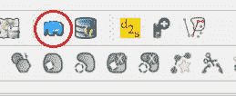

图 20：激活 SPIT

一旦 SPIT 加载并显示其主界面，您应该看到以下内容：

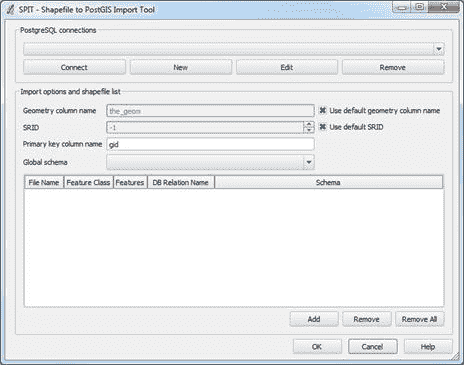

图 21：SPIT 接口

界面相当不言自明。 **PostgreSQL** **连接**区域是您可以找到列出的 SQL 数据库的任何连接的地方。 **导入选项**用于指定数据的 SRID 以及数据导入的其他选项。

您的 PostgreSQL 连接列表在此处与主应用程序之间共享。如果您已经在 QGIS 中创建了连接，只需从下拉列表中选择它并单击 **Connect** ，您就可以在此重复使用它。

但是，出于本练习的目的，我们将创建一个新连接来保存我们的数据。首先，单击 **PostgreSQL 连接**下的 **New** 。将出现**创建新的 PostGIS 连接**对话框。

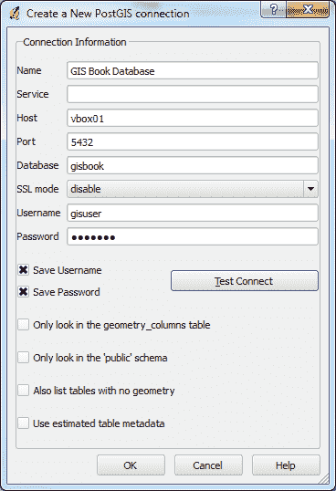

图 22：创建新的 PostGIS 连接

完成如图 22 所示的字段，记住要根据自己的 Postgres 安装需要替换服务器名称，数据库名称，用户名和密码。

您不必保存密码和用户名，但如果您不必每次都输入凭据，则可以更轻松地进行连接。

不需要四个取消选择的选项。它们用于控制以下内容：

*   **只查看 geometry_columns 表**：这个选项正是它所说的。默认情况下，QGIS 将查看数据库中的所有表，以查看其中是否包含空间几何。选中此复选框可防止这种情况。
*   **只查看公共模式**：如果使用不同的模式对数据库进行逻辑划分，选择此选项将使 QGIS 仅查看 **public** 模式（相当于 **DBO** ]在 MS SQL 中）。
*   **同时列出没有几何图形的表格**：选择此选项将使**添加图层**对话框中的 QGIS 列表没有地理数据。
*   **使用估计表元数据**：如果您有一个未在 geometry_columns 表中注册的表，选择此选项将使 QGIS 猜测数据类型，而不是检查表中的数据以确定几何类型。

字段完成后，单击 **Test Connect** 按钮。测试应该是成功的。

单击**确定**保存连接并将其注册到 **SPIT** 工具中。

返回 **SPIT** 对话框后，单击**连接**，然后使用**添加**按钮浏览并加载英国城镇的形状文件。

您可以从 [bitbucket.org/syncfusion/gis-succinctly](https://bitbucket.org/syncfusion/gis-succinctly) 下载样本 shapefile。

一旦你设置了其他选项，如 **SRID** - 为这些演示提供的所有文件都在 UK-OSGB36，SRID 27700 和**几何列名**，你的 **SPIT** 对话框应类似于下图：

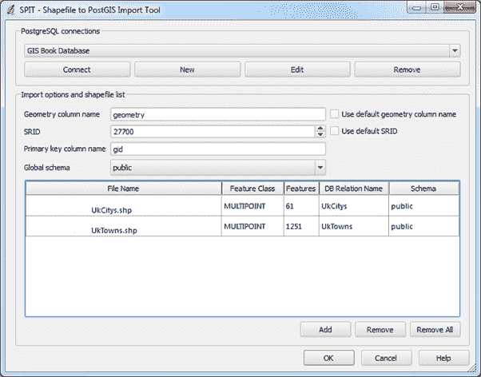

图 23：完成的 SPIT 对话

单击**确定**将您的数据添加到 Postgres 数据库并创建所需的任何表和其他对象。如果你在添加数据后回到 pgAdmin 并查看 **geometry_columns** 表，你会发现它现在有两个条目。

SPIT 完成后，您应该可以返回主 QGIS 窗口并显示 Postgres 矢量图层。我们暂时不会这样做;接下来我们将使用 GeoKettle 加载县边界多边形。

## 使用 GeoKettle 加载边界多边形

有时您需要对数据加载过程进行更多控制。例如，在将数据导入数据库之前，您可能需要组合两个文件并对数据进行一些转换。

当您需要超越使用 SPIT 的简单加载时，您需要使用 ETL（提取，转换和加载）工具，例如 GeoKettle。如前所述，GeoKettle 是一个专门的 ETL 包，可以了解地理空间数据及其所有特殊元数据。

与 Postgres 和 QGIS 一样，我不打算介绍安装过程。如果您下载 Java 安装程序版本，这是相当简单的。由于它需要运行 Java，因此请确保您的计算机上安装了最新的 Java VM。

安装 GeoKettle 后，打开程序。您应该看到类似于以下屏幕截图的内容：

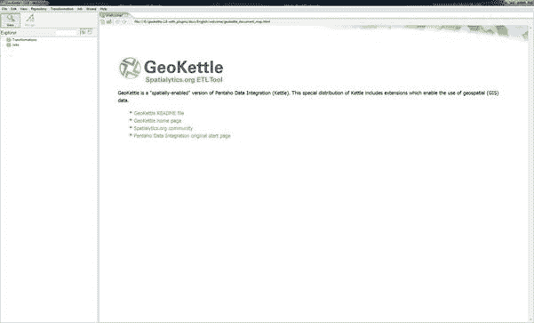

图 24：GeoKettle 主屏幕

使用 GeoKettle 背后的概念与您可能熟悉的常规点击式方法略有不同，但一旦您习惯了使用 GeoKettle，就很容易。

### 转型和工作

如果单击**文件**菜单并选择**新**，您将看到有两个选项：**转换**和**作业**。这里的想法是，许多转换构成了一项工作，允许您将任务分解为更小的块，然后使用序列重新组装它们。

如果您曾在.NET 中进行过任何工作流程编程，那么您将熟悉单独工作单元的概念，并对这些部分进行排序以执行整个任务。使用 GeoKettle 是一样的想法。对于我们将要实现的目标，我们只需要一个简单的转换，因此选择 **New** 下的 **Transformation** 项。

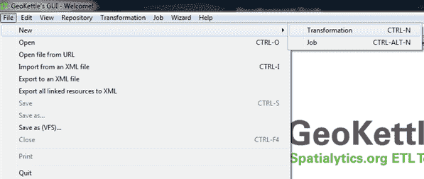

图 25：GeoKettle 文件菜单

### 添加转换步骤

一旦有了新的 GeoKettle 工作台，您就会注意到屏幕左侧的设计器调色板。

要构建变换，请将必要的步骤从此调色板拖到工作表面，然后按住 **Shift** 并在它们之间拖动将它们连接在一起。

然后数据按照您的连接方向从一个步骤流向另一个步骤，在通过时执行所需的步骤。

为了将 shapefile 添加到数据库，我们需要三个转换步骤：

1.  shapefile 输入。
2.  设置 SRID 转换。
3.  表输出。

让我们从添加输入步骤开始。在设计调色板中选择**输入**文件夹，然后将 **Shapefile 文件输入**拖到工作台上，如下面的屏幕截图所示：

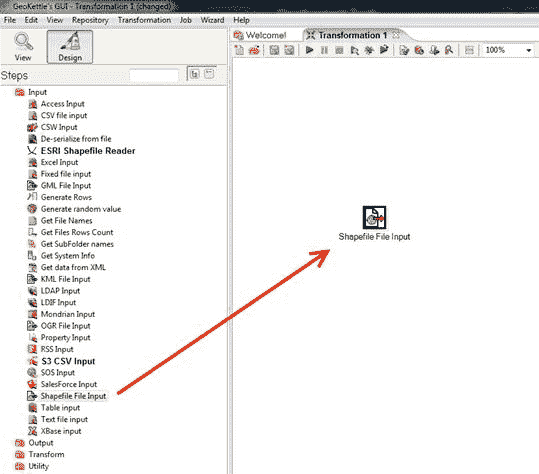

图 26：向转换添加 Shapefile 输入步骤

打开设计器调色板中的 **Output** 文件夹，并将**表格输出**添加到转换中。

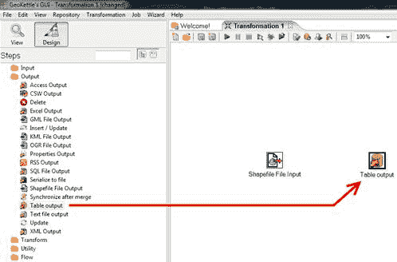

图 27：将表输出步骤添加到转换

打开设计器调色板中的 **Transform** 文件夹，然后添加 **Set SRS** 步骤。

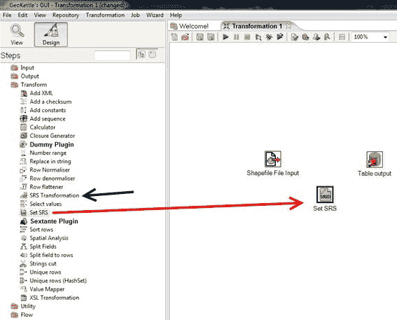

图 28：为转换添加一套 SRS 步骤

注意图 28 中的黑色箭头指向 **SRS Transformation** - 注意不要使用这个，因为它是一个实际的数据转换。如果您将数据从一个空间系统转换为另一个空间系统，您可能会发现需要这样做;例如，如果您有从 GPS 设备录制的 GPS 课程，它可能在 WGS84 坐标空间中，但您可能需要将其更改为与您的地球区域匹配的本地 UTM 系统。

**设置 SRS** 不转换实际坐标值;它只是设置您要添加的数据的 SRID。您必须确保此 SRID 是正确的值;否则，当您尝试演示或投影数据时，几何图形将显示在与预期完全不同的位置。

将必要的步骤添加到工作区后，需要连接它们。要执行此操作，请单击其中一个步骤将其选中，按住 **Shift** ，然后单击并拖动到要连接的步骤。可能令人困惑的一件事是，当您将指针从一个步骤拖动到下一个步骤时，GeoKettle 不会绘制一条线。只需将指针移动到下一个转换步骤，并在到达时释放鼠标按钮。

对于我们的示例，将 **Shapefile 文件输入**连接到**设置 SRS** ，然后将**设置 SRS** 连接到**表输出**。如果一切按预期进行，您应该看到如下内容：

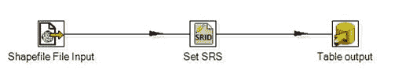

图 29：连接转换步骤

### 配置步骤

一旦连接好所有内容，就应该准备好配置所有内容。我们首先配置 shapefile 输入。双击 **Shapefile 文件输入**步骤以访问其属性。

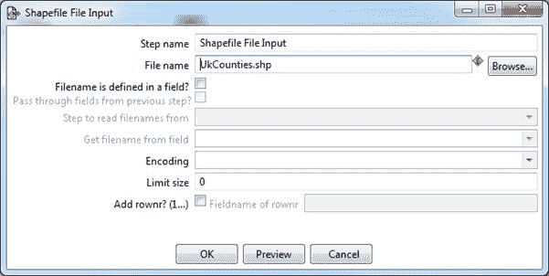

图 30：配置 Shapefile 输入

我们唯一需要改变的是文件名。单击**浏览**按钮，浏览到您下载的英国县界的样本 shapefile 的位置，然后单击**确定**。

在单击 **OK** 之前，您可以使用**预览**按钮快速查看文件。单击**预览**后，系统将提示您要预览多少行。

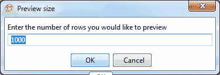

图 31：预览 Shapefile 输入

输入 **0** 将显示输入文件中的所有行。单击**确定**显示预览。 GeoKettle 将打开该文件，并向您显示数据的电子表格视图以及文件中的任何属性。

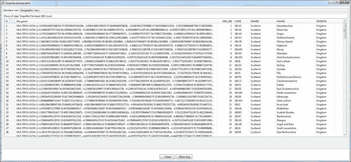

图 32：Shapefile 数据预览 - 标准视图

您可以单击顶部的**地理视图**选项卡查看以下内容：

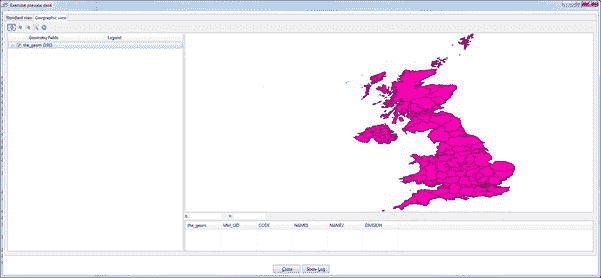

图 33：Shapefile 数据预览 - 地理视图

预览完数据后，单击**关闭**。单击 **Shapefile 文件输入**对话框中的 **OK** ，完成 shapefile 输入设置。

我们需要做的下一件事是设置我们的 SRS 选项。在我们的例子中，正如您在预览数据时可能已经注意到的那样，我们的县边界 shapefile 实际上是在 WGS84（SRID 4326）坐标空间中。如前所述，我们不会实际转换此示例数据的坐标，但在生产系统中，强烈建议您在同一坐标空间中匹配所有数据。如果我是为生产系统执行此操作，我将使用 SRS 转换步骤并实际将坐标更改为 OSGB36（SRID 27700）。对于这个例子，我保持尽可能简单。

如果您想尝试转换数据，请注意您需要两个**设置 SRS** 步骤， **SRS 转换**步骤两侧各一步，以确保您拥有正确的空间 ID 进入和退出转型。

继续我们的示例，让我们设置这个数据所需的单一 SRID。双击**设置 SRS** 步骤打开其对话框;你应该看到以下内容：

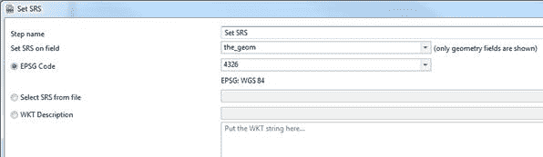

图 34：配置设置 SRS 步骤

对于**设置 SRS 字段**下拉列表，选择正确的字段以设置几何图形。通常在 shapefile 中称为 **the_geom** 。在 **EPSG 代码**字段中，为数据选择正确的空间 ID。在我们的例子中，它将是 SRID 4326（WGS84）。您可以通过下拉列表查看有多少 SRID 坐标空间。您只需输入 **4326** ，而不是浏览整个下拉列表。

设置 SRID 后，单击 **OK** 确认 SRS 设置。

最后一步是设置**表输出**和相关的数据库连接。双击**表输出**步骤打开其配置对话框，如下图所示。请注意，我已经填写了连接和目标表详细信息。

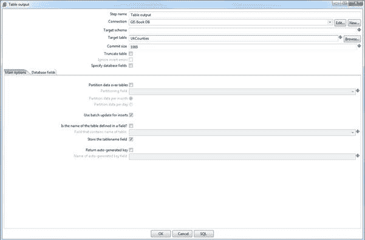

图 35：表输出配置

您要做的第一件事是创建一个新的数据库连接。单击**连接**字段旁边的**新**按钮。将出现**数据库连接**对话框。

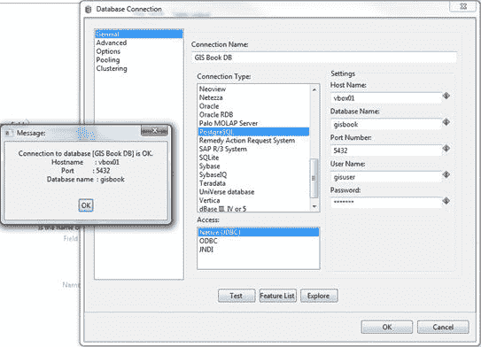

图 36：添加新数据库连接

再次针对图 36，我已经填写了我的详细信息，但您应该能够轻松地看到 GeoKettle 支持各种各样的数据库类型。

在**连接类型**下，选择 **PostgreSQL** 。在 **Access** 下，选择 **Native JDBC** 并填写相应的详细信息，以便在使用 QGIS 添加点数据时连接到您连接的同一数据库。

完成后，为连接命名，然后单击 **Test** 按钮。您应该看到一个小对话框，指出与数据库的连接正常，如上图所示。单击 **OK** 关闭对话框，然后单击**数据库连接**窗口中的 **OK** 返回**表输出**选项。

接下来，您必须设置目标表名称，以便转换步骤知道插入数据的位置。您可能还需要选中 **Truncate 表**复选框以确保表在启动之前没有数据。其他表输出设置通常可以保留原样。

如果您是第一次创建数据，则需要单击窗口底部的 **SQL** 按钮以自动生成并运行在数据库中创建初始表所需的 SQL。如果您正在使用现有表，那么这将为您提供确保表模式与数据匹配所需的 SQL。这是相当简单的，如果您对 SQL 有任何了解，您将立即看到正在发生的事情。

我经常在 SQL 对话框中做的一件事就是添加一个主键，因为 GeoKettle 不会自动添加一个主键。有一些转换步骤可以添加主键等，但我发现通过手动输入额外的行来创建表时，更容易在 SQL 编辑器中添加额外的字段。在下图中，您可以看到我在 Postgres 中添加了一个带有 GID 定义的主键。

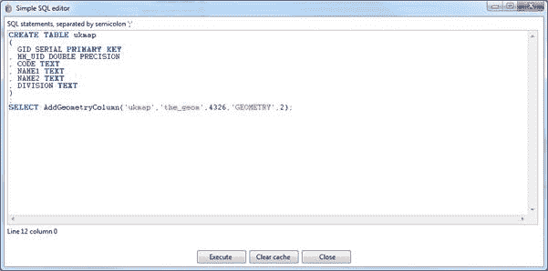

图 37：添加主键

编辑完 SQL 后，单击**执行**运行它。成功运行 SQL 后，可以单击**关闭**退出 SQL 编辑器，然后单击**确定**导航回转换工作区。您已完成设置所需的步骤。

当你到达这一点时，转到**文件**＆gt; **保存**以保存加载脚本。除非您的文件已保存，否则 GeoKettle 将拒绝运行转换。保存脚本并准备好运行转换后，单击工具栏中的绿色播放箭头。

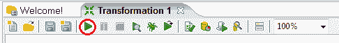

图 38：运行转换的按钮

将出现**执行转换**窗口。

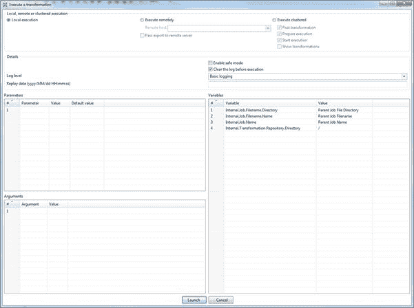

图 39：执行转换窗口

99％的情况下，您不需要在此窗口中更改任何内容。单击**启动**按钮，工作区中的下部窗格将显示转换进度。

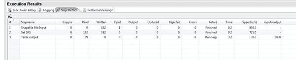

图 40：查看转换结果

当所有**活动**列条目切换到**已完成**时，您应该有一个装有县多边形的数据库;你现在准备开始试验了。

如果任何步骤变为红色并显示**已停止**，则表示您遇到问题。问题的详细信息和堆栈跟踪将显示在 **Logging** 和 **Execution History** 选项卡中。不幸的是，尽管我希望能够列出你在这里看到的每一个可能的问题，但我根本不能。当 GeoKettle 失败时，它只释放堆栈跟踪并拒绝进一步执行任何操作。对于普通开发人员来说，这可能不是问题，但对于非技术用户来说，它确实看起来非常可怕。

我对转换问题的经验是，它们通常是某种数据格式问题;例如，目标服务器的转换步骤中的错误设置会吐出其默认数据，因为它不喜欢 SQL GeoKettle 刚刚发送给它的东西。

每当我收到停止条件时，我将 **Logging** 窗格的输出复制并粘贴到文本编辑器中，这样我就可以在一个更易于阅读的窗口中开始检查 SQL 语句并诊断堆栈跟踪。

完成所有转换步骤后，您可以关闭 GeoKettle 并返回 Quantum GIS。使用您在使用 SPIT 加载数据时创建的连接，您可以查看数据库中现有的数据。

## 预览数据

如果我们打开 Quantum GIS 并开始一个新项目，我们首先需要做的是设置项目属性。我们通过导航到**设置**＆gt;来完成此操作。 **工具栏中的项目属性**。

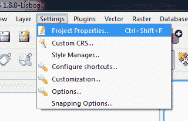

图 41：在量子 GIS 中打开项目属性

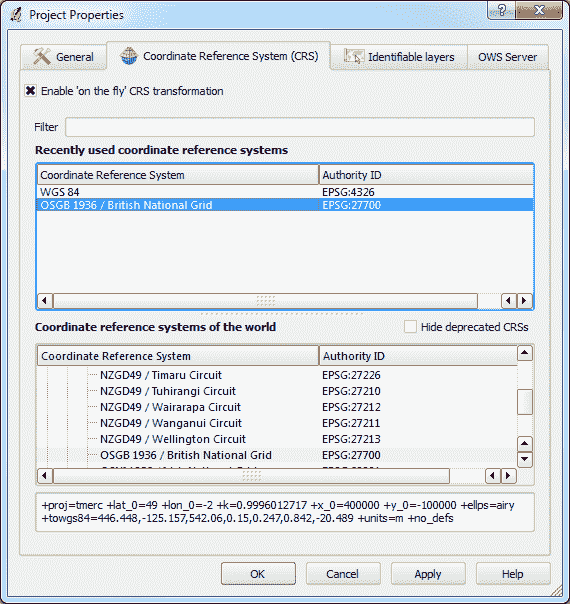

图 42：量子 GIS 项目属性

在**项目属性**中，选中**启用'即时'CRS 转换**复选框，因为我们的数据库中有 SRID 27700 和 SRID 4326 坐标系。正如您在图 42 中所看到的，我为我的项目选择了 OSGB36（SRID 27700），因为我居住在英国。如果您愿意，可以为您的项目选择 WGS84。如前所述，选择特定于您所在位置的坐标系是一种很好的做法。

选择坐标系后，单击 **OK** 返回主 Quantum GIS 工作区。

现在我们需要从数据库开始添加矢量图层。单击工具栏上的蓝色**添加数据库层**图标。您将看到**添加图层**对话框，并应立即识别对话框顶部的 **Connections** 下拉菜单;它看起来就像你在 SPIT 中使用的那个。

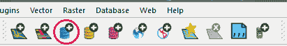

图 43：添加数据库层图标

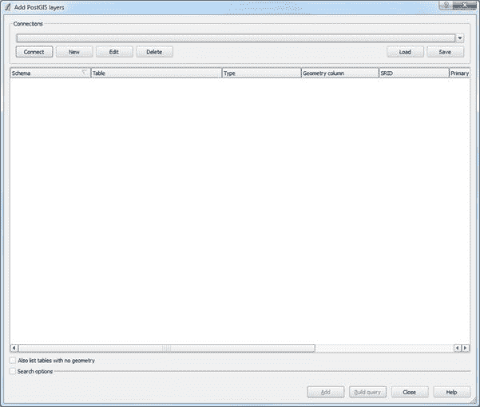

图 44：添加数据库层

从下拉列表中选择要使用的连接，或者像在 SPIT 中一样创建一个新连接，然后单击**连接**。将显示 Postgres 数据库中存在的矢量图层列表，如下图所示：

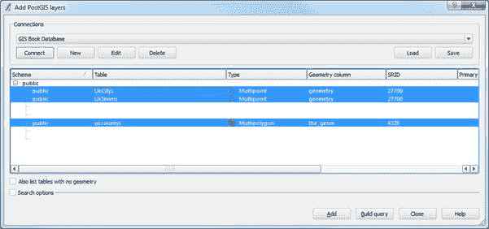

图 45：可用的矢量图层

如您所见，我们先前导入的两个点图层和我们使用 GeoKettle 导入的多边形图层都可用。选择所有这些并单击**添加**。

经过一些处理后，根据您的计算机和数据库速度，QGIS 应该显示图层，希望有三种不同的样式。

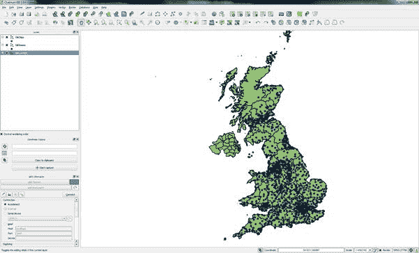

图 46：三层加载地图

如图 46 中的示例所示，县界为绿色，城镇为深蓝色，城市为粉红色。

如果你的显示器看起来像我的，那么恭喜你，你刚刚创建了你的第一个空间数据库。现在我们开始使用这些数据。