# 第 5 章在.NET 中创建 GIS 应用程序

最后，我们来到大多数人一直在等待的部分：在.NET 中创建一个支持 GIS 的小型桌面应用程序。

在本章中，我使用 Visual Studio 2010 Ultimate 进行任何截图，我的代码使用 C＃。

对于使用过任何 Microsoft .NET 语言和编辑器的任何人来说，将我在此处展示的内容与您正在使用的环境相匹配应该不会有太大问题。

## 正在下载 SharpMap

在我们做任何事情之前，我们需要下载 SharpMap;这是我们将要使用的 GIS 框架。由于 SharpMap 目前正在进行大量更改和一般重构，因此最好从 SVN 下载源文件并编译自己的版本，而不是使用预编译的下载。

在浏览器中，导航至 [http://sharpmap.codeplex.com/](http://sharpmap.codeplex.com/) 并单击**源代码**选项卡。单击**下载**以获取最新的变更集作为 zip 文件 - 它大约 180 MB。或者，您可以单击**连接**以获取使用常规客户端连接到 TFS 或 SVN 存储库的地址。

将源同步或解压缩到硬盘驱动器后，启动 Visual Studio，打开 **trunk** 文件夹，然后打开 **SharpMap.sln** 解决方案。

加载完所有内容后，**解决方案资源管理器**应该如下面的屏幕截图所示：

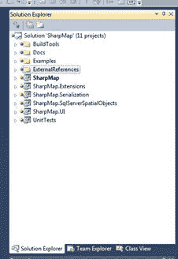

图 68：SharpMap 解决方案

如果所有内容都正常加载，您应该可以单击 **Build Solution** 来获取当前的二进制文件。我通常构建所有的配置，所以我选择 **Release** 然后 **Build** ， **Debug** 然后 **Build** ，依此类推。你选择建造的东西取决于你。

一旦所有内容成功构建，您就可以关闭此项目并自行开始了。

## 创建我们自己的 SharpMap 解决方案

运行 Visual Studio 实例或重用您仍然打开的实例，并创建一个新的 Windows 窗体应用程序。

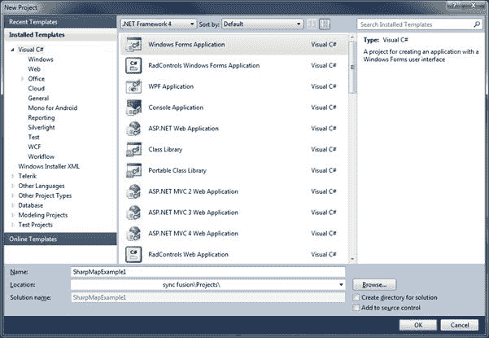

图 69：启动新的 Windows 窗体应用程序

确保您使用的是.NET 4.当前版本的 SharpMap 针对.NET 4 及更高版本。

您需要做的第一件事是双击**解决方案资源管理器**中的**属性**并从 **.NET Framework 4 客户端更改所选的**目标框架**将**配置文件 **.NET Framework 4** 。

| 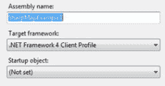 |  | 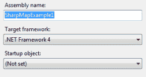 |
| 图 70：更改目标框架 |

现在我们需要将 SharpMap UI 组件添加到我们的工具箱中。双击**解决方案资源管理器**中的 **Form1.cs** 以加载工具栏选项板。右键单击 **General** 下方的空白区域，然后选择 **Add Tab** 。为选项卡命名。在我的应用程序中，我调用了 SharpMap 选项卡。

创建调色板后，展开调色板并右键单击**调色板**区域。从出现的菜单中选择**选择项目**。应显示**选择工具箱项目**对话框。

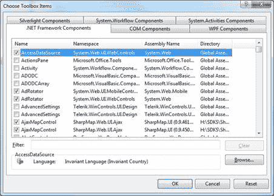

图 71：选择工具箱项目

单击**浏览**按钮并导航到解压缩 SharpMap 工具包的位置。导航到 **SharpMap.UI** ＆gt; **bin** ＆gt; **调试**，然后选择 **SharpMap.UI.dll** 。

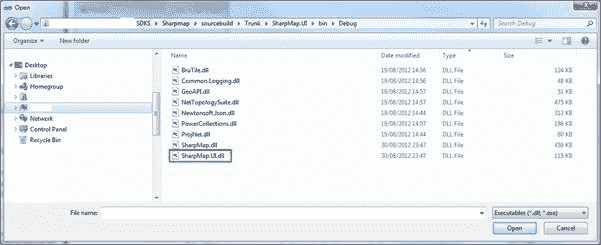

图 72：将 SharpMap 添加到工具箱

单击**打开**，然后导航回 Visual Studio 主屏幕。您应该在工具箱中看到以下内容：

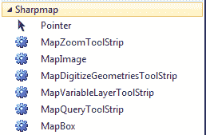

图 73：工具箱中的 SharpMap 和工具

您可能还会发现 **SharpMap** 和 **SharpMap.UI** 已自动添加到您的项目参考中。如果您启动了一个新项目并且已经将工具加载到工具箱中，那么您需要手动添加对项目的引用。要执行此操作，请右键单击项目中的 **References** ，然后浏览到添加 SharpMap.UI.dll 的相同位置。添加 **SharpMap.dll** 和 **SharpMap.UI** 参考。添加这些 DLL 后，重新加载 **References** 对话框。

我们需要添加一些位于解决方案中其他文件夹中的 DLL。

浏览 **SharpMap.Extensions** 项目文件夹，并进入 **Bin** ＆gt; **根据需要调试**或**发布**。选择并添加以下 DLL：

*   BruTile.dll
*   GeoAPI.dll
*   Npgsql.dll
*   SharpMap.Extensions.dll

您的项目引用应类似于以下屏幕截图：

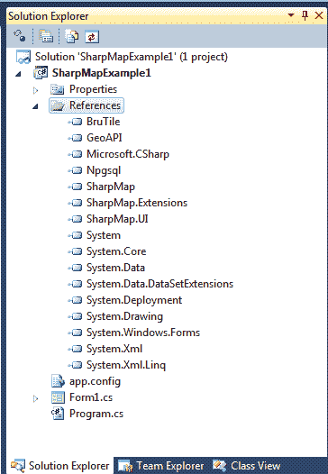

图 74：添加参考文献

现在我们准备将 GUI 放在一起了。

将表单大小设置为 1000×800 左右，将 **StartPosition** 属性更改为 **CenterScreen** ，并将标题文本更改为 **Sharp Map Example 1** 。

我通常将表单重命名为 **formMainForm** ，但这完全取决于您选择的名称。如果您将表单命名为不同的名称，则在开始编码时需要相应地调整源代码。

现在我们需要在设计器中将五个组件拖到我们的表单上。他们是：

*   来自 SharpMap 工具的 MapBox。
*   两个 Button 控件和 Common Controls 中的 ListBox。
*   来自菜单和工具栏的 StatusStrip。

将两个按钮重命名为 **btnZoomAndPan** 和 **btnQueryCounty** 。将它们的显示文字更改为**切换到缩放＆amp;平移模式**和**分别切换到县查询模式**，然后将它们放在表单的左上角。根据需要调整大小以适应文本。

选择 **StatusStrip** 控件并将其重命名为 **StatusBar** 。然后单击**项目 - （集合）**属性以启动**项目集合编辑器**。单击状态栏左侧的下拉菜单并添加 **StatusLabel** 。将新标签重命名为 **lblStatusText** 并从 **Text** 属性中删除文本。

将 ListBox 控件的宽度设置为与按钮控件的宽度相同，并将其放在它们下面。将其高度拉伸到底部状态栏的正上方。将列表框的名称设置为 **lsbCountyResults** ，然后单击其 **Anchor** 属性并将其设置为 **Top，Left，Bottom** 。

最后，使用表单上的其余空间为您的地图框。将其底部与列表框对齐，并将其 **BackColor** 属性设置为 **White** 。将其名称更改为 **mpbMapView** ，并将 **Anchor** 更改为 **Top，Bottom，Left 和 Right** 。

完成的 UI 应类似于以下内容：

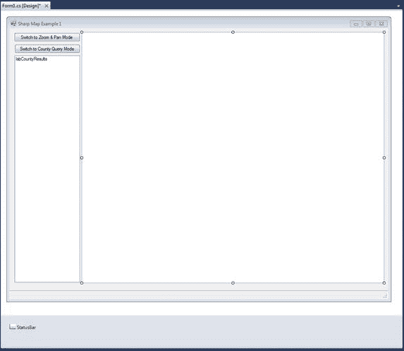

图 75：完成的 SharpMap UI

## 添加代码

现在我们有了一个好看的用户界面，现在是时候开始为我们的应用添加功能了。

使用 MapBox 控件非常简单。这个概念只是创建图层，然后将这些图层添加到控件中，然后控件将呈现并显示它们。

每个图层可以具有不同的空间参考和坐标系，并且地图控件可以动态地重新投影和转换坐标。但是对于这个例子，我们将让 Postgres 为我们完成所有工作。

加载并运行 pgAdmin，并登录包含我们之前加载的数据的数据库。展开对象树，直到可以看到所有表和其他对象。

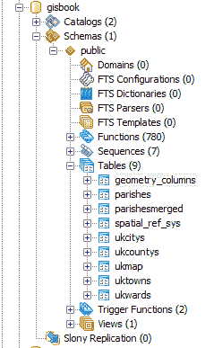

图 76：pgAdmin 中的对象树

如图所示， **Tables** 节点下面是一个名为 **Views** 的绿色小图标。您可能以前在其他数据库中使用过这些。一般的想法是，他们将来自其他表的数据投影到不同的模式，但客户端应用程序看起来好像是一个真正的表。

典型的用途是从通过外键链接的不同表中获取行，并呈现组合数据的简单平面视图，其中所有当前项目形成单行而不是层次结构。

对于我们的演示，我们将把我们的城镇和城市点重新投影为 WGS84（SRID 4326）以匹配英国县层的坐标。我们首先右键单击 **Views** 并创建一个新视图。

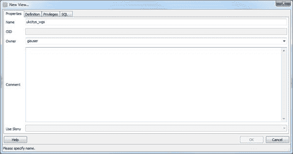

图 77：创建新视图

为视图命名 - 我将其命名为 ukcitys_wgs - 并为您的数据库登录设置正确的用户。

切换到**定义**选项卡并输入以下 SQL：

```
SELECT ukcitys.gid, ukcitys.number, ukcitys.name, ukcitys.admin_name, st_transform(ukcitys.geometry, 4326) AS geometry FROM ukcitys;

```

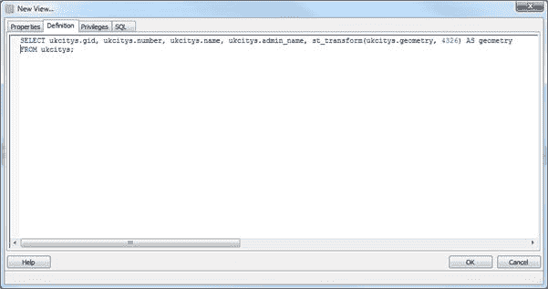

图 78：设置数据库登录

正如您在我们的 SQL 和图 78 中所看到的，我们使用`ST_Transform`将我们的点从 OSGB36（SRID 27700）转换为 WGS84（SRID 4326）。结果是，当执行 ukcitys_wgs 的`SELECT`时，表格布局将与 ukcity 相同，但几何图形将位于新坐标系中。

视图在 GIS 中解决了许多类似的问题，您会发现 GIS 数据库对它们的使用非常广泛。

重复这些步骤并使用以下 SQL 创建 **uktowns_wgs** ：

```
SELECT uktowns.gid, uktowns.number, uktowns.name, uktowns.admin_name, st_transform(uktowns.geometry, 4326) AS geometry FROM uktowns;

```

### 一个小问题......

对于所有这些视图，它们在以这种方式使用它们时确实存在一个小问题：空间元数据。

如果您回想一下本书的开头，我们讨论了 **geometry_columns** 表及其在 GIS 数据库中的重要性。当我们在常规表空间中创建表时，我们通常使用空间函数`AddGeometryColumn`来添加将包含实际几何对象的列。当您使用 GeoKettle 添加县数据时，您应该已经看到了这种情况 - 为创建表而生成的 SQL 应该包含`AddGeometryColumn`空间函数。这不仅会添加列并根据需要修改表，还会将字段注册到所需的元数据表，并设置一些触发器以强制执行正确的数据类型和 SRID。

问题是因为视图是从现有列构建的，所以无法在视图上创建实际几何列。这意味着我们必须手动添加它。幸运的是，这不是一个特别困难的过程;它只涉及插入。

打开 SQL 编辑器窗口并输入以下 SQL：

```
INSERT INTO geometry_columns(f_table_catalog,f_table_schema,f_table_name,f_geometry_column,coord_dimension,srid,type) VALUES('','public','uktowns_wgs','geometry',2,4326,'MULTIPOINT')

```

如果检查 **geometry_columns** 中的行，您会注意到插入的数据与 **uktowns** 的行相同;唯一的区别是 SRID。

要完成此任务，请执行以下操作以更新城市视图：

```
INSERT INTO geometry_columns(f_table_catalog,f_table_schema,f_table_name,f_geometry_column,coord_dimension,srid,type) VALUES('','public','ukcitys_wgs','geometry',2,4326,'MULTIPOINT')

```

完成后，您应该具备以下条件：

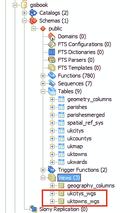

图 79：添加新视图

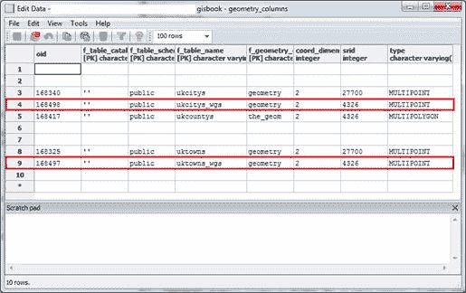

图 80：具有新视图的表

与任何符合 OGC 标准的 GIS 数据库客户端的体面实现一样，SharpMap 将检查 **geometry_columns** 表，以找出我们添加的任何层的详细信息。如果我们添加一个在 geometry_columns 表中找不到的视图，它将取消并产生异常。一旦我们手动添加数据，我们就可以将这些视图加载到我们的应用程序中。

### 返回代码......

现在我们已经拥有了 UI，我们的数据和一些用于投影数据的视图，现在是时候添加一些 C＃来拼接它们了。

我们需要的第一件事是 Postgres 数据库的连接字符串和地图初始化的布尔标志。在第一个表单的构造函数之前添加以下代码，并根据您自己的连接需要替换服务器名称，密码和用户名：

```
private const string _connString = "Server=<server>;Port=5432;User Id=<user>;Password=<password>;Database=gisbook;CommandTimeout=300";
private bool _mapInitializing;

```

请注意，我将命令超时设置为五分钟。如果你要做很多基于服务器，长时间运行的几何处理工作，那么这是明智之举。默认命令超时为 20 秒。当你开始用这些东西做更大的工作时，你最终会得到千兆字节的数据和一些漫长的运行时间。

在我们的构造函数之后，我们需要一个函数来初始化我们要从中调用的 map。您的代码现在应该是这样的：

```
using System.Windows.Forms;

namespace SharpMapExample1
{
  public partial class formMainForm : Form
  {
    private const string _connString = "Server    ;Port=5432;User Id=   ;Password=   ;Database=gisbook;CommandTimeout=300";
    private bool _mapInitializing;

    public formMainForm()
    {
      InitializeComponent();
    }

    public void InitializeMap()
    {

    }

  }

}

```

### 正在初始化地图

我们在地图初始化函数中需要做的第一件事就是设置并加载我们的图层。我们将从县层开始。矢量图层的数据源需要几何列的名称和主键 - 在地理空间术语中也称为 OID 或 GID - 您必须在几何表中使用它们，以及包含图层的表的名称。

初始化和加载县图层的代码，给它一个绿色填充，并设置黑色边框样式如下：

```
const string countyTableName = "ukcountys";
const string countyGeometryColumnName = "the_geom";
const string countyGidColumnName = "gid";
VectorStyle ukCountyStyle = new VectorStyle { Fill = Brushes.Green, Outline =
  Pens.Black, EnableOutline = true };
VectorLayer ukCountys = new VectorLayer("ukcountys")
{
  Style = ukCountyStyle,
  DataSource = new PostGIS(_connString, countyTableName,  
    countyGeometryColumnName,countyGidColumnName),
  MaxVisible = 40000
};

```

我们重复这种模式两次以加载我们城镇的数据：

```
const string cityTableName = "ukcitys_wgs";
const string cityGeometryColumnName = "geometry";
const string cityGidColumnName = "gid";

const string townTableName = "uktowns_wgs";
const string townGeometryColumnName = "geometry";
const string townGidColumnName = "gid";

VectorStyle ukCountyStyle = new VectorStyle { Fill = Brushes.Green, Outline =
  Pens.Black, EnableOutline = true };

VectorStyle ukCityStyle = new VectorStyle { PointColor = Brushes.OrangeRed };
VectorLayer ukCitys = new VectorLayer("ukcitys")
{
  Style = ukCityStyle,
  DataSource = new PostGIS(_connString, cityTableName, cityGeometryColumnName,
    cityGidColumnName),
  MaxVisible = 40000
};

VectorStyle ukTownStyle = new VectorStyle { PointColor = Brushes.DodgerBlue };
VectorLayer ukTowns = new VectorLayer("uktowns")
{
  Style = ukTownStyle,
  DataSource = new PostGIS(_connString, townTableName, townGeometryColumnName,  
    townGidColumnName),
  MaxVisible = 40000
};

```

这里唯一的区别是我们设置点颜色而不是填充和线条颜色，就像我们对多边形图层所做的那样。我们将图层的`Style`属性设置为`VectorStyle`对象，以使图层具有视觉外观。接下来，我们使用我们之前定义的常量和连接字符串将`DataSource`属性设置为与 Postgres 服务器的连接。 `MaxVisible`是在我们的地图查看器中可以看到对象的最大缩放级别。如果我们缩放超出我们指定的值，屏幕上将不会显示任何内容。

在我们定义图层及其样式和连接之后，我们只需将这些图层添加到表单上的地图控件中。

```
mpbMapView.Map.Layers.Add(ukCountys);
mpbMapView.Map.Layers.Add(ukCitys);
mpbMapView.Map.Layers.Add(ukTowns);

```

然后我们设置我们的默认工具，缩放到地图的完整范围，然后渲染它。

```
mpbMapView.ActiveTool = MapBox.Tools.Pan;
mpbMapView.Map.ZoomToExtents();
mpbMapView.Refresh();

```

我们将通过插入以下代码作为函数的前两行来完成;这将在地图初始化时向状态栏添加状态消息：

```
_mapInitializing = true;
lblStatusText.Text = "MAP Initializing please wait";

```

您的代码现在看起来应该如下图所示：

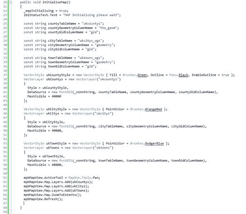

图 81：几乎完成的代码

最后，在`InitializeComponent()`调用的正下方向`InitializeMap()`添加对表单构造函数的调用，这就是初始化函数所需的全部内容。

如果您此时运行应用程序，并且所有内容都已正确设置，您应该会在屏幕上看到地图图层。您应该能够通过在地图表面周围拖动指针来平移它们，并使用鼠标滚轮进行缩放。

它应该看起来像这样：

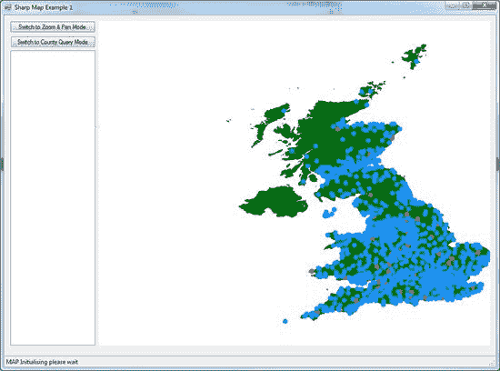

图 82：完成的地图

### 修复状态标签

您会注意到状态栏中的 **MAP 初始化**消息永远不会改变。我们会解决这个问题。当地图完成渲染时，它会触发一个名为 **MapRefreshed** 的事件。

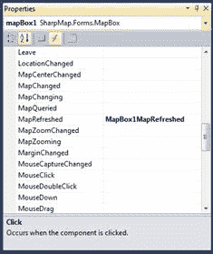

图 83：地图事件

我们在代码中挂钩此事件并向其添加一些代码以更改标签。但是，我们还需要使用我们的布尔变量来控制它，因为我们不希望每次刷新地图时调用它（这将经常发生）。

使用以下代码挂钩事件：

```
private void MapBox1MapRefreshed(object sender, EventArgs e)
{
  if(_mapInitializing)
  {
    _mapInitializing = false;
    lblStatusText.Text = "MAP Initialized";
  }
}

```

如果您现在运行它，状态栏应该在地图完成渲染时更新。

### 连接工具按钮

现在我们将添加允许您切换工具的两个按钮的代码。

SharpMap 有许多不同的工具模式，从缩放和平移到加载地图顶部的绘制线和多边形。

我们将在此应用中使用的两个工具是缩放和平移工具（默认设置）和查询工具。

更改工具就像为表单上的`MapBox`控件的`ActiveTool`属性指定新值一样简单。要分配的值是`MapBox.Tools`类型枚举中的任何值。

依次双击每个按钮，并在每个单击处理程序中添加以下代码，如下所示：

```
private void BtnZoomAndPanClick(object sender, System.EventArgs e)
{
  mpbMapView.ActiveTool = MapBox.Tools.Pan;
}

private void BtnQueryCountyClick(object sender, System.EventArgs e)
{
  mpbMapView.ActiveTool = MapBox.Tools.Query;
}

```

如果您现在运行应用程序，您应该可以使用表单左上角的两个按钮更改模式。自动处理缩放和平移。对于查询，我们必须响应地图框上的 click 事件并添加一些代码以获得我们需要的结果。

### 添加我们的县信息查询代码

我们需要做的第一件事是确保我们使用`Query`工具，如果我们不这样做，就不要再进一步了。

从设计器中，在地图控件上找到`Click`事件，并将以下行添加到代码中的事件处理程序：

```
if (mapBox1.ActiveTool != MapBox.Tools.Query) return;

```

为什么这样？这是一个非常好的问题，特别是考虑到查询工具实际上有自己的事件处理程序，在单击地图时会触发该事件处理程序。

在写这本书时，我最初使用的是专用处理程序，但发现很难缩小范围和我选择的项目。我没有使用一个多边形，而是经常收到似乎是数据库的一半，并且难以筛选传递给事件处理程序的数据量。

经过一些研究后，似乎大多数示例和推荐的避免此问题的方法都涉及捕获`MouseUp`和`MouseDown`事件或`Click`事件。为简单起见，我选择了`Click`事件。

一旦我们知道我们使用的是正确的工具，我们就可以看到我们在地图上的位置。我们必须做的第一件事是以像素为单位获取实际的鼠标位置。然后，我们使用 SharpMap 工具包中的`ImageToWorld`将鼠标位置的 _x_ 和 _y_ 值转换为 WGS84 纬度和经度。

接下来，我们需要使用该位置来查询我们的县图层并收集包含我们点击的位置中存在的任何多边形的`FeatureDataSet`。

```
FeatureDataSet selectedGeometry = new FeatureDataSet();
VectorLayer theLayer =  
  (VectorLayer)mapBox1.Map.FindLayer("ukcountys").FirstOrDefault();

if (theLayer != null)
{
  if (!theLayer.DataSource.IsOpen)
  {
    theLayer.DataSource.Open();
  }

  Envelope boundingBox = new Envelope(wgs84Location.CoordinateValue);
  if (Math.Abs(boundingBox.Area - 0.0) < 0.01)
  {
    boundingBox.ExpandBy(0.01);
  }

  theLayer.DataSource.ExecuteIntersectionQuery(boundingBox, selectedGeometry);
  theLayer.DataSource.Close();
}

```

这应该导致我们的`FeatureDataSet`集合中填充了在该位置找到的任何几何体，在我们的例子中应该是我们点击的县。

接下来，我们需要检查`FeatureDataSet`中是否有任何数据。如果我们这样做，请抓住被点击的县名。

`FeatureDataSet`中的每一行与普通数据集中的一行几乎相同，因此我们可以在 Postgres 的基础表中查找与列名相同的列。如果没有找到行，最好返回。

```
if (selectedGeometry.Tables[0].Count <= 0) return;
string countyName = selectedGeometry.Tables[0].Rows[0]["name2"].ToString();

```

一旦我们从英国县一层获得一个县名，我们就想得到一个我们县的城镇名单。我们使用以下两种方法执行此操作：

```
List<string> cityList = GetCitysForCounty(countyName);
List<string> townList = GetTownsForCounty(countyName);

```

现在我们有了数据，我们希望为用户提供一些视觉反馈。首先，我们将突出显示我们点击的县。

```
VectorLayer highlightLayer = (VectorLayer)
  mpbMapView.Map.FindLayer("highlight").FirstOrDefault();

if (highlightLayer == null)
{
  Color myColor = Color.FromArgb(64,144,238,144);
  Brush fillBrush = new SolidBrush(myColor);

  highlightLayer = new VectorLayer("highlight");
  VectorStyle highlightStyle = new VectorStyle
    {Fill = fillBrush, Outline = Pens.White, EnableOutline = true};

  highlightLayer.Style = highlightStyle;
}

```

我们首先检查我们的地图上是否已经有一个高光层。如果不存在，请创建一个新的。关于在高光层上设置样式的一件事是我们设置颜色的方式。我们使用完整的 ARGB 颜色调用，以便我们可以为图层指定透明度级别 - 函数中的第一个值`64` - 允许我们查看其下面的现有地图元素。

接下来，我们采用前面获得的`FeatureDataSet`并将其指定为高光层的数据源，以便选定的县多边形显示我们定义的半透明样式。请注意，如果在地图上选择多个多边形，则会突出显示多个多边形。之前选定的县将被清除。

```
highlightLayer.DataSource = new GeometryProvider(selectedGeometry.Tables[0]);
mpbMapView.Map.Layers.Add(highlightLayer);
mpbMapView.Refresh();

```

添加高光层并刷新地图后，我们选择的县应该是可见的。

我们的国家/地区查询功能要做的最后一件事是将我们的县信息添加到 UI 左侧的列表框中，并在方法的开头和结尾添加一些代码以显示状态栏中发生的情况。

```
lsbCountyResults.Items.Clear();
lsbCountyResults.Items.Add("Selected county: " + countyName.ToUpper());
lsbCountyResults.Items.Add("");

if (cityList.Count > 0)
{
  lsbCountyResults.Items.Add("Citys in this county");
  foreach (string city in cityList)
  {
    lsbCountyResults.Items.Add(city);
  }
  lsbCountyResults.Items.Add("");
}

if (townList.Count > 0)
{
  lsbCountyResults.Items.Add("Towns in this county");
  foreach (string town in townList)
  {
    lsbCountyResults.Items.Add(town);
  }
  lsbCountyResults.Items.Add("");
}

```

接下来，我们在第一个`if`语句之后添加状态栏消息。

```
lblStatusText.Text = "Querying Map... please wait for results.";
Application.DoEvents();

```

我们在结束括号之前添加完成的消息。

```
lblStatusText.Text = "Query finished.";

```

在我们进一步讨论之前，有些人会说，“哇，这是一个多长的方法”，并想知道为什么我使用`Application.DoEvents`来确保标签在事件处理程序中更新。请记住，这只是示例代码;它不应该是一个完美的例子，或者只是简单地复制和粘贴以制作生产质量的应用程序。其目的纯粹是为了向您展示如何使用 SharpMap 创建一个简单的 GIS 应用程序。

### 结论

我们需要做的最后一件事是创建两种方法，从 GIS 数据库中检索我们的城市和城镇列表。

SharpMap 完全能够获取我们之前发现的多边形轮廓并查询地图中的其他图层，以告诉我们哪些点落在哪个区域内。然而，由于这本书主要是关于使用 GIS 数据库，我想通过让 Postgres 再次为我们做繁重的工作来结束。

这两种方法非常相似，所以我将它们都复制出来并将它们描述为一种。

```
private static List<string> GetTownsForCounty(string countyName)
{
  string sql =
    string.Format(
      "SELECT t.Name FROM ukcountys c, uktowns t WHERE name2 = :county AND
       ST_Within(t.geometry,ST_Transform(c.the_geom,27700))");

  List<string> results = new List<string>();

  using (NpgsqlConnection conn = new NpgsqlConnection(_connString))
  {
    conn.Open();
    using (NpgsqlCommand command = new NpgsqlCommand(sql, conn))
    {
      command.Parameters.Add(new NpgsqlParameter("county", NpgsqlDbType.Varchar));
      command.Parameters[0].Value = countyName;

      using (NpgsqlDataReader dr = command.ExecuteReader())
      {
        while (dr.Read())
        {
          results.Add(dr.GetString(0));
        }
      }
    }
  }

  return results;
}

private static List<string> GetCitysForCounty(string countyName)
{
  string sql =
    string.Format(
      "SELECT t.Name FROM ukcountys c, ukcitys t WHERE name2 = :county AND    
       ST_Within(t.geometry,ST_Transform(c.the_geom,27700))");

  List<string> results = new List<string>();

  using (NpgsqlConnection conn = new NpgsqlConnection(_connString))
  {
    conn.Open();
    using (NpgsqlCommand command = new NpgsqlCommand(sql, conn))
    {
      command.Parameters.Add(new NpgsqlParameter("county", NpgsqlDbType.Varchar));
      command.Parameters[0].Value = countyName;

      using (NpgsqlDataReader dr = command.ExecuteReader())
      {
        while (dr.Read())
        {
          results.Add(dr.GetString(0));
        }
      }
    }
  }

  return results;
}

```

任何做过任何原始 ADO.NET 编程的人都应该立即认识到我们在这里做了什么，甚至可能会合理地问我们为什么不使用 LINQ to SQL 或 Entity Framework，或者......列表继续。

首先，原始 Postgres 数据提供程序不提供实体框架或 LINQ-to-SQL 数据模型提供程序。其次，由于我们正在使用空间函数，因此在 ADO.NET 中执行此操作要比在 SQL 视图语法中深入隐藏的模型要好得多。

我们要做的第一件事是创建一个我们希望在数据库中运行的 SQL 的常量字符串，我希望您特别注意查询字符串中的`:county`。这是 Postgres 数据提供程序与常规 ADO.NET 为查询字符串提供参数的方式不同的地方之一。

在常规 ADO.NET 代码中，参数通常以`@`为前缀，例如`@county`。在 Postgres 中，参数以`:`为前缀。但是，在代码中，以相同的方式添加参数。

其余的是相当不言自明的。我们使用之前定义的连接字符串打开连接，打开数据库，添加参数，然后运行我们的 SQL，最后获取数据读取器对象，将结果读入通用字符串列表。

我们在嵌套的`using`语句中完成所有这些操作，这意味着一切都是`IDisposable`，一旦完成就应该正确释放，让我们只需将结果字符串列表返回给调用方法。

如果一切按计划进行，点击**运行**，你会看到一个应用程序，可以缩放和平移数据库中定义的地图，以及切换到`County Query Mode`并检索城镇列表和选定县的城市。您完成的应用应该类似于以下内容：

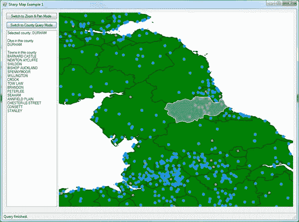

图 84：完成的地图应用

我们终于得到它了。希望我已经激起了你的胃口，并向你展示了 GIS 在日常生活中可以帮助你的一些东西。

请记住，购买具有足够功率的手机可以在小范围内完成此类工作，并且有一些数据库系统可以支持它们，例如 SQL Compact。 SharpMap 允许您执行从矢量到栅格地图等各种操作。一旦开始进一步研究，您会发现某些系统具有读取 GPS 设备的内置功能，使您能够将实时位置信息提取到应用程序中。走出去，以真实和数字形式探索世界。这是一场刚刚开始的冒险。