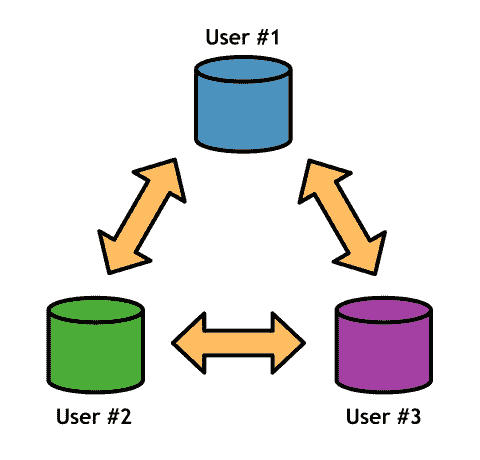

# 简介

Git 是一个开源版本控制系统，以其速度，稳定性和分布式协作模型而闻名。 Git 最初创建于 2006 年，用于管理整个 Linux 内核，现在拥有全面的功能集，一个活跃的开发团队和几个免费托管社区。

Git 是从头开始设计的，很少关注集中版本系统的现有标准。因此，如果您来自 SVN 或 CVS 背景，请在阅读本指南之前尝试忘记您对版本控制的所有了解。

分布式软件开发与集中式版本控制系统根本不同。 Git 不是将文件信息存储在单个中央存储库中，而是为每个开发人员提供 _ 存储库的完整副本。为了促进协作，Git 允许每个存储库与任何其他存储库共享更改。_

图 1：分布式软件开发

在本地计算机上拥有完整的存储库会对开发周期产生深远的影响......

### 更快的命令

首先，存储库的本地副本意味着几乎所有版本控制操作都要快得多。 Git 操作不是通过网络连接与中央服务器通信，而是在本地计算机上执行。这也意味着您可以脱机工作而无需更改工作流程。

### 稳定性

由于每个协作者基本上都有整个项目的备份，因此服务器崩溃，损坏的存储库或任何其他类型的数据丢失的风险远低于依赖单个访问点的集中式系统的风险。

### 孤立的环境

Git 存储库的每个副本（无论是本地还是远程）都保留项目的完整历史记录。拥有一个完整，独立的开发环境，每个用户都可以自由地尝试新增功能，然后再将其打造成干净，可发布的提交。

### 高效合并

每个开发人员的完整历史记录也意味着每个开发人员的 _ 发散 _ 历史记录。只要进行一次本地提交，就会与项目中的其他人不同步。为了应对这种大量的分支，Git 非常善于融合不同的发展方向。