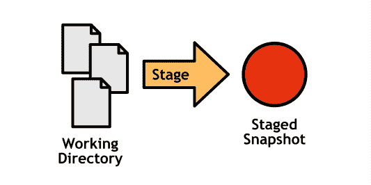
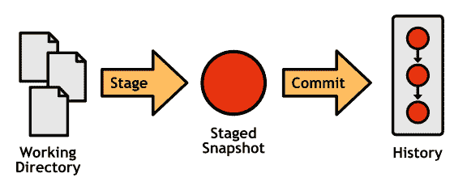
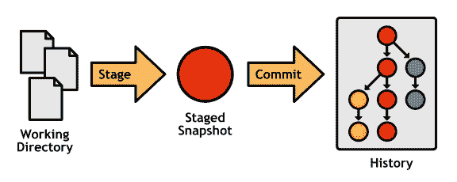

# 第 1 章概述

每个 Git 存储库包含 4 个组件：

*   工作目录
*   临时区域
*   承诺的历史
*   发展部门

从记录提交到分布式协作的所有内容都围绕着这些核心对象。

## 工作目录

工作目录是实际编辑文件，编译代码和开发项目的地方。出于所有意图和目的，您可以将工作目录视为普通文件夹。除此之外，您现在可以访问各种可以记录，更改和传输该文件夹内容的命令。

图 2：工作目录

## 临时区域

暂存区域是工作目录和项目历史记录之间的中介。 Git 允许您将它们分组到相关的变更集中，而不是强制您一次提交所有更改。分阶段更改尚未成为项目历史的一部分。

图 3：工作目录和暂存区域

## 承诺历史

在暂存区域中配置更改后，可以将其提交到项目历史记录，并将其保留为“安全”修订版。提交是“安全的”，因为 Git 永远不会改变它们，尽管 _ 你 _ 可以手动重写项目历史。

图 4：工作目录，暂存快照和已提交历史记录

## 发展部门

到目前为止，我们仍然只能创建一个 _ 线性 _ 项目历史记录，在另一个上面添加一个提交。通过分支项目历史，分支可以并行开发多个不相关的功能。

图 5：具有分支历史的完整 Git 工作流程

Git 分支不像集中版本控制系统的分支。它们制作起来很便宜，易于合并，并且易于共享，因此基于 Git 的开发人员使用 _ 所有内容 _ 的分支 - 来自长期运行的功能以及 5 分钟修复的几个贡献者。许多开发人员 _ 仅 _ 在专用主题分支中工作，将主历史分支留给公开发布。