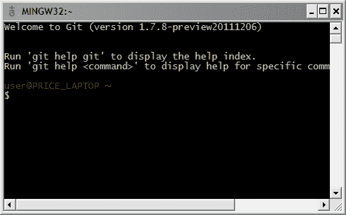

# 第 2 章入门

## 安装

Git 适用于所有主要平台。下面的说明将引导您完成 Windows 上的安装，但最好咨询官方 [Git 网站](http://git-scm.com/)以获取最新信息。

Git for Windows 可通过 [MsysGit](http://code.google.com/p/msysgit/downloads/list) 包获得。

1.  下载并执行最新版本的安装程序。
2.  在标题为“调整 PATH 环境”的设置屏幕中，选择“仅使用 Git Bash”选项。
3.  在标题为“选择 SSH 可执行文件”的设置屏幕中，选择“使用 OpenSSH”。
4.  最后，选择“Checkout Windows-style，commit Unix-style line endings”并按“Next”开始安装。

这将安装一个名为“Git Bash”的新程序，这是您在使用 Git 时应该使用的命令提示符。

图 6：Git Bash 的屏幕截图

## 配置

Git 附带了一长串配置选项，涵盖从您的名字到您最喜爱的合并工具的所有内容。您可以使用 git config 命令设置选项，也可以在主目录中手动编辑名为 .gitconfig 的文件。一些最常见的选项如下所示。

### 用户信息

你想要对任何新的 Git 安装做的第一件事就是自我介绍。 Git 会在您的提交中记录此信息，而 GitHub 等第三方服务会使用它来识别您的身份。

git config --global user.name“John Smith”

git config --global user.email john@example.com

--global 标志记录〜/ .gitconfig 中的选项，使其成为所有新存储库的默认选项。省略它可以让您基于每个存储库指定选项。

### 编辑

Git 的命令行实现依赖于文本编辑器来完成大部分输入。您可以启用 Git 以使用 core.editor 选项选择编辑器：

git config --global core。编辑 gvim

### 别名

默认情况下，Git 没有任何快捷方式，但您可以通过别名命令添加自己的快捷方式。如果您来自 SVN 背景，您将会欣赏以下绑定：

git config --global alias.st status

git config --global alias.ci commit

git config --global alias.co checkout

git config --global alias.br branch

通过在 Git Bash 提示符下运行 git help config 了解更多信息。

## 正在初始化存储库

Git 旨在尽可能不引人注目。 Git 存储库和普通项目文件夹之间的唯一区别是项目根目录中的额外 .git 目录（不是 _ 每个 _ 子文件夹，如 SVN）。要将普通项目文件夹转换为完整的 Git 存储库，请运行 git init 命令：

git init＆lt; path＆gt;

＆lt;路径＆gt; 参数应该是存储库的路径（将其留空将使用当前工作目录）。现在，您可以使用 Git 的所有精彩版本控制功能。

## 克隆存储库

作为 git init 的替代方法，您可以使用以下命令克隆现有的 Git 存储库：

git clone ssh：//＆lt; user＆gt; @＆lt; host＆gt; /path/to/repo.git

这将登录到＆lt; host＆gt; 机器使用 SSH 并下载 repo.git 项目。这是 _ 完整的 _ 副本，而不仅仅是指向服务器存储库的链接。您有自己的历史记录，工作目录，暂存区域和分支结构，在将它们推回到公共存储库之前，没有人会看到您所做的任何更改。