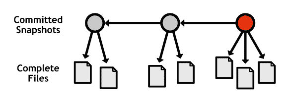
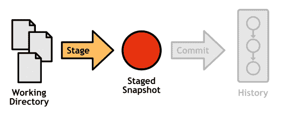
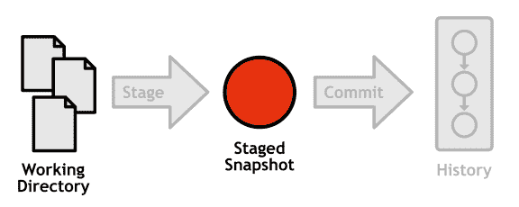
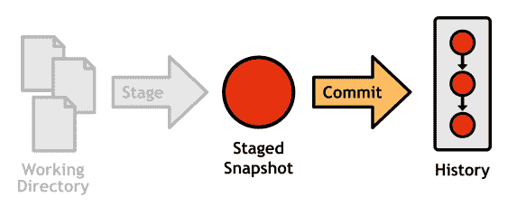

# 第 3 章录制更改

维护项目的一系列“安全”修订是任何版本控制系统的核心功能。 Git 通过记录项目的**快照**来实现这一点。录制快照后，您可以返回并查看旧版本，还原它们并进行实验，而不必担心会破坏现有功能。

SVN 和 CVS 用户应该注意到，这与他们系统的实现有根本的不同。这两个程序都记录了每个文件的差异 - 项目变化的增量记录。相比之下，Git 的快照就是 - _ 快照 _。每个提交都包含它包含的每个文件的完整版本。这使得 Git 非常快，因为每次请求时都不需要生成文件的状态：

图 7：记录完整快照，而不是修订版之间的差异

本章介绍使用工作目录，暂存区域和已提交历史记录创建快照的基本工作流程。这些是基于 Git 的修订控制的核心组件。

## 临时区域

Git 的临时区域为您提供了一个组织提交的位置，然后将其添加到项目历史记录中。 **暂存**是将更改从工作目录移动到暂存快照的过程。

图 8：暂存提交所涉及的组件

它使您有机会从工作目录中选择 _ 相关的 _ 更改，而不是一次性提交所有内容。这意味着您可以通过 _ 按时间顺序 _ 创建 _ 逻辑 _ 快照。这对开发人员来说是一个福音，因为它允许他们将编码活动与版本控制活动分开。当您编写功能时，您可以忘记停止以隔离的块提交它们。然后，当您完成编码会话后，您可以通过舞台将更改分成任意数量的提交。

要将新工作目录或已修改的文件从工作目录添加到暂存区域，请使用以下命令：

git add&lt; file&gt;

要从项目中删除文件，您需要将其添加到临时区域，就像新的或修改过的文件一样。下一个命令将暂停删除并停止跟踪文件，但不会从工作目录中删除该文件：

git rm --cached&lt; file&gt;

## 检查舞台

查看存储库的状态是 Git 中最常见的操作之一。以下命令输出工作目录和暂存区域的状态：

git 状态

这将导致类似于以下内容的消息（某些部分可能会被省略，具体取决于您的存储库的状态）：

#On 分支主人

# 承诺的变更：

# 

#new file：foobar.txt

# 

# 未提交更改的更改：

# 

#modified：foo.txt

# 

# 未跟踪文件：

# 

#bar.txt

第一部分“要提交的更改”是您的暂存快照。如果您现在要运行 git commit ，则只会将这些文件添加到项目历史记录中。下一节列出了 _ 跟踪的 _ 文件，这些文件不会包含在下一次提交中。最后，“未跟踪文件”包含工作目录中尚未添加到存储库的文件。

### 生成差异

如果需要有关工作目录或暂存区域中的更改的更多详细信息，可以使用以下命令生成 diff：

git diff

这将输出工作目录中每个 _ 未分段 _ 更改的差异。您还可以使用 - 缓存的标志生成所有 _ 暂存 _ 更改的差异：

git diff --cached

请注意，项目历史记录超出了 git status 的范围。要显示已提交的快照，您需要 git log 。

图 9： git status 范围内的组件

## 承诺

提交代表项目的每个保存版本，这使它们成为基于 Git 的版本控制的原子单元。每个提交都包含项目的快照，您的用户信息，日期，提交消息以及其整个内容的 **SHA-1 校验和**：

提交 b650e3bd831aba05fa62d6f6d064e7ca02b5ee1b

作者：john&lt; john@example.com&gt;

日期：1 月 11 日星期三 00:45:10 2012 -0600

一些提交消息

这个校验和用作提交的唯一 ID，这也意味着如果没有 Git 知道它，_ 永远不会 _ 被破坏或无意改变。

由于暂存区域已包含所需的变更集，因此提交不需要工作目录的任何参与。

图 10：提交快照所涉及的组件

要提交暂存快照并将其添加到当前分支的历史记录，请执行以下操作：

git commit

您将看到一个文本编辑器，并提示您输入“提交消息。”提交消息应采用以下形式：

&lt;提交 50 个字符以内的摘要。&gt;

&lt;空白行&gt;

&lt;此提交中的更改的详细说明。&gt;

Git 使用第一行格式化日志输出，电子邮件补丁等，所以它应该是简短的，同时仍然描述整个变更集。如果您无法提出摘要行，则可能意味着您的提交包含太多无关的更改。您应该返回并将它们拆分为不同的提交。摘要后面应该有一个空白行和更改的详细说明（例如，您进行更改的原因，它对应的票号）。

## 检查提交

与存储库的状态一样，查看其历史记录是 Git 版本控制中最常见的任务之一。您可以使用以下命令显示当前分支的提交：

git log

我们现在只需要两个工具来检查 Git 存储库的每个组件。

图 11： git 状态与 git log 的输出

这也给了我们一个自然的命令分组：

*   阶段/工作目录： git add ， git rm ， git status
*   承诺历史： git commit ， git log

### 有用的配置

Git 为 git log 提供了大量的格式化选项，其中一些包含在这里。要在一行上显示每个提交，请使用：

git log --oneline

或者，要定位单个文件的历史记录而不是整个存储库，请使用：

git log --oneline&lt; file&gt;

一旦您的历史记录增长超过一次提交，过滤日志输出也非常有用。您可以使用以下内容显示&lt; until&gt;中包含的提交。 但不在&lt; since&gt;中。 两个参数都可以是提交 ID，分支名称或标记：

git log&lt; since&gt; ..&lt; until&gt;

最后，您可以在每次提交中显示更改的 diffstat。这对于查看特定提交影响了哪些文件很有用。

git log --stat

为了可视化历史记录，您可能还需要查看 gitk 命令，该命令实际上是一个专门用于绘制分支图的独立程序。运行 git help gitk 了解详情。

## 标记提交

标签是提交的简单指针，它们对于为公共版本等重要修订添加书签非常有用。 git 标签命令可用于创建新标签：

git tag -a v1.0 -m“稳定发布”

-a 选项告诉 Git 创建一个 _ 带注释的 _ 标签，它允许你一起记录一条消息（用 -m 指定）。

运行不带参数的相同命令将列出现有标记：

git 标签