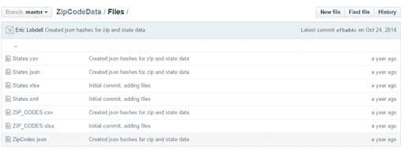
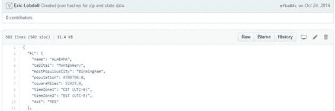
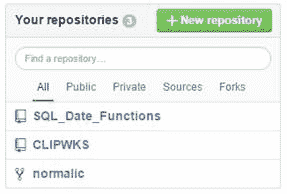

# 第 10 章获取代码

您已经搜索过 GitHub，查看了所有结果，并找到了应该有用的存储库。下一步是下载代码。如果您只是计划使用代码，而不进行协作并有助于使代码更好，则可以将代码下载到本地计算机。

## 下载 ZIP

获取整个存储库的最简单方法是单击菜单栏上的 **Download ZIP** 按钮。使用此方法，您只下载源文件和其他文件（没有存储库历史记录或详细信息）。

图 71：下载 ZIP 文件

需要注意的一件事是 ZIP 将包含所有文件，包括 **readme.md** 文件。此文件可能包含嵌入的 markdown 代码，因此在文本编辑器中可能无法轻松读取。

## 正在下载单个文件

您还可以通过单击文件名来下载单个文件。 GitHub 非常聪明地确定如何显示文件内容，特别是文本或编程语言文件。二进制文件通常不会显示，但您可以单击它们下载它们。例如，让我们看一下 ZipCodeData。假设您需要邮政编码和州信息，并且您的搜索引导您进入此存储库。单击“文件”子文件夹时，会看到以下结果。

图 72：邮政编码文件文件夹

但是，您不需要整个解决方案和其他数据文件;您只对 JSON 格式的数据感兴趣。单击文件名时，该文件将显示在 GitHub 窗口中。

图 73：邮政编码 JSON 数据

单击**原始**选项卡时，GitHub 将打开文件，周围没有装饰。然后，您可以使用浏览器上下文菜单将内容保存到本地驱动器。

Blame 选项卡（尽管名称）是一种方便的方法，用于识别谁在文件中进行了更改，并提供了更改原因的简要说明。

## 分叉项目

虽然您可以轻松下载文件和代码，但如果项目引起您的兴趣，您应该考虑创建一个分支，并可能通过查看一些未解决的问题来为项目做出贡献。开源软件的本质是协作，大多数存储库所有者都欢迎对他们的项目提供帮助。

如果您决定要处理项目，可以单击存储库顶部的 **Fork** 图标。

图 74：分叉项目

分叉项目后，您的存储库列表现在将显示分叉存储库，由分叉图标指示。

图 75：显示分叉存储库

您现在拥有存储库的副本，并且可以开始查看问题以查看您是否可能要贡献。在图 75 中，normalic 是一个方便的库，用于解析美国地址数据，但是用 Ruby 编写。我在 fork 中的目标是为我自己创建一个 C# 版本，然后将它放回到 GitHub 上（同样记入原始存储库）。

## 摘要

您可以将 GitHub 简单地用作源代码和数据的大型库，毫无疑问会找到许多有用的存储库。但是，本着开源软件的精神，您可能会发现自己在协作中帮助改进其他工作以生成更好的软件。