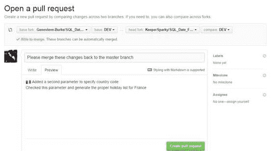

# 第 12 章拉请求

在合作期间的某个时刻，贡献者可能已经完成并测试了足够好的代码，以至于她觉得代码可以添加到主分支中。 Genevieve 通过单击 **Pull 请求**按钮决定创建拉取请求。

图 83：拉取请求

## 创建请求

Genevieve 提交请求并添加她所做工作的描述。

图 84：拉取请求详细信息

存储库所有者现在将在打开存储库时看到 pull 请求。所有者还会收到一封已发出拉取请求的电子邮件。

## 审核请求

所有者在打开存储库时会看到请求。

图 85：拉取请求视图

通过单击拉取请求本身，将显示请求的详细信息。

图 86：拉取请求详细信息

所有者现在可以查看提交和实际文件更改，以决定是否合并代码。查看更改并接受更改后，所有者单击“合并拉取请求”按钮。 GitHub 会要求确认，一旦确认，将执行合并。

成功合并

合并成功后，GitHub 将报告并更新存储库：

图 87：成功的拉取请求

由于 pull 请求已完成，因此在查看存储库时，它将显示为关闭的 pull 请求。

## 摘要

一旦协作者完成请求，并且他们请求将代码合并回来，所有者可以查看更改并接受它们（执行合并），或者可能询问协作者的问题，或者确定之前需要完成的其他工作接受变化。 GitHub 提供了所有者决定包含新代码所需的所有工具和比较。