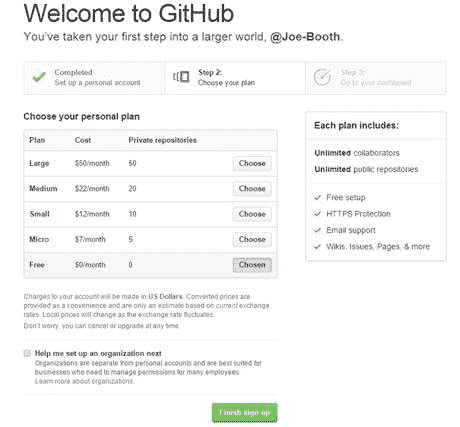
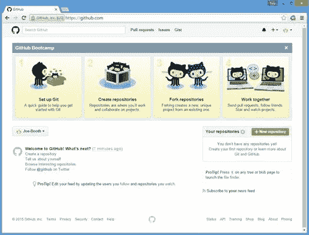

# 第 2 章入门

开始使用 GitHub 的最佳方法是打开浏览器并直接进入。打开您喜欢的浏览器并输入 [https://github.com/](https://github.com/) 打开 GitHub 主页面。您将看到类似于以下内容的屏幕：

图 2：GitHub 主页

虽然您可以在不创建帐户的情况下搜索 GitHub 存储库，但本章介绍了设置帐户的基础知识。如果您不想在不设置帐户的情况下进行浏览，可以跳到第 4 章“搜索 GitHub”。但是，有关创建和管理自己的存储库的章节将需要 GitHub 用户帐户。

|  | 注意：GitHub 可能会改变主页的外观，因此您的初始页面可能与图 2 中的屏幕截图完全不同。注册 |

您只需填写所请求的用户名，电子邮件地址和密码，即可直接从主页注册 GitHub。这些字段是动态验证的，在您键入时报告任何问题。

图 3：GitHub 注册

|  | 提示：您的用户名将显示在您的公共存储库中，因此请务必选择一个您不介意与其他人共享的用户名。 |

您将能够从配置文件屏幕更改您的用户名，GitHub 将自动更新您的存储库信息。但是，如果人们有指向旧配置文件页面的链接，则这些链接不会重定向到您的新名称，而是返回 404（未找到）错误。如果您确实更改了用户名，请务必更新所有公共配置文件以引用新名称。

### 选择你的计划

填写完帐户信息后，下一步就是选择 GitHub 计划。默认计划是免费计划。此计划允许您创建公共存储库并与其他存储库进行交互。

图 4：GitHub 计划选择

个人计划表明您计划拥有的私人存储库的数量。如果您只打算搜索和使用公共存储库，免费计划将满足您的需求。然而;当您使用 GitHub 时，您可能希望将其用于内部或私人开发工作。在这种情况下，付费计划的价格合理。

|  | 注意：在本书中，我们专注于个人 GitHub 计划。组织也有计划，允许不同的用户和基于团队的不同访问。此外，计费可以发送到单独的电子邮件帐户，团队所有者可以访问组织成员。 |

### 你的仪表板

输入基本帐户信息并选择计划后，您将进入个人信息中心页面。顶部的 GitHub Bootcamp 横幅允许您使用向导方法设置 Git 和您自己的存储库。

图 5：GitHub 仪表板

此时，您已设置 GitHub 帐户，并且您可以搜索 GitHub，下载代码（和其他文件），并与其他用户的存储库进行交互。但是，您需要执行其他设置工作来创建自己的存储库。这包括在您的计算机上安装 Git 并创建 Git 存储库。这将在下一章中介绍。如果您只对搜索现有工作感兴趣，可以跳过该章。如果您决定将自己的工作放入 GitHub，则需要回到它。