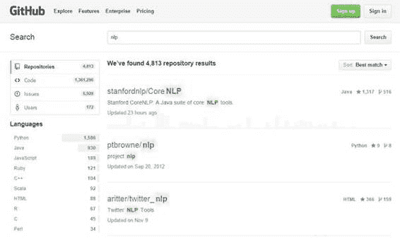
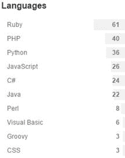

# 第 4 章搜索 GitHub

搜索 GitHub 非常简单;就像 Google 搜索一样，您只需在屏幕顶部的搜索栏中输入您要查找的内容即可。

图 17-搜索 GitHub

按**输入**以恢复搜索结果。在这个例子中，我搜索了有关 NLP（自然语言处理）的任何存储库。对于这个特定的搜索，GitHub 发现了超过 4,800 个匹配的存储库 - 可能比我希望的多一些。

图 18：GitHub 搜索结果

幸运的是，GitHub 提供了排序和过滤选项，使搜索所有这些存储库变得更加容易。

## 排序结果

默认情况下，GitHub 会将最可能的匹配项返回给您的搜索查询。搜索栏下方的“排序”下拉菜单控件显示结果的当前排序顺序：

图 19：排序顺序

如果单击向下箭头键，则可以看到其他排序选项。这有助于您快速浏览搜索结果。

### 大多数明星

正如我们之前提到的，GitHub 除了仅仅是一个存储库之外，还提供类似社交媒体的功能。如果用户发现某个特定的存储库很有用，或者他们积极参与其中，那么他们可以为项目提供一个明星。例如，流行的 JavaScript Bootstrap 框架有超过 90,000 个星，jQuery 接近 40,000。

|  | 注意：您必须拥有一个帐户并登录以“存储”存储库。 |

如果您是一名新开发人员，并且想知道最流行的 JavaScript 框架是什么，通过“Most Stars”进行搜索和排序可以让您了解哪个框架可能是一个很好的学习起点。

图 20：评级星

您可以看到存储库名称旁边的星号数量，如图 20 所示。正如您所看到的，blueimp 的 File-Upload jQuery 模块有超过 22,000 颗星。它可能是一个安全的赌注，它已被大量开发人员测试和使用。

### 最少的明星

你也可以用最少的星星排序，但你不应该认为一个星级较少的项目是一个糟糕的项目。它拥有较少的星星这一事实也可能证明它是一个未知的项目或新的贡献。它可能是一个伟大的项目，但很少有人需要它或已经发现它。这些类型的项目中可能存在一些隐藏的宝石，特别是如果您正在处理一个不常见的应用程序。

### 大部分/最少分叉

虽然我们将在后面的章节中讨论 GitHub 分支，但这里的简要描述应该有所帮助。 fork 是某人已下载的存储库的副本，很可能是为了建议更改或作为他们自己项目的起点。

|  | 注意：fork 不仅仅是下载文件;你可以轻松地做到这一点。叉子通常是为了添加到现有项目而制作的。 |

分叉的数量让您了解有多少开发人员对项目感兴趣并做出贡献。例如，有一个 LINQ to CSV 项目，允许.NET 开发人员对 CSV（逗号分隔值）文件使用 LINQ 查询。该项目有 64 颗星（截至本书）和 51 个分支。这表明项目已经完成了很多工作，并建议许多开发人员正在使用该库。

有时，需要某些代码的开发人员可能会在 GitHub 上添加第一个版本，并找到其他感兴趣的开发人员来处理该项目。协作是开源社区的标志，因此一个有趣的项目可以从用户社区获得来自世界各地的帮助，以改进现有代码。

一个只有少量叉子但很多星星的项目可能会建议一个非常稳定和完整的项目。一个拥有许多分叉但很少有明星的项目可能是少数非常活跃的开发人员正在使用的一个利基主题。

### 最近更新

另一种排序选项是最近更新的排序，它将列表从最近更新的排序到最旧的更新。将首先介绍新项目或最近活跃的项目。项目的简单下载不算作活动，只计算更新存储库的操作。有些项目不一定需要最近的更新。例如，有一个.NET 组件可以从邮政编码中检索地理坐标（纬度和经度）。它在一年多时间内没有活跃，但数据内容基于最新的（2010 年）人口普查数据，因此一旦代码安定下来，就不需要更新它，直到另一次人口普查或更新的邮政编码数据变为可用。

### 最近最新更新

最近最新更新显示最早的（在活动方面）。同样，项目更新日期仅提供项目活跃程度的概念。 Scriptaculous（一个 JavaScript 框架）在六个月内没有更新，但有近 2,400 颗星。这表明一个框架仍在使用，并且相当成熟。它实际上写于 2005 年（古代在互联网时代）并在 2010 年被冻结，但仍然在使用，并且即使它被冻结，仍然有项目列出的贡献者。

随着新的浏览器和技术经常出现，旧的 Web 项目可能与新技术不兼容。请记住 I.E. 9 直到 2011 年才发布，所以这个特殊的框架（Scriptaculous）与 I.E.一起运作良好。 8 个版本。对于计算机较旧且未运行最新浏览器的 Web 应用程序，它可能是一个很好的框架。

在排序选项，明星（使用它之后有多少开发人员喜欢的项目），分支（有多少开发人员对增强项目感兴趣）和活动（项目最近的工作方式）之间，您应该能够为您的应用选择一个好的项目。

## 过滤结果

除了对结果进行排序之外，GitHub 搜索结果还提供了一些基本的过滤选项，主要是让您专注于特定的编程语言。例如，假设我们正在开发一个项目，将 QuickBooks 与您正在处理的某些应用程序集成在一起。在 GitHub 中搜索“QuickBooks”会产生 300 多个结果。如果我按大多数明星对它们进行排序，我会发现 PHP 和 Ruby 实现占据了前 10 位的结果。

但是，在搜索结果的左侧，GitHub 显示了所有找到的存储库的语言组细分。

图 21：语言

通过单击语言名称，我们可以过滤结果，仅显示有关 QuickBooks 的 24 个项目，并使用 C# 作为基本语言。

|  | 注意：请记住，可以从任何.NET 语言（如 Visual Basic）访问用 C# 编写的库。 |

## 摘要

GitHub 中的基本搜索以及排序和过滤选项应该允许您浏览存储库并找到启动开发工作所需的库，应用程序等。