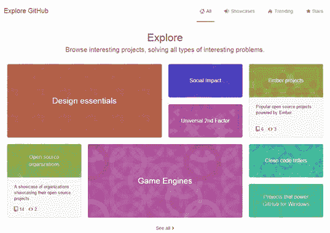
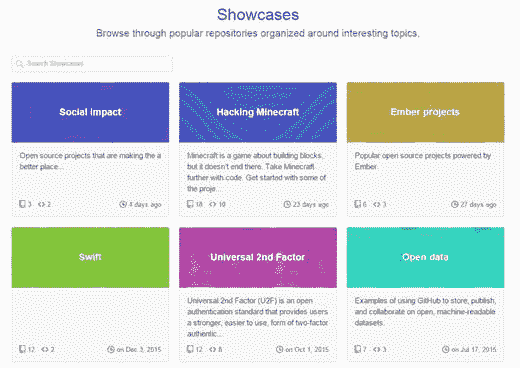
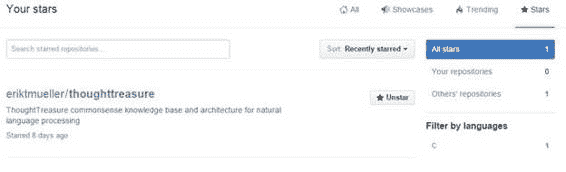

# 第 7 章浏览 GitHub

虽然搜索是 GitHub 的一个强大功能，但您也可以浏览许多有趣的项目并查看最新趋势。在您的帐户图标下，下拉菜单并选择**浏览**。您将看到类似于以下内容的屏幕：

图 29：GitHub Explore 主题

您可以单击任何框以查看各种类别中最常加星标的存储库。类别列表可能会根据 GitHub 中的最新趋势和活动而更改。

在类别下方，您将找到趋势存储库（基于本周的活动）。

图 30：趋势存储库

下一个菜单选项 Showcases 显示了各种感兴趣的主题，并允许您浏览其中的各种存储库。

图 31：展示柜

您可以单击任何框以查看其中的存储库。例如，选择“打开数据”框时会出现以下屏幕。

图 32：打开数据存储库

有时候，您可能只想探索 GitHub 并了解其他开发人员正在积极开展的工作。或者您可能不太了解搜索词是什么，但查看类别可以帮助您找到有用的存储库。 Showcases 和 Trending 存储库可以替代按关键字搜索。

## 明星

星标菜单选项将显示您已加星标的任何存储库的列表：

图 33：已加星标的存储库

## 摘要

探索 GitHub 可以是一个有趣的练习，你永远不会知道你可能会找到什么好东西，包括那些你可能从未想过要搜索的东西。