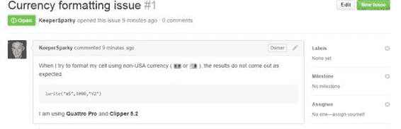
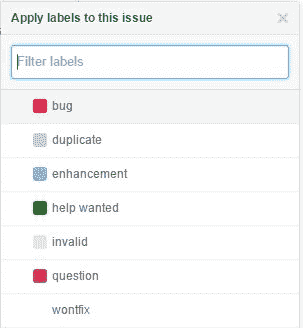
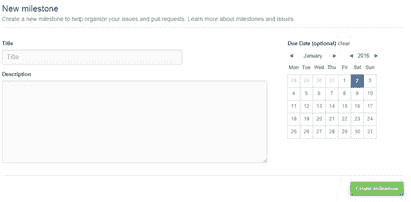
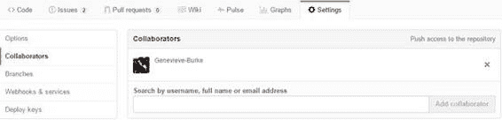

# 第 8 章问题 - 详情

问题是 GitHub 的协作组件，人们就项目活动进行沟通。虽然 Git 和 GitHub 是功能强大的版本控制工具，但通过问题和拉取请求提供的协作支持可以鼓励人们共同合作以生成出色的软件项目。

## 创建问题

在项目详细信息页面中，您可以单击**问题**选项卡，然后单击**新问题**按钮。

图 34：“问题”选项卡

单击“新建问题”按钮时，将显示以下屏幕，以便您输入问题详细信息。您可以使用 Markdown 语法（请参阅附录 1）来设置文本样式。

图 35：编写问题

您可以在正文中使用 Markdown 和[表情符号](http://www.emoji-cheat-sheet.com/)来格式化问题说明。 “预览”选项卡显示问题的样子。

图 36：问题预览

您还可以将文件附加到问题，以帮助存储库作者清楚地了解问题。观看存储库的任何人现在都会收到包含问题内容的电子邮件。

|  | 提示：请记住，GitHub 是国际性的 - 请务必尽可能清楚地表达您的问题，因为来自世界各地的人们可能正在审核该问题。 |

除了 Markdown 之外，您还可以使用 @userName 语法来引用 GitHub 用户，使用 #Issue 语法来引用另一个问题或拉取请求。这允许交叉引用问题并与其他用户和问题链接。

当您输入问题时，GitHub 识别 @ ，# 和：字符，并将搜索匹配以使其更容易。例如，键入# 会显示存储库中的其他问题列表：

图 37：编辑窗口中的问题列表

：（冒号）将显示支持表情符号字符列表， @ 符号将显示与存储库和问题相关联的用户列表。

## 编辑问题

当存储库所有者发现问题时，他们将能够开始处理该问题。这允许他们对问题进行分类，将其分配给某人，将其标记为已关闭，并对该问题进行评论。

图 38：所有者视图

### 标记问题

通常，审核该问题的人将首先为其分配标签，例如错误或增强。

图 39：标记问题

图 39 中显示的七个项目是 GitHub 提供的默认标签。您可以通过单击**标签**按钮从问题列表中添加新标签。

图 40：问题列表

这将显示一个屏幕，允许您编辑标签，删除不需要的标签，并添加任何新标签。添加新标签时，GitHub 会询问标签名称并使用颜色选择器让您选择用于此问题的颜色。

图 41：新问题

添加新标签后，您可以将该标签用于所有新问题和现有问题。

### 里程碑

如果您遇到许多问题，可能需要将它们分组为里程碑。里程碑可以是您想要的任何东西，例如：

*   Sprint - 未来两周内将要解决的问题
*   测试版 - 为下一个主要版本工作
*   客户特定 - 特定客户的问题

您可以创建里程碑，类似于创建标签的方式。里程碑还将允许您选择截止日期以帮助跟踪。

图 42：里程碑屏幕

### 受让人

受让人 按钮可让您指定一个人来处理此问题。它应该是所有者或任何合作者。当您（所有者）正在查看存储库时，您可以从设置菜单添加协作者。

图 43：协作者

协作者可以分配任务。您可以通过查找用户名，电子邮件地址或全名来查看协作者列表并添加新协作者列表。您可以使用 X 按钮从项目中删除协作者。协作者也可以对您的项目进行推送访问。

## 观看问题

当您处理问题，添加标签，受让人等时，GitHub 将显示问题列表中的所有信息

图 44：问题列表

您可以使用顶部的各种选项（作者，标签，里程碑和受理人）来过滤问题列表。您还可以使用搜索时可以使用的相同选项对列表进行排序。 GitHub 使跟踪问题既简单又强大。

## 结案问题

在提交存储库时，可以通过提交消息关闭该问题。 GitHub 认识到以下单词意味着该问题正在关闭。您应该使用#issue 号码关注关键字。

*   关闭
*   关闭
*   关闭
*   修复
*   修复
*   修正
*   解决
*   解决
*   已解决

当 GitHub 在提交消息中看到模式时，它将自动关闭该问题。您也可以在一个提交消息中关闭多个问题。例如，以下提交消息将自动关闭问题# 2。

图 45：关闭提交消息中的问题

## 摘要

GitHub 的问题跟踪和协作功能使其作为跟踪开发进度和工作的工具非常有用。它是一个简单但功能强大的学习系统，对于管理具有多人，多个里程碑等的项目非常有用。