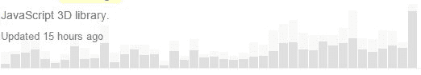

# 第 9 章查看项目

显示搜索结果时，存储库列表中包含大量信息。这些信息可以让您了解项目的受欢迎程度以及项目的积极性。

## 搜索结果

以下示例来自对使用 HTML Canvas 的 JavaScript 代码的搜索。 three.js 是一个 JavaScript 库，可让您在 HTML 5 Canvas 上进行 3D 绘图和动画制作。它的设计简单易用，但却是一个非常强大的 3D 工作库。

图 46：搜索结果

查看搜索结果会显示一些可能有助于了解项目的信息。

### 存储库名称

在图 46 中， mrdoob / three.js 是存储库的所有者和名称。如果您打开存储库窗口，您将能够单击所有者的名称以查找有关他或她的更多信息，以及可能存在的其他存储库。例如，打开我的一个项目（ KeeperSparky ）将向您展示我在阅读本书时上传的两个项目。

图 47：所有者配置文件

如果你想知道，那就是“KeeperSparky”，因为我在足球守门员中扮演足球守门员并且在我大学期间有绰号 Sparky（Radar 的朋友来自 M.A.S.H.）。

### 语言

在右上角，您可以看到三条信息：项目编写的语言，星号（GitHub 用户的正评级）和分叉数（人员增强或处理项目）。

|  | 注意：自首次添加存储库（而不是 7,000 个活动分支）以来，Forks 是跟踪所有分支的历史数字。 |

### 上次更新

在存储库名称和描述下指示存储库上次更新的时间;在我们的例子中，它在 7 小时前更新。这通常是项目非常活跃的良好迹象。

### 参与图

在描述和最后更新的信息下面是参与图。该图显示了来自所有者和贡献者的对存储库的提交的活动。

图 48：参与图

进行提交的所有者和贡献者是有区别的，所以像上面这样的项目显示了很多活动，来自 Mr.Doob 和 519 个贡献者......

## 存储库详细信息

单击存储库后，会显示大量信息，并且您（作为注册用户）可以与存储库进行大量交互。我们将介绍本节中的各种屏幕，以指导您选择您可能感兴趣的选项。

### 社交互动

页面顶部的栏显示左侧的存储库所有者和名称，右侧显示三个按钮。

图 49：存储库的顶部栏

#### 看

您可以观看它（收到所有活动的通知），您可以忽略它（从不看任何通知），或者您可以“不看”（仅查看特别提及您的用户 ID 或您明确参与的通知）。

#### 星

Star 类似于 Facebook 中的 Like 按钮;它通常意味着你已经使用过该项目并喜欢它。您可以通过切换星形按钮随时为  加注星标或取消星标。右边的数字显示了有多少用户“已加星标”或“喜欢”该项目。

#### 叉子

Fork 选项为您的用户 ID 创建存储库的副本（它将显示在您的其他存储库中，而不是显示 fork 图标）。 fork 通常是您希望基于的贡献或启动您自己的项目的副本。如果您只是想使用代码，则可以下载项目，而无需创建分支。

### 存储库动作

存储库名称正下方是一组显示项目各种视图的选项卡。此外，您还可以查看提交的数量（项目生命周期的更新），分支，发布和贡献者。

图 50：存储库操作

#### 代码选项卡

&lt;&gt; 代码选项卡是您找到存储库时的默认选定视图。您可以查看存储库中存在的实际文件和任何子文件夹。

图 51：代码选项卡

最上面的一行显示了首次创建存储库时添加的摘要行。如果您是存储库的所有者，则可以在 GitHub 中编辑此行。

下一行显示存储库中代码的活动（提交，分支，发布和贡献者的数量）。您可以单击每个项目以查看更多详细信息。例如，如果我们查看 momentjs （一个 JavaScript 时间库），我们会找到 90 个贡献者。

图 52：贡献者

图 52 中的屏幕截图仅显示了前两个贡献者（基于提交的数量），但 GitHub 将显示所有贡献者（在合理范围内;如果项目有数百个，GitHub 将警告您并且不显示所有贡献者）。每个人的名字旁边是提交次数，然后是添加的行数（ **绿色** ）和删除的行数（ **red** ）。 GitHub 提供了大量的数字运算和图表来探索。

#### 问题标签

单击“问题”选项卡会显示与存储库关联的可搜索问题列表。您还可以通过单击绿色的新问题按钮来创建新问题。

图 53：问题

在此屏幕中，您可以通过单击**作者**（问题的创建者），**标签**旁边的下拉箭头（例如错误，增强，新图标）来过滤问题列表等），**里程碑**和**受让人**。您还可以按日期和添加到问题的注释数量对列表进行排序。

左侧允许您在打开和关闭问题之间切换。

**过滤器**下拉菜单可让您在问题列表中搜索已创建的问题，已分配给您的问题，提及您的问题等。

在撰写问题时，请务必提供足够的详细信息，以明确报告的内容。如果这是一个错误，请包含重现它的步骤。如果是功能请求，请务必明确要添加或增强的功能。以下示例显示写入 momentjs 库的明确问题。

图 54：示例问题

#### 拉请求

拉取请求意味着已经针对问题做出了修复，并且协作者正在请求将修复合并回到其中一个分支中。图 55 显示了一个示例拉取请求列表。

图 55：拉取请求列表

Pull 请求对“问题”选项卡具有类似的过滤和排序选项（例如“作者”，“标签”和“里程碑”）。

当您打开拉取请求时，第一行会将请求显示为注释。

图 56：拉取请求描述

在这个例子中，用户 monkbroc 更新了他的分叉版本（ monkbroc：patch-2 ），并请求将他对 fork 的提交合并到项目的 master 分支中。

您可能还会看到带有 pull 请求的其他类型的描述。例如，图 57 显示了一个已合并回主分支的关闭拉取请求。

图 57：合并拉取请求

但是，并非所有拉取请求都合并到主分支中;在图 58 中，拉取请求已关闭而未合并。由存储库所有者来接受并应用任何拉取请求。

图 58：关闭拉取请求的示例

在拉取请求列表中，不同的图标指示请求的状态。

在下一行，您将看到三个选项卡。第一个选项卡 Conversation 显示与请求相关的各种问题和注释。

图 59：拉取请求对话

此选项卡允许您查看原始问题和后续注释。

下一个选项卡 Commits 显示协作者对其分支分支的任何提交。这显示了 fork 的日期和提交消息。

图 60：提交消息

颜色编码的数字显示在此提交期间添加和删除的行数。

最后一个选项卡 Files changed，显示了使用此提交确切更改了文件内容的详细信息。这允许所有者查看她是否想要接受拉取请求。

图 61：更改详细信息

默认情况下，GitHub 显示更改的统一视图，但您可以单击**拆分**按钮并排显示两个文件，以另一种方式查看更改。

GitHub 报告协助存储库所有者的一个很好的功能是拉取请求是否与基本分支冲突的状态。

图 62：冲突报告

作为拉取请求的一部分呈现的所有信息帮助存储库所有者决定是否将请求合并回主分支。

## Wiki

GitHub 允许您创建和维护有关存储库的 Wiki，尽管这是一个可选功能。如果您有 Wiki，则会出现一个选项卡，让存储库查看器查看 Wiki。 Wiki 是持续存储库文档的良好来源。 **readme.md** 文件提供了很好的介绍，而 Wiki 可以更详细地详细说明如何使用代码。

图 63：Font Awesome Wiki

跟踪 Wiki 内容，因此您可以查看修订版，以查看 Wiki 中随时间发生的变化。维基内容并像其他任何存储库一样进行更新，并将拉动请求合并到 Wiki 中。

Wiki 编辑提供了许多不同的格式选项，默认为 Markdown，但支持许多其他 Wiki 编辑器。下面的屏幕显示了 Wiki 的基本编辑器。

图 64：Wiki 编辑

Wiki 内容是协作的，允许多个用户增强 Wiki 并改进存储库上的文档。

#### 脉冲

Pulse 选项卡显示一段时间内存储库中活动的概述（默认为上周）。

图 65：脉冲

顶部显示了合并和建议的拉取请求以及已关闭和新的活动问题。您可以单击任何区域以获取组成活动的所有项目的列表。

摘要下方是有关此活动期间的协作者的信息。您可以单击图形栏下方的图片查看该用户的帐户页面。

最后，在顶部的摘要信息下方是此活动期间内所有拉取请求和问题的列表。

Pulse 选项卡可让您了解存储库的活动程度;此示例表示 Bootstrap 中的一周活动。

#### 图表

“图形”选项卡显示有关存储库，其贡献者，活动等的各种数据。顶部的菜单显示了可显示的各种图形：

图 66：GitHub Graphs 菜单

贡献者图表显示了项目最活跃的贡献者以及他们在项目生命周期中所做的提交（这与您在查看代码时单击贡献者链接时获得的页面相同）。

图 67：贡献者图表

提交图表显示两个图表;最上面的一个是过去一年中项目所有活动的条形图。下图显示了每天的平均提交次数。

图 68：提交图表

顶部的图表让您了解项目的活跃程度，而底部的图表则显示了一周中哪些日子完成了大部分工作。

会员图显示了此存储库的所有分支。它显示了用户及其分叉。您可以单击用户名以查看该用户的帐户详细信息。您还可以单击 fork 名称以访问该用户的存储库分支。

图 69：成员图

有时，如果 fork /贡献者列表太大，GitHub 将显示其俗语幽默感，并且仅显示一些分支。

图 70：位太大了

还有其他图表可显示有关存储库及其活动的统计信息。您可以访问[此链接](https://help.github.com/articles/about-repository-graphs/)来阅读所有图表。

### readme.md 内容

存储库中的文件列表下方是 **readme.md** 文件的内容。这个文件应该很好地概述了存储库的内容，如何安装和使用它等等。你可以在 GitHub 上找到各种自述文件;一些是完整的用户手册，而其他一些是告诉你如何安装软件的几行。

至少，我会提供代码的简短（一段）摘要，以及如何安装它（最低要求）。这至少可以激起用户的胃口。然后，您可以提供更多详细信息（在自述文件的其余部分中）或作为存储库中的单独文档文件。

## 摘要

本章中有很多关于 GitHub 提供的有关存储库的信息。您应该知道如何使用此信息来帮助确定特定的存储库是否可以帮助您的应用程序，以及您是否可以回馈代码库。

在下一章中，我们将讨论如何获取自己个人使用的代码或参与项目的代码。