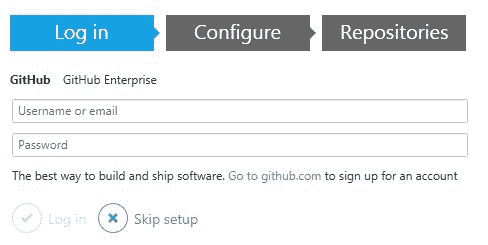
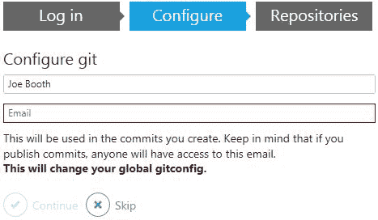
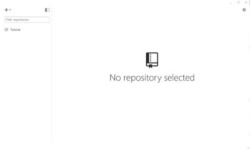
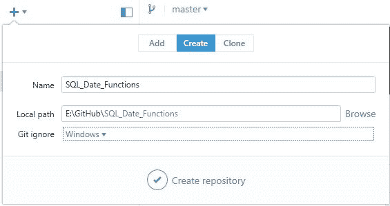
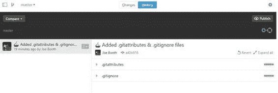
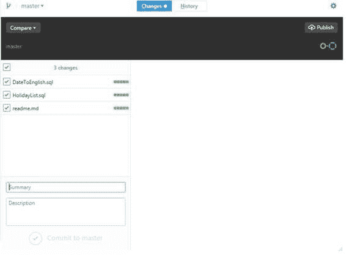
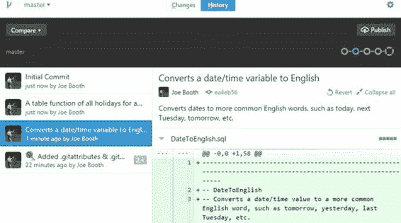
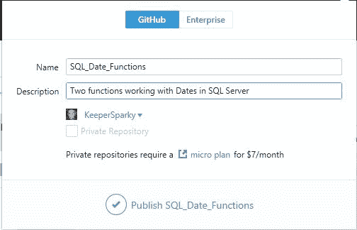
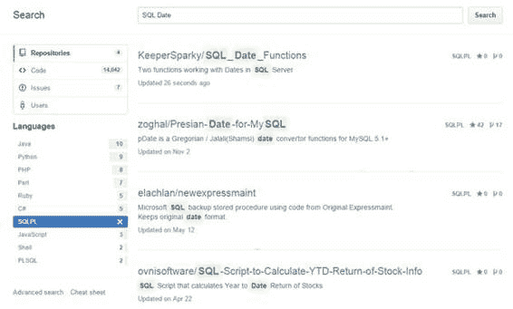

## 下载 GitHub 桌面

在本地计算机上安装 Git 的第一步是访问 [GitHub 桌面](https://desktop.github.com/ "蘞뉘뿰ṝĽ纀篓")网站并下载桌面应用程序。

图 6：GitHub 桌面站点

### 配置 GitHub 桌面

完成安装后，您需要使用**登录**选项卡将桌面版本链接到 GitHub 帐户。

图 7：桌面配置

登录后，您将转到“配置”选项卡。

### 配置选项卡

“配置”选项卡用于将您的帐户与您所做的任何提交（写入您的存储库）相关联。

图 8：Git 配置

Git 将您的用户 ID 和电子邮件地址链接到您的提交，因此查看您的存储库的任何人都将看到您的电子邮件地址。如果您希望将您的电子邮件地址保密，您可以访问 GitHub 并编辑您的个人资料。在**个人设置**下，导航到电子邮件菜单项。

图 9：电子邮件配置文件配置

如果选中此框，任何 Git 操作都将被发送到特殊的 GitHub 帐户（_ 用户名 _ @ users.noreply.github.com）。您还需要在 Configure Git 屏幕中设置此电子邮件地址。

### 存储库

如果这是您第一次使用 Git，则不会设置存储库，因此您需要创建一个存储库。 GitHub 桌面将检测到并跳转到存储库页面。

图 10：存储库页面

单击 **+** （加号）符号以添加存储库。默认情况下，GitHub 将一个名为 GitHub 的文件夹添加到您的文档文件夹中，该文件夹将存储存储库。首次设置存储库时，可以通过更改本地路径将存储库放在任何位置。在下面的屏幕上，我将我的 SQL 日期函数存储库添加到名为 E：\ GitHub 的本地文件夹中。

图 11：创建存储库

设置存储库后，可以将所需文件移动到此本地文件夹。这将是将它们发布到 GitHub 的第一步。首次设置存储库时，将添加两个文件，这些文件基本上为 Git 提供配置说明。

图 12：初始存储库

#### Gitattributes

默认。 **gitattributes** 文件提供了一组控制 GitHub 操作的选项，特别是在比较文件时。该列表包含文件扩展名（* .doc）和检测到该文件时要执行的命令。例如，以下行指示 GitHub 在运行比较时将具有.PDF 扩展名的任何文件转换为纯文本：

* .pdf diff = astextplain

您也可以为文件扩展名添加其他属性。例如：

* .jpg 二进制

这行告诉 Git 任何带有.JPG 扩展名的文件都是二进制文件。虽然 Git 非常了解文件类型，但您可能在项目中有一些文件应该被视为二进制文件（从不比较或合并）。

.gitattributes 文件是可选的;如果您不需要对存储库中的文件进行任何特殊处理（例如，仅添加源代码文件），则可以将其删除。

#### GitIgnore

的。 **gitignore** 文件告诉 GitHub，为了跟踪目的，应该忽略它可能找到的某些文件。对于 Windows 系统，您可能希望忽略诸如 MSI 安装程序，.DB 映像缓存等文件。例如，以下行指示 Git 不跟踪存储库中的任何 MSI 安装程序文件：

* .msi

有许多匹配规则，否定规则等，你可以添加到 GitIgnore 文件中获取 Git 的指令。

#### 创建 readme.md 文件

一旦创建了存储库，就应该创建一个 **readme.md** 文本文件。 （.md 扩展名代表 Markdown Document）。当您在 GitHub 上打开存储库时，将显示此文件，并且可以由使用 GitHub 的人员进行搜索。虽然它是一个简单的文本文件，但您可以使用一些格式化选项。 GitHub 使用 Markdown 语法来创建纯文本文件，这些文件将显示为 HTML。如果您想了解有关 Markdown 的更多信息，请关注[此链接](http://daringfireball.net/projects/markdown/)，或使用 GitHub 帮助系统查看文本中支持的代码。

对于我们关于 SQL Date 函数的简单自述文件，我们将使用 ##＆lt; _ 文 _ ＆gt; ## 创建 H2 级标题， ### 用于 H3 级标题。

## SQL 日期函数##

为 SQL-Server 编写了几个日期函数（虽然可以很容易地移植到其他平台）。

### Holiday_list（）###

一个好的 readme.md 文件应该吸引用户探索你的存储库。您还可以使用以下语法添加指向您自己网站的链接：

[Joe Booth Consulting]（ [http://www.joebooth-consulting.com](http://www.joebooth-consulting.com) ）

创建文件后，将其保存在 GitHub 本地存储库文件夹中。

#### 加载文件

如果单击**更改**，您应该会看到刚添加的 **readme.md** 文件。如果没有文件，您将被告知没有本地更改，您将有机会在 Windows 资源管理器中打开文件夹（存储库）。将要添加的文件复制到该文件夹​​中。 Git 现在将显示文件夹中所做的更改（新文件）。例如，我创建了一个存储库来保存我的假日列表 SQL 代码和 readme.md 文件：

图 13：初始更改集

要将这些文件提交到本地分支，您应该输入摘要和描述。需要摘要才能将更改提交到主分支。但是，提供摘要和说明是个好主意。完成后，单击 Commit to Master 按钮。

|  | 注意：摘要和说明适用于您已更改的所有文件，因此您可能希望单独提交文件以更好地描述每个文件。 |

您现在可以返回**历史记录**选项卡查看所做的更改集（Git 文件和您添加的文件）。

图 14：对存储库所做的更改

#### 发布存储库

最后一步，单击 **Publish** 按钮将存储库发布到 GitHub 服务器。

图 15：发布您的存储库

恭喜 - 您刚刚将第一个存储库发布到 GitHub。

### 搜索

发布后，搜索 GitHub 会找到我的存储库。

图 16：查找存储库