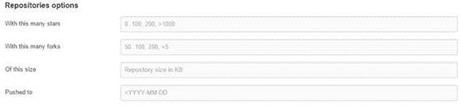

## 存储库选项

同样，您可以限制您有兴趣搜索的存储库。

图 23：存储库搜索选项

您可以将搜索范围限制为最小或最大星数和/或叉数。您还可以限制存储库的大小和最新推送的日期。

例如，要查找许多人使用的 JavaScript [Timezone](https://github.com/mde/timezone-js) 库，我们可能会使用以下语法：

时区语言：javascript 明星：＆gt; 500

通过组合选项，您可以将返回的结果范围缩小到适合您应用需求的解决方案。

|  | 提示： 虽然您可以创建一些非常大的搜索请求（例如超过 500 颗星的所有项目），但除了高级搜索选项外，通常还应包含至少一个搜索词。 |

当您对搜索选项感到满意时，可以直接输入搜索文本而无需使用高级搜索参数屏幕。

|  | 提示： 请记住，关键字（星号，语言等）都以:(冒号）结尾。搜索“星星＆gt; 500”将不会返回任何结果，但“星星：＆gt; 500”将起作用。 |