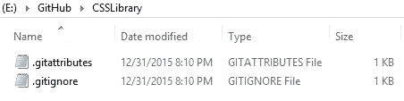

## 工作目录

工作目录是计算机或网络共享上的文件夹。每个开发人员都拥有所有代码和相关文件的完整副本。您可以在工作目录中完成所有开发工作，并让 Git 管理该文件夹的版本控制方面。

Git 将此工作目录称为存储库，或简称为 repos。当 Git 管理文件夹时，您将获得 Git 提供的所有版本控制权益。

### Git 文件

在工作目录中，您可能会找到一些额外的文件，用于向 Git 提供有关文件夹中文件的说明。这些是 .gitattributes 和 .gitignore 。属性文件告诉 Git 如何处理各种文件以进行比较操作。 ignore 文件指示 Git 不应该由 Git 处理某些文件（基于扩展名）。这些文件将在后面的章节中详细介绍。

图 1：启动 Git 空工作目录

当您创建存储库时，Git 会将这些文件的默认版本添加到您的工作目录中。您可以在现有目录上创建 Git 存储库，或让 Git 为您创建新的存储库（和工作文件夹）。您还可以克隆现有存储库。克隆是存储库的完整副本（包括历史记录）。无论您如何创建它，您现在都将拥有一个 Git 存储库来开始工作。

### 克隆

克隆是存储库的完整副本。例如，您可以制作存储库的副本，修复一些错误，然后将代码提交回存储库。这假设您具有对存储库的写访问权。

### 叉

fork 是在您的帐户下为无法直接更新的存储库创建的存储库的副本。您可以在副本中更改代码，然后提交拉取请求，要求将更改集成回主存储库。在开源项目中通常就是这种情况，许多协作者会帮助作者解决问题，但作者决定何时将它们包含在主分支中。

### 拉请求

拉取请求是对存储库所有者的请求，以将您建议的更改合并回代码库。这通常由已修复报告问题的协作者完成。

|  | 注意：拉/推术语可能会令人困惑。 “推”通常意味着将信息从中心位置移动到订户，而“拉”意味着订户请求信息。在 GitHub 中，“订户”是存储库所有者，他们希望从您的（开发人员）本地存储库中提取更改。如果您将所有者视为订阅者，则“拉取请求”的定义意味着：“嘿，订阅者，我有一些您可能想要的更改......” |