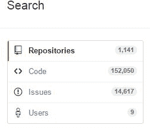

# 第 6 章其他搜索

虽然到目前为止我们专注于存储库搜索，但您也可以搜索 GitHub 以获取其他信息。当 GitHub 搜索时，它还会同时搜索代码，库和用户。当我用 C＃的语言搜索 Excel 时，我发现超过 1,100 个存储库和超过 150,000 行代码包含单词“Excel”。此外，还有超过 14,000 个问题（错误报告，增强请求等）和 9 个用户名中包含“Excel”的用户。

图 24：搜索选项

无论您要搜索什么，GitHub 都会向您显示其他类别的计数和结果。某些排序选项会根据您正在查看的类别而有所不同。但是，仍然可以应用前面描述的搜索选项。