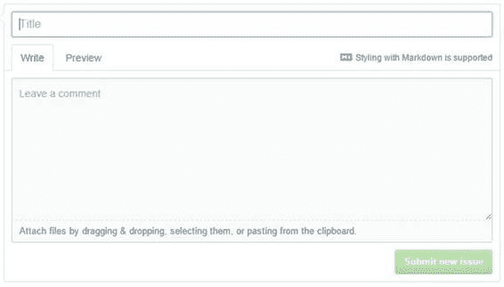

## 问题

问题是人们撰写有关特定存储库的建议，错误报告，文档更新等。 GitHub 具有非常强大的代码跟踪和比较功能，因为 GitHub 的很大一部分正在协作更新项目。有许多关键字可以让您搜索问题，也许找到一些有趣的存储库，您可能有经验可以帮助。

问题条目非常简单，可以轻松提供问题和描述（并且您可以附加文件）。 “新问题”屏幕如下所示：

图 26：新问题屏幕

在提交新问题之前，您应该检查是否已经建议了类似的问题。

### 搜索问题内容

您可以在关键字中使用标题，正文或注释（或三者的任意组合）。如果未指定，则仅搜索标题和正文。例如，假设您正在使用 C# 电子表格库并且正在获取损坏的电子表格。以下语法将查找 C# 存储库中损坏的电子表格的所有问题。

损坏的电子表格：标题，肢体语言：c# 

### 问题类型

问题可能是问题或拉取请求（将建议的代码合并回存储库的请求）。您可以使用类型限制搜索：关键字：

*   类型：pr - 仅搜索拉取请求
*   类型：问题 - 仅搜索问题

如果未指定类型，则将搜索问题和拉取请求。

### 用户

有许多用户与问题相关联：原始作者，分配用于解决问题的人员，评论者等。您可以使用各种关键字搜索涉及问题的各种方式的人员：

*   作者 - 创建问题的人
*   受让人 - 负责解决问题的用户
*   提及 - 可能在问题正文或评论中提及的特定用户
*   评论者 - 对某个问题发表评论的人

您可以在搜索时组合上述列表的任意组合。例如，以下搜索引出了由 English Extra 创建并由 Doug Crockford 评论的旧问题：

作者：englishextra 评论者：douglascrockford

请注意，问题和相应的注释有时会有点蹩脚（例如，从此搜索中读取问题）。

如果你想找到一个与问题相关的用户，但不确定他们有哪个角色，你可以使用涉及：关键字，这基本上只是所有四种类型用户的 OR 。

### 开/关

**状态：**关键字可用于查找开放式问题和已关闭问题。例如，要找到 Derek Nutile 与 CSS 相关的开放性问题（字体很棒的名声）：

州：开放涉及：dereknutile 语言：css

### 日期

您可以使用创建的：关键字或更新的：关键字搜索何时创建或更新问题。两者都使用格式为 yyyy-mm-dd 的日期。例如：

font-awesome 创建时间：2015-12-01..2015-12-31 语言：css

此搜索查找 2015 年 12 月期间更新的所有字体特征问题.Fontate Awesome 是一个图标库，通常人们会要求开发特定的图标。例如，该用户最近建议将一个 MS-DOS 和终端图标添加到 Font Awesome：

图 27：Font Awesome 请求

### 评论

您可以使用评论：关键字按照问题附加的评论数量进行搜索。搜索注释计数时，可以使用标准数字比较运算符。

### 排序问题

您可以通过多种方式对找到的问题列表进行排序。默认的最佳匹配项会尝试查找与您的大多数搜索条件相匹配的问题。您还可以按以下方式排序：

*   大多数或最少评论
*   最新或最旧
*   最近更新或最近更新