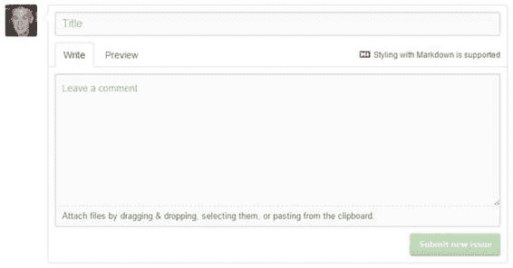

## 创建问题

在项目详细信息页面中，您可以单击**问题**选项卡，然后单击**新问题**按钮。

图 34：“问题”选项卡

单击“新建问题”按钮时，将显示以下屏幕，以便您输入问题详细信息。您可以使用 Markdown 语法（请参阅附录 1）来设置文本样式。

图 35：编写问题

您可以在正文中使用 Markdown 和[表情符号](http://www.emoji-cheat-sheet.com/)来格式化问题说明。 “预览”选项卡显示问题的样子。

图 36：问题预览

您还可以将文件附加到问题，以帮助存储库作者清楚地了解问题。观看存储库的任何人现在都会收到包含问题内容的电子邮件。

|  | 提示：请记住，GitHub 是国际性的 - 请务必尽可能清楚地表达您的问题，因为来自世界各地的人们可能正在审核该问题。 |

除了 Markdown 之外，您还可以使用 @userName 语法来引用 GitHub 用户，使用 #Issue 语法来引用另一个问题或拉取请求。这允许交叉引用问题并与其他用户和问题链接。

当您输入问题时，GitHub 识别 @ ，＃和：字符，并将搜索匹配以使其更容易。例如，键入＃会显示存储库中的其他问题列表：

图 37：编辑窗口中的问题列表

：（冒号）将显示支持表情符号字符列表， @ 符号将显示与存储库和问题相关联的用户列表。