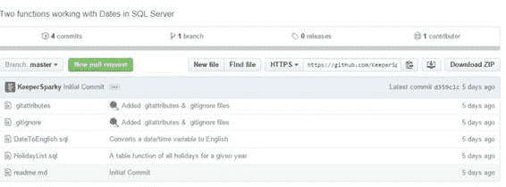
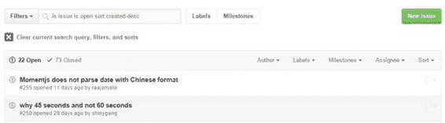
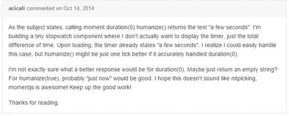
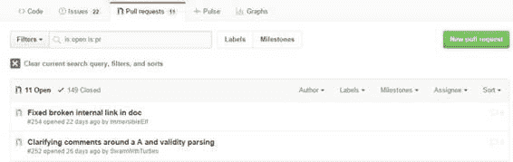
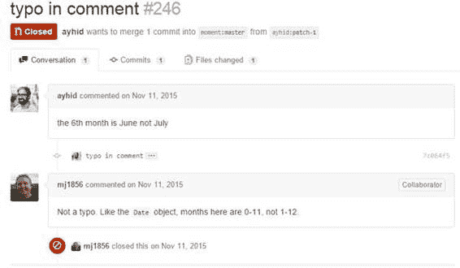
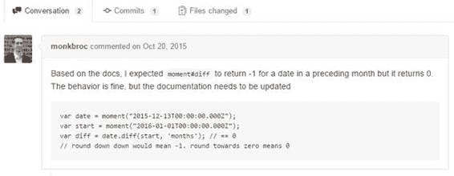
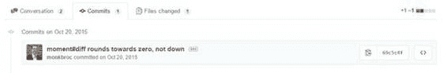
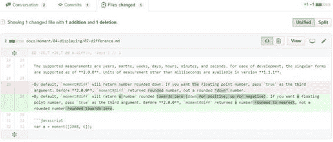

## 存储库详细信息

单击存储库后，会显示大量信息，并且您（作为注册用户）可以与存储库进行大量交互。我们将介绍本节中的各种屏幕，以指导您选择您可能感兴趣的选项。

### 社交互动

页面顶部的栏显示左侧的存储库所有者和名称，右侧显示三个按钮。

图 49：存储库的顶部栏

#### 看

您可以观看它（收到所有活动的通知），您可以忽略它（从不看任何通知），或者您可以“不看”（仅查看特别提及您的用户 ID 或您明确参与的通知）。

#### 星

Star 类似于 Facebook 中的 Like 按钮;它通常意味着你已经使用过该项目并喜欢它。您可以通过切换星形按钮随时为  加注星标或取消星标。右边的数字显示了有多少用户“已加星标”或“喜欢”该项目。

#### 叉子

Fork 选项为您的用户 ID 创建存储库的副本（它将显示在您的其他存储库中，而不是显示 fork 图标）。 fork 通常是您希望基于的贡献或启动您自己的项目的副本。如果您只是想使用代码，则可以下载项目，而无需创建分支。

### 存储库动作

存储库名称正下方是一组显示项目各种视图的选项卡。此外，您还可以查看提交的数量（项目生命周期的更新），分支，发布和贡献者。

图 50：存储库操作

#### 代码选项卡

&lt;&gt; 代码选项卡是您找到存储库时的默认选定视图。您可以查看存储库中存在的实际文件和任何子文件夹。

图 51：代码选项卡

最上面的一行显示了首次创建存储库时添加的摘要行。如果您是存储库的所有者，则可以在 GitHub 中编辑此行。

下一行显示存储库中代码的活动（提交，分支，发布和贡献者的数量）。您可以单击每个项目以查看更多详细信息。例如，如果我们查看 momentjs （一个 JavaScript 时间库），我们会找到 90 个贡献者。

图 52：贡献者

图 52 中的屏幕截图仅显示了前两个贡献者（基于提交的数量），但 GitHub 将显示所有贡献者（在合理范围内;如果项目有数百个，GitHub 将警告您并且不显示所有贡献者）。每个人的名字旁边是提交次数，然后是添加的行数（ **绿色** ）和删除的行数（ **red** ）。 GitHub 提供了大量的数字运算和图表来探索。

#### 问题标签

单击“问题”选项卡会显示与存储库关联的可搜索问题列表。您还可以通过单击绿色的新问题按钮来创建新问题。

图 53：问题

在此屏幕中，您可以通过单击**作者**（问题的创建者），**标签**旁边的下拉箭头（例如错误，增强，新图标）来过滤问题列表等），**里程碑**和**受让人**。您还可以按日期和添加到问题的注释数量对列表进行排序。

左侧允许您在打开和关闭问题之间切换。

**过滤器**下拉菜单可让您在问题列表中搜索已创建的问题，已分配给您的问题，提及您的问题等。

在撰写问题时，请务必提供足够的详细信息，以明确报告的内容。如果这是一个错误，请包含重现它的步骤。如果是功能请求，请务必明确要添加或增强的功能。以下示例显示写入 momentjs 库的明确问题。

图 54：示例问题

#### 拉请求

拉取请求意味着已经针对问题做出了修复，并且协作者正在请求将修复合并回到其中一个分支中。图 55 显示了一个示例拉取请求列表。

图 55：拉取请求列表

Pull 请求对“问题”选项卡具有类似的过滤和排序选项（例如“作者”，“标签”和“里程碑”）。

当您打开拉取请求时，第一行会将请求显示为注释。

图 56：拉取请求描述

在这个例子中，用户 monkbroc 更新了他的分叉版本（ monkbroc：patch-2 ），并请求将他对 fork 的提交合并到项目的 master 分支中。

您可能还会看到带有 pull 请求的其他类型的描述。例如，图 57 显示了一个已合并回主分支的关闭拉取请求。

图 57：合并拉取请求

但是，并非所有拉取请求都合并到主分支中;在图 58 中，拉取请求已关闭而未合并。由存储库所有者来接受并应用任何拉取请求。

图 58：关闭拉取请求的示例

在拉取请求列表中，不同的图标指示请求的状态。

在下一行，您将看到三个选项卡。第一个选项卡 Conversation 显示与请求相关的各种问题和注释。

图 59：拉取请求对话

此选项卡允许您查看原始问题和后续注释。

下一个选项卡 Commits 显示协作者对其分支分支的任何提交。这显示了 fork 的日期和提交消息。

图 60：提交消息

颜色编码的数字显示在此提交期间添加和删除的行数。

最后一个选项卡 Files changed，显示了使用此提交确切更改了文件内容的详细信息。这允许所有者查看她是否想要接受拉取请求。

图 61：更改详细信息

默认情况下，GitHub 显示更改的统一视图，但您可以单击**拆分**按钮并排显示两个文件，以另一种方式查看更改。

GitHub 报告协助存储库所有者的一个很好的功能是拉取请求是否与基本分支冲突的状态。

图 62：冲突报告

作为拉取请求的一部分呈现的所有信息帮助存储库所有者决定是否将请求合并回主分支。