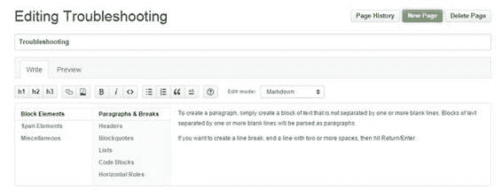
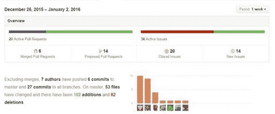
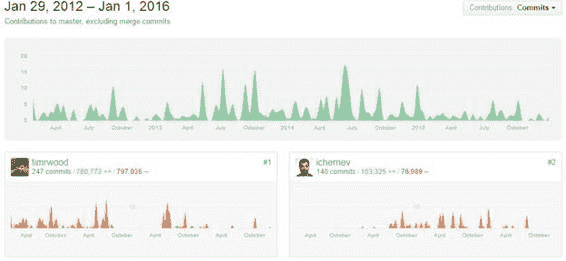
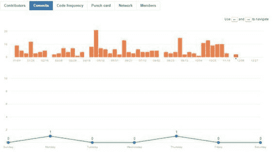
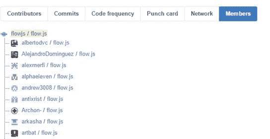

## Wiki

GitHub 允许您创建和维护有关存储库的 Wiki，尽管这是一个可选功能。如果您有 Wiki，则会出现一个选项卡，让存储库查看器查看 Wiki。 Wiki 是持续存储库文档的良好来源。 **readme.md** 文件提供了很好的介绍，而 Wiki 可以更详细地详细说明如何使用代码。

图 63：Font Awesome Wiki

跟踪 Wiki 内容，因此您可以查看修订版，以查看 Wiki 中随时间发生的变化。维基内容并像其他任何存储库一样进行更新，并将拉动请求合并到 Wiki 中。

Wiki 编辑提供了许多不同的格式选项，默认为 Markdown，但支持许多其他 Wiki 编辑器。下面的屏幕显示了 Wiki 的基本编辑器。

图 64：Wiki 编辑

Wiki 内容是协作的，允许多个用户增强 Wiki 并改进存储库上的文档。

#### 脉冲

Pulse 选项卡显示一段时间内存储库中活动的概述（默认为上周）。

图 65：脉冲

顶部显示了合并和建议的拉取请求以及已关闭和新的活动问题。您可以单击任何区域以获取组成活动的所有项目的列表。

摘要下方是有关此活动期间的协作者的信息。您可以单击图形栏下方的图片查看该用户的帐户页面。

最后，在顶部的摘要信息下方是此活动期间内所有拉取请求和问题的列表。

Pulse 选项卡可让您了解存储库的活动程度;此示例表示 Bootstrap 中的一周活动。

#### 图表

“图形”选项卡显示有关存储库，其贡献者，活动等的各种数据。顶部的菜单显示了可显示的各种图形：

图 66：GitHub Graphs 菜单

贡献者图表显示了项目最活跃的贡献者以及他们在项目生命周期中所做的提交（这与您在查看代码时单击贡献者链接时获得的页面相同）。

图 67：贡献者图表

提交图表显示两个图表;最上面的一个是过去一年中项目所有活动的条形图。下图显示了每天的平均提交次数。

图 68：提交图表

顶部的图表让您了解项目的活跃程度，而底部的图表则显示了一周中哪些日子完成了大部分工作。

会员图显示了此存储库的所有分支。它显示了用户及其分叉。您可以单击用户名以查看该用户的帐户详细信息。您还可以单击 fork 名称以访问该用户的存储库分支。

图 69：成员图

有时，如果 fork /贡献者列表太大，GitHub 将显示其俗语幽默感，并且仅显示一些分支。

图 70：位太大了

还有其他图表可显示有关存储库及其活动的统计信息。您可以访问[此链接](https://help.github.com/articles/about-repository-graphs/)来阅读所有图表。

### readme.md 内容

存储库中的文件列表下方是 **readme.md** 文件的内容。这个文件应该很好地概述了存储库的内容，如何安装和使用它等等。你可以在 GitHub 上找到各种自述文件;一些是完整的用户手册，而其他一些是告诉你如何安装软件的几行。

至少，我会提供代码的简短（一段）摘要，以及如何安装它（最低要求）。这至少可以激起用户的胃口。然后，您可以提供更多详细信息（在自述文件的其余部分中）或作为存储库中的单独文档文件。