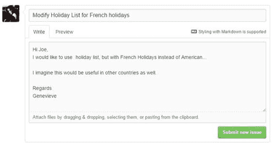
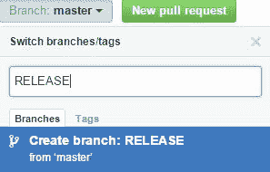

## SQL 日期函数

在本书的早期，我们创建了一些处理日期的 SQL 代码库。其中一个脚本（假期列表）将创建给定年份的假期列表。法国程序员吉纳维芙喜欢这个剧本，但她希望在法国假期改造它，而不仅仅是美国假期。她决定提交一个问题，建议不同国家的假期，而不是简单地下载脚本并将其修改为自己使用。

### 正在提交问题

Genevieve 在 GitHub 中打开存储库并单击 **Issues** 选项卡。她点击**新问题**提交有关代码的新问题。

图 76：提交问题

请注意，她可以使用 Markdown 语法来控制她的问题外观，并且还可以上传与问题相关的文件。

### Joe 收到了电子邮件

由于我正在观看自己的存储库，因此我收到了 GitHub 发来的电子邮件，告诉我已经提交了一个问题。

嗨乔，
我想使用假期列表，但是法国假期而不是美国假期。

我想这也适用于其他国家。

此致，
Genevieve

-
直接回复此电子邮件或 [在 GitHub](https://github.com/KeeperSparky/SQL_Date_Functions/issues/2) 上查看。 

我认为这是一个很好的建议，但我不确定我是否有时间研究多个国家的假期。

### 查看问题

我打开 GitHub 并登录，我可以查看与此存储库相关的问题。到目前为止，这是唯一报道的问题。

图 77：问题

由于这是迄今为止唯一的问题，并且需要一些研究或协助才能从其他国家获得假期，我决定创建一个新的分支机构。我将这个分支称为 RELEASE，并使用它来完成添加国家支持的工作。如果在现有基础中报告任何错误，我可以更正这些错误而不向用户提供任何部分完成的语言支持代码。

#### 创建分支

分支表示存储库中所有代码的完全独立的副本。这允许您或任何协作者处理此代码而不会影响主分支。完成代码后，如果您选择，GitHub 将帮助您将其合并回主分支。

要创建分支，请单击存储库中的 **Branch** 并键入分支的名称。

图 78：创建新分支

GitHub 将看到该分支不存在，并提供从当前选定的分支（本例中为 master）为您创建新分支。

图 79：新分支

您现在将拥有一个单独的代码副本，以便您可以在不干扰主代码分支的情况下对其进行处理。

### 添加协作者

由于 Genevieve 同意提供帮助，我更新了存储库设置并将她添加为协作者。

图 80：添加协作者

此时，Genevieve 可以从存储库的 Dev 分支创建一个 fork。她创建了 fork，现在有自己的副本可供使用。

图 81：存储库的分叉副本

此时，Genevieve 可以开始进行更改，以在 SQL 用户定义的函数中实现法语假日。