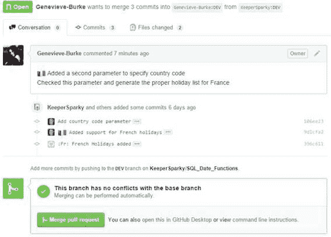

## 审核请求

所有者在打开存储库时会看到请求。

图 85：拉取请求视图

通过单击拉取请求本身，将显示请求的详细信息。

图 86：拉取请求详细信息

所有者现在可以查看提交和实际文件更改，以决定是否合并代码。查看更改并接受更改后，所有者单击“合并拉取请求”按钮。 GitHub 会要求确认，一旦确认，将执行合并。

成功合并

合并成功后，GitHub 将报告并更新存储库：

图 87：成功的拉取请求

由于 pull 请求已完成，因此在查看存储库时，它将显示为关闭的 pull 请求。