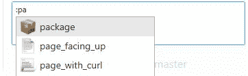
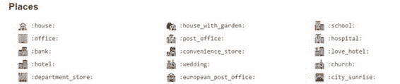

# 附录 2 表情符号

除了使用 Markdown 之外，您还可以在 GitHub 文本框中添加表情符号字符。表情符号是在文档正文中显示而不是文本的迷你图片。表情符号名称由冒号字符分隔。如果在文本窗口中键入冒号，GitHub 将以冒号后的字母开头显示可用的表情符号：

图 88：表情符号选择

表情符号可以让你的文字更容易阅读和理解，更有趣的是看。一些示例表情符号如图 89 所示：

图 89：示例表情符号

许多网站都使用表情符号，而不仅仅是 GitHub。要查看完整集，请访问[此网站](http://www.emoji-cheat-sheet.com/)。