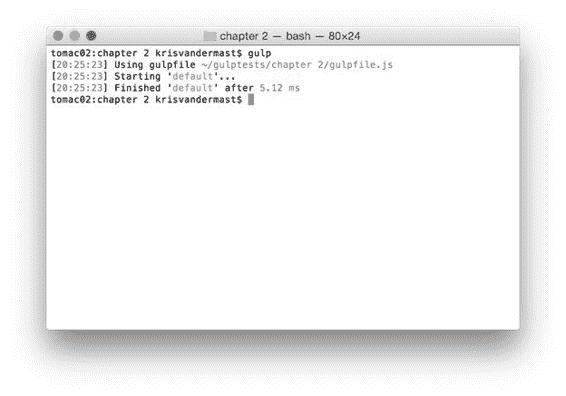

# 第 2 章让我们建立一些东西

## 安装 Gulp

如第 1 章所述，Gulp 是一个在 node.js 之上运行的任务运行器。因此要让 Gulp 运行，我们需要安装 node.js.您可以在此处下载 [](https://nodejs.org/en/) 。随之而来的是 Node Package Manager，或者是 npm。在本书的其余部分中，您将使用 npm 来安装所需的 Gulp 插件。稍后会详细介绍。

安装 node.js 后，需要打开控制台窗口或终端窗口并输入以下内容：

npm install --global gulp

这将全局安装 Gulp 并将 Gulp 添加到您计算机的路径上。

|  | 提示：如果您未在 Mac 上以管理员权限运行，则需要在此命令前加上 sudo 。所以它成为 sudo npm install --global gulp 。 |

前面的步骤只需要在每台要使用 Gulp 的机器上执行一次。

完成这些步骤后，您可以输入以下命令来检查是否已设置好所有步骤。

节点-v
npm -v
gulp -v

这将为您提供每个组件的版本。当我写这个段落时，你在下一个图中看到的版本可以在我的机器上找到。当您阅读本文时，版本号可能已经更改。


图 3：显示 node.js，npm 和 Gulp CLI 的版本

## 如何安装插件

您必须在每个机器上执行前一段中必须执行的步骤。但是，您需要为正在处理的每个项目安装插件。

根据您使用的工具，可能会为您自动化。在这种情况下，请检查您正在使用的工具的文档。

如果您只是使用文本编辑器和终端窗口，就像本书的第一章一样，您可以按照以下步骤操作：

1.  创建要在其中创建应用程序的文件夹
2.  打开该文件夹并输入 npm init 。这将在您完成所有设置步骤后创建 **package.json** 文件。在设置过程中，您可以填写每一行，或者您可以通过按**输入**键快速逐步完成每个问题，并在最后回答**是**。
3.  You can now install Gulp and Gulp plugins via the command:

    一个。 npm install gulp --save-dev

    湾 npm install gulp-less --save-dev （例如安装 Gulp 插件 gulp-less ）

|  | 提示：当您预先了解插件时，您也可以进行这样的声明，例如 npm install gulp gulp-less gulp-coffeescript --save-dev 一次安装所有三个模块。 |

|  | 提示：如果您找到示例代码并注意到 package.json 文件中的大量条目，您可以通过键入 npm install --save-dev 来查找所有条目，然后再查找软件包并在本地恢复它们。 |

## gulpfile.js

gulpfile.js 是您在每个项目的基础上花时间编写任务的地方。这是 Gulp 查看该怎么做的标准文件。您可以使用自己喜欢的文本编辑器创建它。

对于本书，您可以从 [GitHub](http://github.com/) 获取代码，甚至更好，在您喜欢的编辑器中自己输入代码并边做边学。

创建一个要保留代码的文件夹，并在其中创建一个名为**第 2 章**的子文件夹。创建一个名为 **gulpfile.js** 的新文件，并在您选择的文本编辑器中打开它。

gulpfile.js 始终放在项目的根文件夹中。因此，为终端窗口或 DOS 框提到的命令应该从同一项目根文件夹的根目录运行。在本书中，我有幸将启动文件（如 less，sass 和 coffeescript）放在 **Assets** 子文件夹下。我还将说明从当前子文件夹位置放置列表的位置。由您决定将其放在本地硬盘驱动器上的位置（可能是某些临时文件夹或代码文件夹）。代码清单的位置将写成 **/Assets/colors.less** 或 **/gulpfile.js** ，例如，其中 **/** 代表您启动的子文件夹测试代码。例如： **c：\ code \ chapter2 \ defaulttask \** 。

## 默认任务

好的，你准备好完成你的第一项任务了。或者更好，默认任务。这是在执行 gulp 命令时运行的任务，而不指定应运行哪个任务。务必将您的环境设置为能够使用 Gulp。请参阅[附录 A](../Text/gulp-61.html#_Appendix_A_Installing) 。

在 **Assets** 子文件夹中，创建两个新文件，其中包含以下内容：

代码 3：CodeFolder / Assets / Colors.less

```
@color:#b6ff00;
@backcolor:#808080;

```

  

代码 4：/Assets/Styles.less

```
@import "Colors.less";

body {

  background-color: @backcolor;
}

a {

  color: @color;

  &:hover {

  color: @color + @backcolor;

  }
}

```

现在直接在**第 2 章**文件夹下，打开 **gulpfile.js** 文件并添加以下代码：

代码 5：/gulpfile.js

```
"use
  strict";

var gulp = require('gulp');
var less = require('gulp-less');
var minifyCSS = require('gulp-clean-css');

gulp.task('default', function () {

  gulp.src('Assets/Styles.less')

  .pipe(less())

  .pipe(gulp.dest('wwwroot/css'));
});

```

在代码清单 5 中，我们看到需要一些插件，所以让我们通过命令安装它们。务必将终端窗口或控制台窗口的路径设置为第 2 章：

1.  npm install --save-dev gulp
2.  npm install --save-dev gulp-less
3.  npm install --save-dev gulp-clean-css

|  | 提示：当你不在 Mac 上以管理员权限运行时，可以在 sudo 前加上这些命令的前缀，因此它变为 sudo npm install --save-dev gulp 。这将要求输入密码，之后安装将继续，而不必使用管理权限运行。 |

从您现在所在的终端窗口或 DOS 窗口，确保您位于 gulpfile.js 文件所在的文件夹第 2 章。输入 gulp 并按**确认**键。稍等一下，看看新创建的 wwwroot \ css 子文件夹下的结果。根据您的机器，这可以是快速或非常快 - 伟大的性能是 Gulp 的优势之一。



图 4：在 Gulp 中运行默认任务

现在只有一个 styles.css 文件，具有以下预期输出：

代码 6：/wwwroot/css/styles.css

```
body {
  background-color: #808080;
}
a {
  color: #b6ff00;
}
a:hover {
  color: #ffff80;
}

```

很高兴看到我们的少文件被编译并写出来了。我们可以使用 **css** 文件。但我们也想缩小.css 文件，所以重新打开 **gulpfile.js** 文件并使用 minification 插件，如下所示：

  

代码清单 7：调整后的/gulpfile.js

```
"use
  strict";

var gulp = require('gulp');
var less = require('gulp-less');
var minifyCSS = require('gulp-clean-css');

gulp.task('default', function () {

  gulp.src('Assets/Styles.less')

  .pipe(less())

  .pipe(minifyCSS({ keepBreaks: false }))

  .pipe(gulp.dest('wwwroot/css'));
});

```

再次运行 Gulp，现在结果变为：

代码 8：缩小的 css 文件：/wwwroot/css/styles.css

```
 body{background-color:grey}a{color:#b6ff00}a:hover{color:#ffff80}

```

### 选项

在代码清单 6 中，我们不仅使用了对 minifyCSS 的调用，而且还传入了一个参数 {keepBreaks：false} 。一些插件提供传递选项的能力。根据您使用的文本编辑器，您可能会获得代码完成，但通常最简单的方法是查看文档。例如，对于 gulp-clean-css ，我们可以看一下[这个文档](https://www.npmjs.com/package/gulp-clean-css)。

但是，我们没有看到提到的选项。怎么会？我们可以在该页面上看到这个插件是 clean-css Node.js 库的简单包装器。进一步单击该特定库的文档，我们可以看到[概述](https://github.com/jakubpawlowicz/clean-css)。如你所见，它们中有很多。

作为练习，您可以使用不同的选项，看看输出会发生什么。您可以从 Gulp 文件中最简单的更改开始，然后设置 {keepBreaks：true} 。

## 其他任务

前一段介绍了您运行任务。将额外的插件添加到流中也很简单，因此，改变我们任务的行为。嗯，这一切都很棒，但你可能会把一切都放在一项重大任务上。但是，它会导致繁琐的代码，并且在开发周期的过程中和之后很难维护。

这就是为什么在 Gulp 中也可以有多个任务的原因。就像在大多数其他编程语言中一样，您可以将代码编写或重构为更小的部分。它使您更容易找到要更改的代码或复制到另一个项目。另一个优点是，您可能不希望同时执行所有任务。很可能只有一小部分需要再次运行，而不是整体运行。

让我们再次从代码清单 6 中获取代码，并将默认任务更改为它实际执行的操作：转换 less 文件并从该进程中缩小生成的 CSS。代码现在变成：

代码 9：调整后的/gulpfile.js

```
"use
  strict";

var gulp = require('gulp');
var less = require('gulp-less');
var minifyCSS = require('gulp-clean-css');

gulp.task('transformLessAndMinifyCSS', function () {

  gulp.src('Assets/Styles.less')

  .pipe(less())

  .pipe(minifyCSS({ keepBreaks: false }))

  .pipe(gulp.dest('wwwroot/css'));
});

```

现在返回终端并运行 gulp 命令。从图 5 中可以看出，没有任何东西可以运行，因为我们不再有默认任务。


图 5：尝试运行默认任务但未找到任何内容

但是，如果我们尝试运行 gulp 命令并附带任务的特定名称，它将运行。所以在终端中输入 gulp transformLessAndMinifyCSS 。请参见图 6 中的输出。如果要验证输出，建议删除 **/ wwwroot / css** 下生成的文件。稍后我们将看到我们也可以利用 Gulp 为我们做到这一点。这将使我们更加确定输出确实是我们所期望的。


图 6：指定要显式运行的任务

但是，如果我们可以有一个入口点，默认任务，并从那里运行另一个任务，那将是很好的。如果我们对 gulpfile.js 文件进行一些调整，我们也可以达到这个目标。

代码 10：默认任务调用 transformLessAndMinifyCSS task /gulpfile.js

```
"use
  strict";

var gulp = require('gulp');
var less = require('gulp-less');
var minifyCSS = require('gulp-clean-css');

gulp.task('default', ['transformLessAndMinifyCSS'], function () {

  console.log('Do
  something else while you\'re here...');
});

gulp.task('transformLessAndMinifyCSS', function () {

  gulp.src('Assets/Styles.less')

  .pipe(less())
        .pipe(minifyCSS({
  keepBreaks: true }))

  .pipe(gulp.dest('wwwroot/css'));
});

```


图 7：运行从属任务

在图 6 中，我们可以看到任务 transformLessAndMinifyCSS 在进入默认任务的函数体之前运行，其中放置了 console.log 语句以显示执行顺序。

代码清单 8 显示了任务函数调用中的一个额外参数：

gulp.task（'default'，['transformLessAndMinifyCSS']，function（）

这是 Gulp 传递其依赖的其他功能的方式。我们马上讨论一下。

## 任务依赖

到目前为止，我们只看到了一个简单的任务，直到最后一个示例，代码清单 8.默认情况下，Gulp 尝试尽可能高效，并以最大并发性运行任务。

  

代码 11：以最大并发/gulpfile.js 运行

```
"use
  strict";

var gulp = require('gulp');
var less = require('gulp-less');
var minifyCSS = require('gulp-clean-css');

gulp.task('task1', function () {

  console.log('Task 1
  is executing...');
});

gulp.task('task2', function () {

  console.log('Task 2
  is doing its thing...');
});

gulp.task('build', ['task1', 'task2']);

gulp.task('default', ['build'], function () {

  console.log('default
  task...');
});

```

输出结果如下：


图 8：运行相关任务

我们可以看到我们从代码中的默认任务开始，该任务调用 build 任务，它自己调用 task1 和 task2 。我们看到 task1 和 task2 首先运行，因为 build 任务依赖于这两个，并且在两者都完成之前不会运行。一旦发生这种情况，构建功能可以发挥作用，然后由默认任务运行。下图显示了此代码中使用的树：


图 9：依赖任务

这是一个小而坦率的非常简单的树。正如您在现实生活中的项目所能想象的那样，gulpfile.js 中的任务将更多，包括独立任务或独立任务和从属任务。如果几个任务依赖于同一任务怎么办？那么会发生什么？我们来看看。为了更容易理解，这是将要发生的事情的树：


图 10：运行相同子任务的从属任务

  

我们的代码：

代码 12：从不同的地方运行任务/gulpfile.js

```
"use
  strict";

var gulp = require('gulp');

gulp.task('clean', function () {

  console.log('Cleaning
  up...');
});

gulp.task('task1', ['clean'], function () {

  console.log('Task 1
  is executing...');
});

gulp.task('task2', ['clean'], function () {

  console.log('Task 2
  is doing its thing...');
});

gulp.task('build', ['task1', 'task2']);

gulp.task('default', ['build'], function () {

  console.log('default
  task...');
});

```

你可以看到 task1 和 task2 都依赖于 clean 任务。一个例子可能是某些输出文件夹需要在其他任务可以完成它们的目的之前进行清理，并且您不希望在之前的运行中留下一些东西。

并且你猜对了： clean 任务只运行一次。 Gulp 非常聪明，可以发现有更多任务可以进行调用，但是两次运行相同任务会产生开销。

在 gulpfile.js 文件中运行代码后，输出如下图所示：


图 11：运行依赖于同一任务的多个任务

## 摘要

在本章中，我们了解了 Gulp 任务的基础知识。我们看到了单个任务，默认任务，多个任务，甚至是对其他任务的依赖。在后面的章节中，我们将看到更多示例，但就目前而言，您了解基础知识和不同的组合。