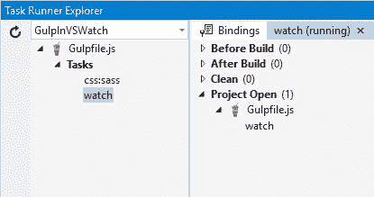
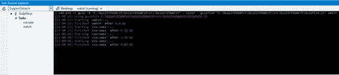
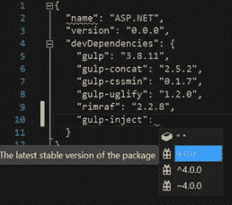
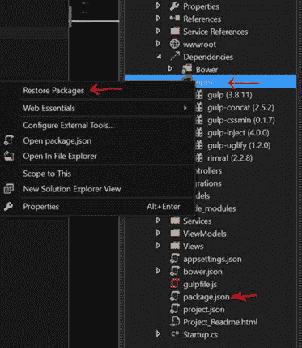

# 第 5 章在 Visual Studio 中吞下

## 简介

Visual Studio 2015 最近发布;这是微软多年来在成功的 IDE 系列中的一次重大升级。很高兴看到 ASP.NET 背后的团队也选择了 Gulp 作为他们的首选任务。

## 捆绑和缩小

在以前的 ASP.NET 版本中，我们引入了 System.Web.Performance 命名空间，这有助于缩小和捆绑 CSS 和 JavaScript 文件。这样做的好处是通过缩小使文件的大小更小。通过将文件捆绑在一起成为一个文件，还可以减少要下载的并发文件数。这是个好消息，因为浏览器只允许少量这些同时使用。我总是发现[这篇文章](http://www.asp.net/mvc/overview/performance/bundling-and-minification)是对这个特定主题的一个很好的介绍。完成本书后，请花些时间阅读。

## ASP.NET 5

ASP.NET 5 将成为 Microsoft 的第一个跨平台版本，这意味着您的代码也可以在 Mac 或基于 Linux 的发行版上运行。这是一件非常重要的事情，与过去完全一致。在编写本书的那一刻，ASP.NET 5 仍然处于测试阶段，所以也许有些事情可能仍会发生变化。请务必密切关注 ASP.NET 5 的发行说明，以了解其中包含的内容和内容，以及如何使用内容。本章的其余部分基于它如何与 ASP.NET 5 Beta 8 一起使用。

### Grunt

当第一个测试版模板发布时，他们就带有 Grunt。 Grunt 也是一个基于 JavaScript 的任务运行器，就像 Gulp 一样。然而，它更老了，它使用插件比 Gulp 慢一点。这样做的主要原因是它没有像 Gulp 那样使用管道流。相反，Grunt 在每个插件“步骤”之后保存到磁盘。 Grunt 仍然很受欢迎，所以你可能会遇到你将被分配到的项目。

以下代码清单显示了可能的 Grunt 文件;它是直接从文档页面中获取的。

  

代码 57：gruntfile.js - /gruntfile.js

```
module.exports
  = function (grunt) {

  grunt.initConfig({

   pkg: grunt.file.readJSON('package.json'),

  concat: {

  options: {

  separator: ';'

  },

  dist: {

  src: ['src/**/*.js'],

  dest: 'dist/<%=
  pkg.name %>.js'

  }

    },

  uglify: {

  options: {

  banner: '/*! <%=
  pkg.name %> <%= grunt.template.today("dd-mm-yyyy") %>
  */\n'

  },

  dist: {

  files: {

  'dist/<%= pkg.name
  %>.min.js': ['<%= concat.dist.dest %>']

  }

  }

  },

  qunit: {

  files: ['test/**/*.html']

  },

  jshint: {

  files: ['Gruntfile.js', 'src/**/*.js', 'test/**/*.js'],

  options: {

  // options here to
  override JSHint defaults

  globals: {

  jQuery: true,

  console: true,

  module: true,

  document: true

  }

  }

  },

      watch: {

  files: ['<%=
  jshint.files %>'],

  tasks: ['jshint', 'qunit']

  }

  });

  grunt.loadNpmTasks('grunt-contrib-uglify');

  grunt.loadNpmTasks('grunt-contrib-jshint');

  grunt.loadNpmTasks('grunt-contrib-qunit');

  grunt.loadNpmTasks('grunt-contrib-watch');

  grunt.loadNpmTasks('grunt-contrib-concat');

  grunt.registerTask('test', ['jshint', 'qunit']);

  grunt.registerTask('default', ['jshint', 'qunit', 'concat', 'uglify']);

};

```

如您所见，由于各种配置设置，与 Gulp 文件相比，Grunt 文件可能会变得非常快。

### Gulp

在 ASP.NET 5 的开发过程中，社区要求微软用 Gulp 取代 Grunt。这是出于各种原因：它是一种更快，更好，即将推出的技术，每天都有越来越多的粉丝，并拥有健康的插件生态系统。在过去几年中，Microsoft，尤其是 ASP.NET 背后的团队，已采用开源方法，并积极倾听其用户群。

#### Grunt 代码与 Gulp 代码

Grunt 完全是关于配置而不是编码，而 Gulp 则是关于通过代码进行配置。下一个示例将显示要运行的相同任务，但两者都以各自的风格编写。

代码 58：gruntfile.js - /gruntfile.js

```
module.exports
  = function (grunt) {

  grunt.initConfig({

  less: {

  development: {

  files: {

  "wwwroot/css/app.css": "Assets/*.less"

  }

  }

  },

  autoprefixer: {

  options: {

  browsers: ['last 2
  version']

  },

  single_file: { 

  src: 'wwwroot/css/app.css', 

  dest: 'wwwroot/css/single_file.css' 

  }, 

  }

  });

  grunt.loadNpmTasks('grunt-contrib-less');

  grunt.loadNpmTasks('grunt-autoprefixer');

  grunt.registerTask('css:less', ['less', 'autoprefixer']);
};

```

代码 59：gulpfile.js - /gulpfile.js

```
var gulp = require('gulp'),

  less = require('gulp-less'),

  prefix = require('gulp-autoprefixer')

gulp.task('css:less', function () {

  gulp.src('./Assets/*.less')

  .pipe(less())

  .pipe(prefix({ browsers: ['last 2 versions'], cascade: true }))

  .pipe(gulp.dest('./wwwroot/css/'));
});

```

您可以看到 Grunt 文件可以变得非常快，并且可能需要一些相当大的配置步骤。 Gulp 快速，易于编写，易于理解且语法较少。最重要的是，Gulp 几乎每天都会看到新插件的增加，这使它成为一个很好的工具。

### 编辑

微软最着名的编辑器是 Visual Studio，目前品牌为 Visual Studio 2015.有一个免费的社区版本，对于繁重的企业开发和架构，你可能想要选择使用完整的旗舰版： [Visual Studio 2015 企业版](https://www.visualstudio.com/?Wt.mc_id=DX_38656)。

鲜为人知的是免费提供的 Visual Studio Code 版本。这不仅仅是 Visual Studio 2015 的精简版，而是一个单独的编辑器。最好的部分是可用的三个主要 OS 平台中的每一个都有一个版本：Windows，Mac OS X 和 Linux。


图 32：Mac OS X 上的 Visual Studio 代码

### 档案新项目

这一次，我们正在迁移到安装了 Windows 和 [Visual Studio 2015](https://www.visualstudio.com/?Wt.mc_id=DX_38656) 的计算机。有不同的口味可供选择，例如企业版的免费社区版本。

启动 Visual Studio 2015（图 33）后，或者使用菜单并选择 **File** &gt; **新项目**，或者在打开 Visual Studio 2015 后看到的第一页上的**启动**下单击**新项目**。


图 33：Visual Studio 2015 开始屏幕

从下一个出现的模态窗口（图 34）中，选择 **ASP.NET Web 应用程序**。给它一个有意义的名称，然后在你的机器上选择一个路径。确保选中**创建解决方案目录**的选项。


图 34：选择 ASP.NET Web 应用程序

单击 **OK** 按钮后，您将看到如图 35 所示的窗口。从 ASP.NET 5 预览模板中选择第三个选项， **Web 应用程序**。单击**确定**。


图 35：选择要从中开始的 ASP.NET 模板

Visual Studio 2015 现在将基于所选模板创建新解决方案。在 Visual Studio 2015 中打开解决方案资源管理器时，您将看到类似于以下内容的内容：


图 36：新创建的解决方案

在项目 **GulpInVS** 的根目录中，您可以看到文件 gulpfile.js 也被添加到解决方案中。它已经设置了一些初始代码以方便您使用。接下来我们会看到。

### 开箱即用的东西

创建新的 ASP.NET 5 Web 应用程序后，解决方案中已经有一个 gulpfile.js，其中包含以下内容：

代码清单 60：新创建的 ASP.NET 5 应用程序的 gulpfile.js 内容 - /gulpfile.js

```
///
  <binding Clean='clean' />

var gulp = require("gulp"),

  rimraf = require("rimraf"),

  concat = require("gulp-concat"),
    cssmin
  = require("gulp-cssmin"),

  uglify = require("gulp-uglify"),

  project = require("./project.json");

var paths = {

  webroot: "./" + project.webroot + "/"
};

paths.js
  = paths.webroot + "js/**/*.js";
paths.minJs
  = paths.webroot + "js/**/*.min.js";
paths.css
  = paths.webroot + "css/**/*.css";
paths.minCss
  = paths.webroot + "css/**/*.min.css";
paths.concatJsDest
  = paths.webroot + "js/site.min.js";
paths.concatCssDest
  = paths.webroot + "css/site.min.css";

gulp.task("clean:js", function (cb) {
    rimraf(paths.concatJsDest,
  cb);
});

gulp.task("clean:css", function (cb) {

  rimraf(paths.concatCssDest, cb);
});

gulp.task("clean", ["clean:js", "clean:css"]);

gulp.task("min:js", function () {

  gulp.src([paths.js, "!" + paths.minJs], { base: "." })

  .pipe(concat(paths.concatJsDest))

  .pipe(uglify())

  .pipe(gulp.dest("."));
});

gulp.task("min:css", function () {

  gulp.src([paths.css, "!" + paths.minCss])

  .pipe(concat(paths.concatCssDest))

  .pipe(cssmin())

  .pipe(gulp.dest("."));
});

gulp.task("min", ["min:js", "min:css"]);

```

快速浏览一下前 Gulp 文件，向我们展示了 Gulp 和不同插件的定义（ rimraf ， concat ， ] cssmin 和 uglify ）。我们也看到了一些特殊的东西：

project = require（“./ project.json”）;

由于 node.js v0.5.2 已经发布，因此可以通过 require 将.json 文件加载并缓存到变量中。这样可以将配置放在另一个文件中。在这种情况下，project.json。

Gulp 文件中的下一个内容是声明路径，以便在一个方便的位置需要时可以轻松地在 Gulp 文件的其余部分进行更改。注意 project.webroot 用法。 webroot 是我们之前加载的 project.json 文件的参数。

我们看到的前三个任务涉及清理文件夹，一个用于 CSS，一个用于 JavaScript。请注意，两者都有一个传入的回调变量， cb ，用于通知调用任务他们的作业在运行后已完成。

接下来的最后三个任务都是关于 JavaScript 和 CSS 文件的连接和缩小。请注意，它不使用 globbing，而是专门处理一个文件。特别是 site.js 和 site.css。

project.webroot 来自 project.json 文件，它通过 require 语句加载。在该文件中，定义如下：  “webroot”：“wwwroot” 。这是 ASP.NET 5 中的一个新子文件夹，其中放置了所有静态项目，这些项目在发布到服务器或云时需要公开可用。此特定设置具有一定意义，因为它也显示在另一个窗口中。您可以通过右键单击解决方案资源管理器中的 Web 项目并选择**属性**来查看它。这将打开如图 37 所示的窗口：


图 37：Web 根参数

奇怪的是，人们无法在此屏幕中更改它，但只能在 project.json 文件中更改它。

### 在 ASP.NET 5 和 Visual Studio 2015 中使用 Gulp

多年来，Visual Studio 一直被认为是一个很棒的 IDE。其中一个原因是 Visual Studio 中的“visual”一词：开发人员可以利用菜单或专用窗口或窗格来完成任务。到目前为止，在本书中，我们已经从控制台窗口运行了 Gulp。这与开发人员习惯在 Visual Studio 中工作的方式并不完全一致。

对于 Gulp，Visual Studio 中有一个专用窗格，可以通过以下几种方式访问​​：

*   通过菜单：首先在解决方案资源管理器中选择 **gulpfile.js** 文件，然后转到**工具**&gt; **Task Runner Explorer** 。
*   右键单击解决方案资源管理器中的 **gulpfile.js** ，然后从上下文菜单中选择 **Task Runner Explorer** 。


图 38：打开 Task Runner Explorer

一旦使用这些方法中的任何一个来打开 Task Runner Explorer，我们就可以看到已经有了一个 Clean 动作的绑定：


图 39：Task Runner Explorer

在左侧，我们可以看到带有 Gulp 图标的 Gulpfile.js，以及我们在代码清单 59 中看到的六个不同的任务。在右侧，我们可以看到一些绑定。这与我们到目前为止所使用的有些不同，并且在 Visual Studio 中是典型的。

我们现在看到的唯一绑定是 Clean 绑定，一旦执行，它将运行 Gulp clean 任务。为此，请使用菜单并选择 **Build** &gt; **清洁溶液**。


图 40：Gulp 清理任务已运行。

另一种运行相同任务的方法是右键单击左窗格中的任务，然后选择**运行**。


图 41：直接运行 Gulp 清理任务

再看一下代码清单 60，您将在文件顶部看到以下行：

///&lt; binding Clean ='clean'/&gt;

这看起来很熟悉，是的，这一行弥补了工具能够将任务绑定到 Visual Studio 的 Task Runner Explorer 中的绑定。在这种特定情况下，它将 Gulp clean 任务绑定到 Clean 绑定。您可以通过取出 gulpfile.js 文件中的行，保存它并再次打开 Task Runner Explorer 来轻松测试。绑定将消失。通过将其放回 gulpfile.js 文件并保存它，将恢复绑定。

您可以通过更改 gulpfile.js 文件或右键单击 Task Runner Explorer 中的 Gulp 任务并从上下文菜单中选择 **Bindings** &gt;来添加新绑定。并选择以下四种可能之一：

表 1：Visual Studio Task Runner Explorer 中的绑定

| 绑定 |
| 在构建之前 | 在构建过程开始之前运行 Gulp 任务 |
| 建成之后 | 构建过程完成后运行 Gulp 任务 |
| 清洁 | 执行清洁解决方案时运行 Gulp 任务 |
| 项目开放 | Visual Studio 打开项目时运行 Gulp 任务 |


图 42：在 Task Runner Explorer 中添加绑定到 Gulp 任务

## 在 Visual Studio 中观察 Gulp 的变化

我们在前一段中看到的内容可以用来回答我在 [Web 欧洲大会 2015](http://webnextconf.eu/) 期间提出的问题，同时介绍 Gulp：如何在使用 Visual 时更改文件并运行任务工作室？

通过以下一些简单的步骤可以看出答案。我们将使用 gulp-sass 将 Sass 文件转换为相应的 CSS 文件。为此，在 **wwwroot / css /下创建两个 Sass 文件。**

代码 61：AnotherOne.scss

```
@mixin border-radius($radius) {
  -webkit-border-radius: $radius;

  -moz-border-radius: $radius;

  -ms-border-radius: $radius;

  border-radius: $radius;
}

.box { @include border-radius(10px);
  }

```

代码 62：Styles.scss

```
@import "AnotherOne.scss";

a.CoolLink {

  color: greenyellow;

  &:hover {

  text-decoration: underline;

  }

  &:visited {

  color: green;

  }
}

```

代码 63：gulpfile.js

```
///
  <binding Clean='clean' ProjectOpened='watch' />

var gulp = require("gulp"),

  sass = require('gulp-sass'),

  project = require("./project.json");

var paths = {

  webroot: "./" + project.webroot + "/"
};

paths.js
  = paths.webroot + "js/**/*.js";
paths.sass
  = paths.webroot + "css/**/*.scss";
paths.sassToCss
  = paths.webroot + "css";

gulp.task("css:sass", function () {

  gulp.src(paths.sass)

  .pipe(sass())

  .pipe(gulp.dest(paths.sassToCss));
});

gulp.task('watch', function () {

  gulp.watch(paths.sass, ['css:sass']);
});

```

几乎整理了 gulpfile.js 文件以显示完成任务的方法。需要需要语句并设置路径。创建了两个任务：一个 css：sass ，用于将.scss 文件转换为.css 文件，以及监视任务。每当它看到 wwwroot / css 文件夹下的某个.scss 文件发生变化时，就会运行 css：sass 任务。

这不是什么新东西，因为我们已经在第 3 章中讨论了类似的方法。新的部分是 Visual Studio 的反应方式。在 gulpfile.js 文件的顶部，您可以看到以下行：

///&lt; binding Clean ='clean'ProjectOpened ='watch'/&gt;

第一部分是熟悉的，正如我们在前一个例子中看到的那样。使用前面讨论的工具， watch 任务已经与 Task Runner Explorer 中的 Project Open 绑定相结合，如图 43 所示。



图 43：Gulp 任务监视与 Project Open 绑定相结合

您现在可以手动启动手表任务或关闭 Visual Studio。再次打开 Visual Studio 并重新打开该项目。打开项目后，直接查看 Task Runner Explorer。您将看到手表任务已运行。现在，每当您更改 wwwroot / css 文件夹下的.scss 文件时，保存更改的文件时将运行 css：sass 任务。图 44 显示了 Task Runner Explorer 窗格中的输出。



图 44：Watch 项目在打开项目时运行，并在每次保存.scss 文件后进行更改。

现在我们已经实现了与使用简单控制台窗口时相同的功能，就像在第 3 章中一样。这使我们在 Visual Studio 中的开发工作更加愉快。

某些更改后 Styles.css 的结果可能如下所示：

  

代码 64：Styles.css

```
.box {
  -webkit-border-radius: 10px;
  -moz-border-radius: 10px;
  -ms-border-radius: 10px;
  border-radius: 10px;
  }

a.CoolLink {
  color: lawngreen; }
  a.CoolLink:hover {

  text-decoration: underline; }
  a.CoolLink:visited {

  color: green; }

```

## 使用 Gulp 升级版本脚本和 CSS

到目前为止，我们主要了解如何利用 Gulp 捆绑，缩小和翻译脚本和 CSS。这些都是很棒的功能，它从开发人员那里拿走了大量的手工工作。我们将这些结果直接包含在 HTML 文件中，并将它们发送到浏览器以执行其工作。

在开发过程中，您实际上将编写代码。您可以在制作下一个优秀应用程序的过程中不断构建，捆绑或缩小的代码。进行这些更新将最终产生新文件，我们希望将这些文件包含在我们的页面中。但是，浏览器会尝试尽可能多地缓存静态内容。这就是应用程序生产周期中的需求，因为您会看到更少的请求到达您的服务器，因此节省了资源。在开发或升级已部署的生产应用程序期间，您可能希望通知浏览器他们需要忽略他们拥有的缓存版本并获取最新版本。

有几种技术，最常见的是要么在版本号中放置一个版本号，要么在其后面添加一个唯一的查询字符串以使其作为一个整体是唯一的。

因为这是经常请求的，所以有不同的 Gulp 插件可以尝试解决这个常见问题。

借助插件 gulp-inject ，我们可以完成任务。在我们使用早期（或新版本）的 ASP.NET MVC 应用程序中，我们可以通过将以下内容放在&lt; head&gt;中来调整 **_Layout.cshtml** 文件。 Razor 页面的部分。

  

代码 65：_Layout.cshtml 头部

```
<head>

  <meta charset="utf-8" />

  <meta name="viewport" content="width=device-width, initial-scale=1.0" />

  <title>@ViewData["Title"] - GulpInVSWatch</title>

  <!-- inject:css
  -->

  <!-- endinject
  -->

</head>

```

为了使它工作，我们需要编写我们的 gulpfile.js 文件，如下面的代码片段：

代码 66：gulp-inject 的 gulpfile.js

```
var gulp = require("gulp"),

  inject = require('gulp-inject');

gulp.task("inject", function () {

  var target = gulp.src('./Views/Shared/_layout.cshtml');

  var sources = gulp.src('./wwwroot/css/**/*.css');

  return target

  .pipe(inject(sources))

  .pipe(gulp.dest('./Views/Shared/'));
});

```

这小段 Gulp 代码在注入任务中发挥了神奇作用。它抓取了目标文件，在我们的例子中是 _Layout.cshtml。在这种情况下，源代码将是我们可以在子文件夹 wwwroot / css 中找到的所有.css 文件，并将放在 _Layout.cshtml 文件的 head 部分中特殊组成的注释行之间。

接下来的行获取目标文件，注入源并将更改后的 _Layout.cshtml 文件写回到 Views / Shared /下的原始位置。

可以在以下代码清单中看到此操作的结果。在示例解决方案中，我有三个不同的.css 文件，它们全部注入：

  

代码 67：使用 gulp-inject 注入三个.css 文件后的结果

```
<head>

  <meta charset="utf-8" />

  <meta name="viewport" content="width=device-width, initial-scale=1.0" />

  <title>@ViewData["Title"] - GulpInVSWatch</title>

  <!-- inject:css
  -->

  <link rel="stylesheet" href="/wwwroot/css/AnotherOne.css">

  <link rel="stylesheet" href="/wwwroot/css/site.css">

  <link rel="stylesheet" href="/wwwroot/css/Styles.css">

  <!-- endinject
  -->

</head>

```

这很好用，但这不是我们希望的完整体验。还记得我们在段落前面谈到的版本控制条件吗？那么，是时候解决这个问题了。幸运的是，不需要另一个 Gulp 插件。 gulp-inject 插件有很多选项，我们可以利用和操纵注入的内容。

在终端窗口的 DOS 框中，我们现在将执行 npm install gulp-inject --save-dev 命令从 npm 获取包，以便我们可以使用它。在 Visual Studio 中，它有点不同。

打开 **package.json** 文件并进行编辑。 Visual Studio 的优点在于它在编辑 package.json 文件时也提供了 IntelliSense。在 devDependencies 部分，为 gulp-inject 添加一个新行。在 Solution Explorer 中，右键单击 **npm** 节点并选择 **Restore packages** 。

打开 **package.json** 文件，如图 45 所示。您可以为 gulp-inject 添加额外的行，并获取包名称和版本的 IntelliSense。现在这很方便，不是吗？



图 45：编辑 package.json 时的 IntelliSense

很可能你已经获得了自动加载 npm 包的 Visual Studio 更新。如果你没有，那么你可以采取下一个简单的步骤，如图 46 所示：



图 46：在 Visual Studio 中恢复包

相应地将 gulpfile.js 文件更改为：

代码 68：gulpfile.js 用于转换注入的文件并添加查询字符串

```
var gulp = require("gulp"),

  inject = require('gulp-inject');

gulp.task("inject", function () {

  var target = gulp.src('./Views/Shared/_layout.cshtml');

  var sources = gulp.src('./wwwroot/css/**/*.css');

  var ticks = new Date().getTime();

  return target

  .pipe(inject(sources, {

  transform: function (filepath) {

  arguments[0] = filepath + '?v=' +
  ticks;

  return
  inject.transform.apply(inject.transform, arguments);

  }

  }))

  .pipe(gulp.dest('./Views/Shared/'));
});

```

这里我们添加了一个额外的选项来转换文件路径。它的后缀是？v = 以及我们在转换之前用当前日期的滴答数填充的滴答数。注入后，最终结果将与以前略有不同：

代码 69：使用 gulp-inject 和添加的查询字符串注入三个.css 文件后的结果

```
<head>

  <meta charset="utf-8" />

  <meta name="viewport" content="width=device-width, initial-scale=1.0" />

  <title>@ViewData["Title"] - GulpInVSWatch</title>

  <!-- inject:css
  -->

  <link rel="stylesheet" href="/wwwroot/css/AnotherOne.css?v=1448220822909">

  <link rel="stylesheet" href="/wwwroot/css/site.css?v=1448220822909">

  <link rel="stylesheet" href="/wwwroot/css/Styles.css?v=1448220822909">

  <!-- endinject
  -->

</head>

```

这导致了我们从一开始就想要的东西。由于 gulp-inject 插件的转换选项，操作注入文件名的结果变得非常容易。现在将它与 Visual Studio 的 Task Runner Explorer 中的 After Build 绑定结合起来，您就拥有了可靠的开发人员体验。

## 摘要

本章概述了在 Visual Studio 中使用 Gulp 的可能性，新的 Task Runner Explorer，以及您的 Gulp 任务与绑定相结合的方式，以执行您在开发过程中遇到的繁重的手动任务。我们还看到了开发人员在使用 Visual Studio 时遇到的两个常见问题的专用解决方案。这些解决方案的灵感来自于我在 2015 年米兰网络欧洲大会上关于 Gulp 的演讲后得到的问题。