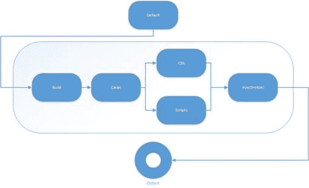

# 第 6 章未来前景光明

## Gulp 4

在图 3 中，我们看到当前版本的 Gulp 是 3.9.0。这个版本也在本书中使用。在 IT，特别是互联网中，这样的版本不会持续很长时间。 Gulp 4 已经出现，当你开始阅读本书时，它甚至可能是当前的版本。不用担心 - 我们为您报道。你会注意到很多东西会保持不变，而有些东西会变得更容易掌握。您还可以更好地控制 Gulp 执行任务的方式。

### 四个 API

如果你害怕某些东西可能会改变，那么你很幸运。 Gulp 4 的 API 与我们在之前版本中使用的 API 保持一致，因此以下内容仍然有效：

*   任务
*   src
*   dest
*   手表

任务函数的语法稍有改变，但是：

*   Gulp 3： gulp.task（名称[，依赖任务]，fn）
*   Gulp 4： gulp.task（name，fn）

我们将在本章中进一步了解 fn 在 Gulp 4 中可以做些什么。

如果您想了解可能仍在更改（或添加）的内容，请务必查看 [Gulp 更改日志](https://github.com/gulpjs/gulp/blob/4.0/CHANGELOG.md)。

## Gulp 如何运行任务

### Orchestrator

在 Gulp 3 中，我们注意到我们可以轻松地编写任务依赖关系，如下所示： [ **' css：less '，'脚本：打字稿']** 。这将导致那些依赖任务以最大可能的并发性运行。在幕后，Gulp 将依次创建一个依赖树，并按顺序编排任务的确切运行。代码清单 12 显示了这一点。为了连续阅读，我们将重复该列表：

代码 12：从不同的地方运行任务

```
"use
  strict";

var gulp = require('gulp');

gulp.task('clean', function () {

  console.log('Cleaning
  up...');
});

gulp.task('task1', ['clean'], function () {

  console.log('Task 1
  is executing...');
});

gulp.task('task2', ['clean'], function () {

  console.log('Task 2
  is doing its thing...');
});

gulp.task('build', ['task1', 'task2']);

gulp.task('default', ['build'], function () {

  console.log('default
  task...');
});

```

clean 任务只执行一次，即使它被引用为 task1 和 task2 的依赖任务。 Orchestrator 确保它发生这样，并且 clean 任务不会被调用两次。如果它被调用两次，甚至更多，那么某些任务可能会通过清除已经使清除任务运行的另一个任务的结果而造成严重破坏。这是你不想发生的情况。

### 系列和平行线

随着 Orchestrator 的使用，事物将按照它构成依赖树的顺序运行，但这可能感觉有点像魔术。如果没有你对它的控制，事情就会继续。由于依赖任务的使用，你可以给 Gulp 提示以某种方式运行，但仍然感觉有点像你没有一切都在控制之下。

Gulp 4 解决了这个问题。因为人们想要更多地控制将要运行的内容以及何时运行。因此，Orchestrator 已被搁置，并引入了两个新的执行功能：

*   Gulp.series ：用于顺序执行
*   Gulp.parallel ：用于并行执行

两者都接受以下参数：

*   要执行的任务名称
*   要执行的功能

通过组合这些，您可以根据需要编制复杂的执行订单。但是，请注意，保持简单仍然是一件好事，因为过于复杂的系统往往难以调试和维护。

之前我们在 Gulp 4 中提到，任务 API 看起来会有所不同： gulp.task（name，fn）。

fn 可以是串联，并联，串联和并联的组合，也可以是函数。

编写要并行运行的任务，例如将 Less 转换为 CSS 和将 TypeScript 转换为 JavaScript，可能如下所示：

代码 70：Gulp.parallel

```
gulp.task('default', gulp.parallel('css:less', 'js:typescript'));

```

再看看代码清单 12 并尝试使用新语法重写它，如下所示：

代码 71：代码清单 12 用 Gulp 4 重写

```
"use
  strict";

var gulp = require('gulp');

gulp.task('clean', function () {

  console.log('Cleaning
  up...');
});

gulp.task('task1', function () {
    console.log('Task 1 is executing...');
});

gulp.task('task2', function () {

  console.log('Task 2
  is doing its thing...');
});

gulp.task('build', gulp.series('clean', gulp.parallel('task1', 'task2')));

gulp.task('default', gulp.series('build'));

```

除了我们引入 gulp.series 和 gulp.parallel 函数调用之外，语法看起来几乎相同。需要注意的一件非常重要的事情是要求清理任务;它被作为 task1 和 task2 的依赖关系。允许这两个并行运行，但与 Gulp 4 一样，我们不再使用 Orchestrator。这将导致清理任务运行两次，我们需要不惜一切代价避免。

图表可以更直观的方式说明这一点。在并行调用之后添加了一个额外的系列步骤，以表明这也是可能的。



图 47：Gulp 4 中的串行和并行任务

## npm

npm 作为构建工具？到目前为止，我们看到 npm 用于下载和管理 Gulp 插件。好吧，有网上的文章发现人们只使用 npm 来完成我们在本书中讨论过的所有内容。这可能成为在不断变化的世界中做事的新方式。目前，Gulp 仍然是一个伟大的新兴工具，微软的采用也表明了它的重要性。

## HTTP 2

到目前为止，Web 开发人员已经做了很多努力来最小化和连接脚本或 CSS 文件。使用 HTTP 2，将不再需要。根据一些消息来源，这样做甚至可能适得其反，并且会损害表现。因此，您可能需要修改精心制作的 Gulp 文件，以跟上不断发展的 Web 技术和协议，从而最大限度地提高应用程序的性能。

现代浏览器（通常也称为“常青树”浏览器，因为它们总是最新的）已经支持 HTTP 2.服务器软件也很快就会加入到潮流中，并且在接下来的几年里，我们将看到这个改进的协议无处不在的支持因此，请务必密切监控您的应用程序。

## 摘要

这是一个较短的章节，因为很难预测未来。但是，我们可以预见到未来几年 HTTP 2 将很快变大。 （web）应用程序的数量将会增加，我们将看到它们的形状不同，例如在智能设备上打包为应用程序，如 Ionic，Cordova 和 manifold.js。

我希望你喜欢读这本书。