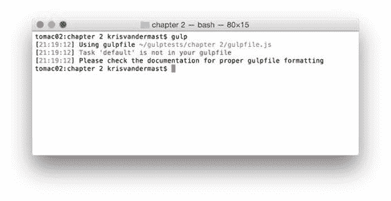
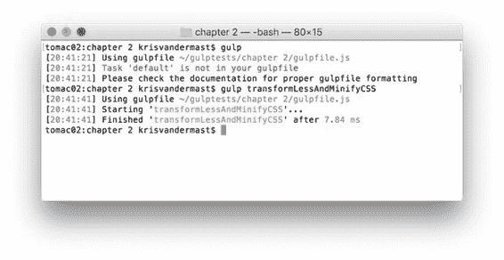
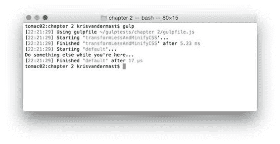

## 其他任务

前一段介绍了您运行任务。将额外的插件添加到流中也很简单，因此，改变我们任务的行为。嗯，这一切都很棒，但你可能会把一切都放在一项重大任务上。但是，它会导致繁琐的代码，并且在开发周期的过程中和之后很难维护。

这就是为什么在 Gulp 中也可以有多个任务的原因。就像在大多数其他编程语言中一样，您可以将代码编写或重构为更小的部分。它使您更容易找到要更改的代码或复制到另一个项目。另一个优点是，您可能不希望同时执行所有任务。很可能只有一小部分需要再次运行，而不是整体运行。

让我们再次从代码清单 6 中获取代码，并将默认任务更改为它实际执行的操作：转换 less 文件并从该进程中缩小生成的 CSS。代码现在变成：

代码 9：调整后的/gulpfile.js

```
"use
  strict";

var gulp = require('gulp');
var less = require('gulp-less');
var minifyCSS = require('gulp-clean-css');

gulp.task('transformLessAndMinifyCSS', function () {

  gulp.src('Assets/Styles.less')

  .pipe(less())

  .pipe(minifyCSS({ keepBreaks: false }))

  .pipe(gulp.dest('wwwroot/css'));
});

```

现在返回终端并运行 gulp 命令。从图 5 中可以看出，没有任何东西可以运行，因为我们不再有默认任务。



图 5：尝试运行默认任务但未找到任何内容

但是，如果我们尝试运行 gulp 命令并附带任务的特定名称，它将运行。所以在终端中输入 gulp transformLessAndMinifyCSS 。请参见图 6 中的输出。如果要验证输出，建议删除 **/ wwwroot / css** 下生成的文件。稍后我们将看到我们也可以利用 Gulp 为我们做到这一点。这将使我们更加确定输出确实是我们所期望的。



图 6：指定要显式运行的任务

但是，如果我们可以有一个入口点，默认任务，并从那里运行另一个任务，那将是很好的。如果我们对 gulpfile.js 文件进行一些调整，我们也可以达到这个目标。

代码 10：默认任务调用 transformLessAndMinifyCSS task /gulpfile.js

```
"use
  strict";

var gulp = require('gulp');
var less = require('gulp-less');
var minifyCSS = require('gulp-clean-css');

gulp.task('default', ['transformLessAndMinifyCSS'], function () {

  console.log('Do
  something else while you\'re here...');
});

gulp.task('transformLessAndMinifyCSS', function () {

  gulp.src('Assets/Styles.less')

  .pipe(less())
        .pipe(minifyCSS({
  keepBreaks: true }))

  .pipe(gulp.dest('wwwroot/css'));
});

```



图 7：运行从属任务

在图 6 中，我们可以看到任务 transformLessAndMinifyCSS 在进入默认任务的函数体之前运行，其中放置了 console.log 语句以显示执行顺序。

代码清单 8 显示了任务函数调用中的一个额外参数：

gulp.task（'default'，['transformLessAndMinifyCSS']，function（）

这是 Gulp 传递其依赖的其他功能的方式。我们马上讨论一下。