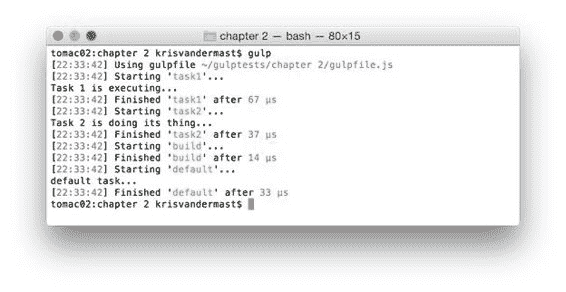
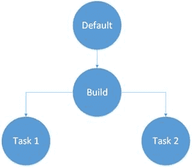
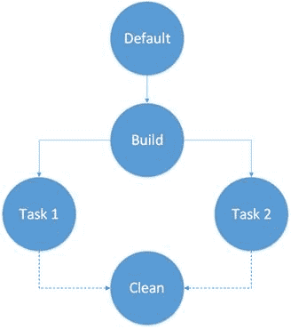

  

代码 11：以最大并发/gulpfile.js 运行

```
"use
  strict";

var gulp = require('gulp');
var less = require('gulp-less');
var minifyCSS = require('gulp-clean-css');

gulp.task('task1', function () {

  console.log('Task 1
  is executing...');
});

gulp.task('task2', function () {

  console.log('Task 2
  is doing its thing...');
});

gulp.task('build', ['task1', 'task2']);

gulp.task('default', ['build'], function () {

  console.log('default
  task...');
});

```

输出结果如下：



图 8：运行相关任务

我们可以看到我们从代码中的默认任务开始，该任务调用 build 任务，它自己调用 task1 和 task2 。我们看到 task1 和 task2 首先运行，因为 build 任务依赖于这两个，并且在两者都完成之前不会运行。一旦发生这种情况，构建功能可以发挥作用，然后由默认任务运行。下图显示了此代码中使用的树：



图 9：依赖任务

这是一个小而坦率的非常简单的树。正如您在现实生活中的项目所能想象的那样，gulpfile.js 中的任务将更多，包括独立任务或独立任务和从属任务。如果几个任务依赖于同一任务怎么办？那么会发生什么？我们来看看。为了更容易理解，这是将要发生的事情的树：



图 10：运行相同子任务的从属任务