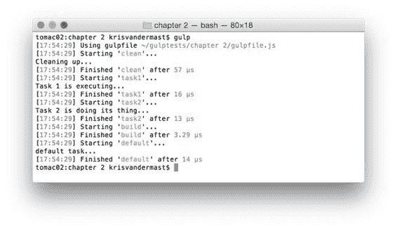

  

我们的代码：

代码 12：从不同的地方运行任务/gulpfile.js

```
"use
  strict";

var gulp = require('gulp');

gulp.task('clean', function () {

  console.log('Cleaning
  up...');
});

gulp.task('task1', ['clean'], function () {

  console.log('Task 1
  is executing...');
});

gulp.task('task2', ['clean'], function () {

  console.log('Task 2
  is doing its thing...');
});

gulp.task('build', ['task1', 'task2']);

gulp.task('default', ['build'], function () {

  console.log('default
  task...');
});

```

你可以看到 task1 和 task2 都依赖于 clean 任务。一个例子可能是某些输出文件夹需要在其他任务可以完成它们的目的之前进行清理，并且您不希望在之前的运行中留下一些东西。

并且你猜对了： clean 任务只运行一次。 Gulp 非常聪明，可以发现有更多任务可以进行调用，但是两次运行相同任务会产生开销。

在 gulpfile.js 文件中运行代码后，输出如下图所示：



图 11：运行依赖于同一任务的多个任务