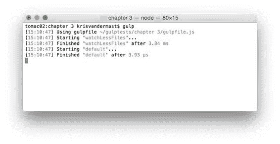
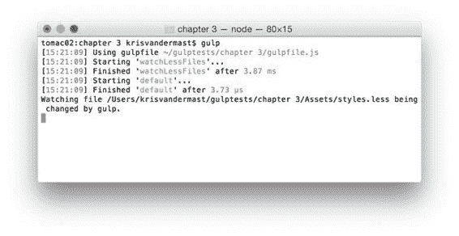
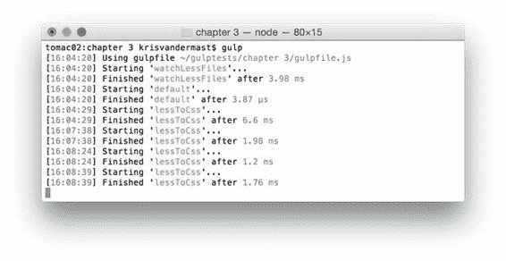
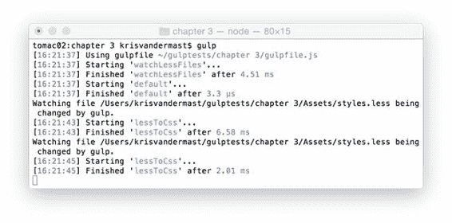

  

代码清单 14：一个简单的.less 文件：/Assets/Styles.less

```
@color:#b6ff00;
@backcolor:#808080;

body {

  background-color: @backcolor;
}

a {

   color: @color;

  &:hover {

  color: @color + @backcolor;

  }
}

```

不要忘记安装所需的 Gulp 插件：

· npm install gulp --save-dev

· npm 安装 gulp-less --save-dev

现在运行默认的 Gulp 任务来启动 watch 任务。结果如下图所示。



图 12

现在正在监视 Assets 文件夹中的文件。要对此进行测试，请在文本编辑器中打开 **styles.less** 文件，并在其中键入额外的空格。现在保存它并再次查看图 13 中的输出。



图 13：正在监视的文件已更改并保存后的输出

event.path 显示我们正在观看的文件的路径，而 event.type 正确显示输出**已更改**。其他可能的类型是**添加**或**缺失**。

很高兴看到一些文件在保存时发生了变化，但我们谈到了自动化的事情。在这种情况下，将处理后的.less 文件转换为我们感兴趣的.css 文件。为此，只需更改 **gulpfile.js** 文件：

代码 15：将.less 文件处理成.css 文件/gulpfile.js

```
"use
  strict";

var gulp = require('gulp');
var less = require('gulp-less');

gulp.task('lessToCss', function () {

  gulp.src('Assets/Styles.less')

  .pipe(less())

  .pipe(gulp.dest('wwwroot/css'));
});

gulp.task('watchLessFiles', function () {

  gulp.watch('./Assets/styles.less', ['lessToCss']);
});

gulp.task('default', ['watchLessFiles']);

```

再次运行 Gulp，更改 **styles.less** 文件，然后保存。每次保存.less 文件时，这样做几次就会运行任务，正如我们在输出中看到的那样：



图 14：每次运行 task lessToCss 时都会重复保存.less 文件

这肯定可以节省宝贵的时间。为此，我们需要更改文件，保存文件，自己运行任务 lessToCss ，并在此过程中，离开我们的文本编辑器。

要停止该过程，您只需使用键盘组合 **Ctrl + C** 即可。要再次开始观看，只需再次运行默认的 Gulp 任务即可。



图 15：重复更改.less 文件