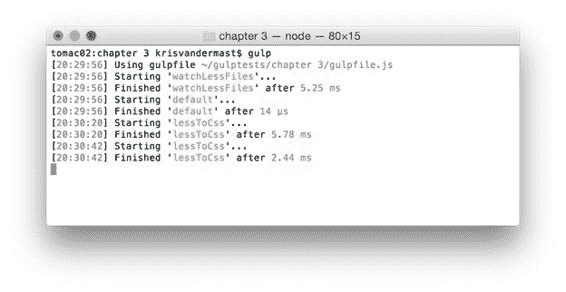

## 正在观看文件夹

在上一节中，我们了解了如何观看文件并在保存文件时采取行动。这很好，但是当我们可以为整个文件夹做这件事时真的很有趣。我们可以稍微改变代码以包含变量。这将保留路径，因此我们不必每次都输入它，并且可能通过错误输入来制造错误。

改变后的代码现在看起来像这样：

代码 16：将.less 文件处理成.css 文件/gulpfile.js

```
"use
  strict";

var gulp = require('gulp');
var less = require('gulp-less');
var lessPath = './Assets/**/*.less';

gulp.task('lessToCss', function () {

  gulp.src(lessPath)

  .pipe(less())

  .pipe(gulp.dest('wwwroot/css'));
});

gulp.task('watchLessFiles', function () {

  gulp.watch(lessPath, ['lessToCss']);
});

gulp.task('default', ['watchLessFiles']);

```

变量 lessPath 使用全局符号 Assets / ** / *。。这是一种强大的编写方式，因为它意味着“直接在 Assets 文件夹下的所有.less 文件，以及 Assets 文件夹的子文件夹中的文件。”因此，不必为每个子文件夹编写路径并通过，您有机会以一种紧凑的方式编写它。

如果我们运行代码并更改一些.less 文件（直接在 Assets 文件夹或任何子文件夹下）并保存该.less 文件，则运行任务 lessToCss 并将输出写入 wwwroot / css 文件夹并考虑 Assets 文件夹下的子文件夹。



图 16：查看多个文件和文件夹

现在，如果你尝试添加一个新的.less 文件并保存它......没有任何反应。但是，如果要在添加监视之前更改已存在的.less 文件，则新的.less 文件也将转换为.css 文件。后者是显而易见的，但我们希望它也适用于新文件。