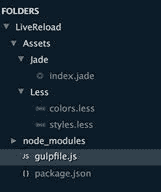

  

对于这个例子，我们将利用 Jade 生成 HTML 页面，Less 生成 CSS 样式表，Gulp 任务和观察者，当然还有 gulp-connect 插件。在添加重新加载功能之前，让我们为这个小项目创建最小的最小值。布局如下：



图 17：项目文件夹和文件结构

|  | 注意：gulpfile.js 和 package.json 直接位于 LiveReload 文件夹下，而不是在 node_modules 子文件夹下。 Sublime Text 中使用的 Cobalt2 主题可能会给人留下这样的印象。 Gulpfile.js 和 package.json 总是直接在项目的根文件夹下。 |

**index.jade** 文件如下所示：

代码 18：/Assets/Jade/index.jade

```
doctype
  html
html
      head
            title
  Hello world
            link(rel="stylesheet",
  href="css/styles.css")
      body
            h1
  gulp is great
            p
  it seems like it's working
            script(src="js/main.js")

```

Less 文件如下所示：

代码 19：/Assets/Less/colors.less

```
@color1: #c9c9c9;
@color2: #e3e3e3;
@color3: #9ad3de;
@color4: #89bdd3;

```