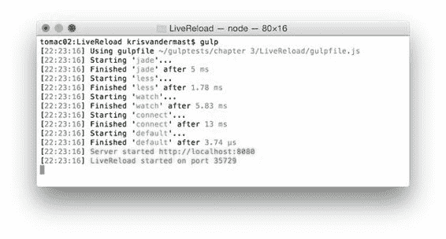
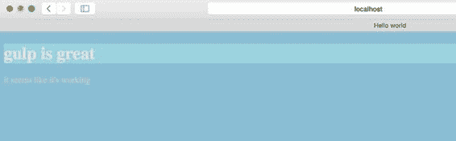
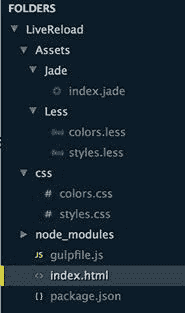
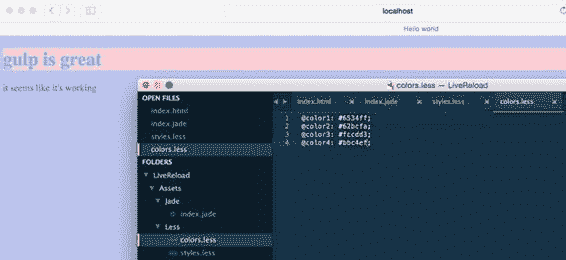
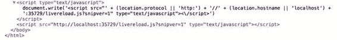

  

代码 20：/Assets/Less/styles.less

```
@import "colors.less";

body {
      color: @color1;
      background-color: @color4;
}

h1 {
      color: @color2;
      background-color: @color3;
}

```

和 gulpfile.js：

代码 21：/gulpfile.js

```
"use
  strict";

var gulp = require('gulp'),
      less
  = require('gulp-less'),
      jade
  = require('gulp-jade'),
      connect
  = require('gulp-connect');

var jadeDir = './Assets/Jade/**/*.jade';
var lessDir = './Assets/Less/**/*.less';
var outputDirHtml = './';
var outputDirCss = './css/';

gulp.task('jade', function () {

  gulp.src(jadeDir)
            .pipe(jade())
            .pipe(gulp.dest(outputDirHtml))
});

gulp.task('less', function () {

  gulp.src(lessDir)
            .pipe(less())
            .pipe(gulp.dest(outputDirCss));
});

gulp.task('watch', function () {

  gulp.watch([jadeDir], ['jade']);

  gulp.watch([lessDir], ['less']);
})

gulp.task('default', ['jade', 'less', 'watch']);

```

从终端运行 gulp 命令可确保在监视任务添加熟悉的监视输入文件时生成 index.html 和 css 文件。尝试更改 Jade 或 Less 文件以查看它是否已更新。

现在打开浏览器并在 **index.html** 页面上打开它。更改 **index.jade** 文件中的内容，保存并刷新浏览器以查看更改。

是时候让魔法了。将 gulpfile.js 更改为以下内容：

代码 22：具有 livereload 功能的 gulpfile.js - /gulpfile.js

```
"use
  strict";

var gulp = require('gulp'),
      less
  = require('gulp-less'),
      jade
  = require('gulp-jade'),
      connect
  = require('gulp-connect');

var jadeDir = './Assets/Jade/**/*.jade';
var lessDir = './Assets/Less/**/*.less';
var outputDirHtml = './';
var outputDirCss = './css/';

gulp.task('jade', function () {

  gulp.src(jadeDir)
            .pipe(jade())
            .pipe(gulp.dest(outputDirHtml))
            .pipe(connect.reload());
});

gulp.task('less', function () {

  gulp.src(lessDir)
            .pipe(less())
            .pipe(gulp.dest(outputDirCss))
            .pipe(connect.reload());
});

gulp.task('watch', function () {

  gulp.watch([jadeDir], ['jade']);

  gulp.watch([lessDir], ['less']);
})

gulp.task('connect', function () {

  connect.server({

  root: './',

  livereload: true

  });
});

gulp.task('default', ['jade', 'less', 'watch', 'connect']);

```

要添加的另一个重要代码，一个容易被忽略的代码，就是在 Jade 文件或 Less 文件之一被更改时调用重新加载： .pipe（connect.reload（））; 。在 jade 和较少任务中，确保触发重载。在构建运行更新后，它会被触发并且浏览器会同时重新加载。运行 gulp 命令，将显示以下内容：



图 18：LiveReload

首先，它将执行任务以将 Jade 文件解析为 HTML，将 Less 文件解析为 CSS，并在前两个上添加监视。它还将执行 connect 任务。在该任务中，设置根 URL 并应启用实时重新加载选项。你需要明确地这样做;否则，它不会开始。

输出的最后两行显示导航到的位置： [http：// localhost：8080](http://localhost:8080) 。 gulp-connect 插件提供了一个内置服务器，我们将在本例中使用它。

打开所选的浏览器并浏览到 [http：// localhost：8080 / index.html](http://localhost:8080/index.html) 。您将看到如下页面：



图 19：jade 和较少任务运行后的初始结果

由于 jade 和较少任务运行，这些输出导致我们的解决方案添加了文件：



图 20：jade 之后的解决方案和更少的任务已经运行

现在为酷的部分。当您在 Jade 或 Less 文件中更改某些内容时，将浏览器保持在屏幕的可见范围内。保存后，您将在浏览器中看到即时更新。对于此演示，我选择更改相应 colors.less 文件中的颜色。



图 21：colors.less 文件已更改并保存

这有效的原因是 gulp-connect 在 HTML 中注入了额外的 JavaScript。通过使用浏览器的 F12 工具，我们可以很容易地看到以下内容：



图 22：通过 gulp-connect 注入的 JavaScript 部分

如果您熟悉 Visual Studio 和 ASP.NET Web 开发，则可能遇到过类似的问题。在那里它被称为 BrowserLink，您可以在 Visual Studio 中的 CSS 文件中更改某些内容，它会自动更新浏览器。