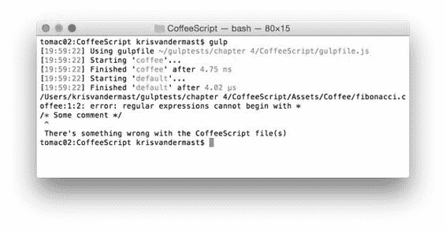

  

代码 25：fibonacci.js - /wwwroot/scripts/fibonacci.js

```
(function () {

  var fib, i, number, solutions;

  fib = function (x) {

  if (x < 2) {

  return x;

  } else {

  return fib(x - 1) + fib(x - 2);

  }

  };

  solutions = [];

  for (number = i = 0; i <= 10; number
  = ++i) {

  solutions.push(fib(number));

  }

  console.log(solutions);

}).call(this);

```

如果您不喜欢这种输出方式，那么您可以将参数传递给 coffee 调用，如 .pipe（coffee（{bare：true}））。

然后，这将把 fibonacci.coffee 文件编译为以下 JavaScript 代码：

代码 26：带有裸的 fibonacci.js：true - /wwwroot/scripts/fibonacci.js

```
var fib, i, number, solutions;

fib
  = function (x) {

  if (x < 2) {

  return x;

  } else {

  return fib(x - 1) + fib(x - 2);

  }
};

solutions
  = [];

for (number = i = 0; i <= 10; number
  = ++i) {

  solutions.push(fib(number));
}

console.log(solutions);

```

#### 发生错误时进行一些处理

例外确实发生，所以最好记住它们并在需要时采取适当的行动。毕竟，异常可能会破坏整个 Gulp 脚本，而 Gulp 插件可能会响应错误事件。

例如，假设您想在 CoffeeScript 文件中添加一些注释，作为代码应该执行的操作的小注释。您可以在文件中写下 / *一些注释* / 。这在 JavaScript 中完全没问题，但 CoffeeScript 编译器在执行其魔法时会返回错误。

为了使代码清单 24 中的代码更加健壮，我们可以将其更改为：

代码 27：带有错误事件监听器的 gulpfile.js - /gulpfile.js

```
"use
  strict";

var gulp = require('gulp'),
      coffee
  = require('gulp-coffee');

gulp.task('coffee', function () {

  gulp.src('./Assets/Coffee/**/*.coffee')
            .pipe(coffee({
  bare: true }).on('error', function (e) {

  console.log(e + '\r\n
  There\'s something wrong with the CoffeeScript file(s)');
            }))
            .pipe(gulp.dest('./wwwroot/scripts'));
});

gulp.task('default', ['coffee']);

```

现在打开 **fibonacci.coffee** 文件。最重要的是，写下 / * Fibonacci 序列* / 并再次运行默认的 Gulp 任务。我们将看到以下输出：



图 23：出现问题时我们希望收到通知

gulp-coffee 插件的输出现在可以很好地显示出错的地方，因此您可以快速找到并解决问题。

### TypeScript

TypeScript 是由 Microsoft 开发的一种语言，就像 CoffeeScript 一样，编译为 JavaScript。自从 Angular.js 团队在谷歌宣布密切合作以来，它现在获得了很多兴趣和动力。已经选择 TypeScript 作为编写即将推出的基于 Angular.js 的应用程序的首选语言。你已经可以感觉到，这在未来几年将是巨大的。

如果你想了解更多有关 TypeScript 的信息，我建议你看看  [这个网站](http://www.typescriptlang.org/)，特别是 Playground 部分，看看它是否正常工作。这里使用的例子就是其中之一。