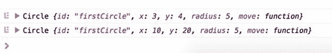

  

代码 33：gulpfile.js - /gulpfile.js

```
var gulp = require('gulp'),
      es6
  = require('gulp-es6-transpiler');

gulp.task('js:es6', function () {

  return gulp.src('./Assets/ES6/inheritance.js')
                        .pipe(es6({
  'disallowUnknownReferences': true
  }))
                        .pipe(gulp.dest('./wwwroot/js'));
});

gulp.task('default', ['js:es6']);

```

|  | 注意：在运行 gulp 任务之前，请确保已安装 gulp 和 gulp-es6-transpiler 软件包。 |

ES5 等效项将生成以下代码。对于胆小的人，或许可以看看下一段，因为它不漂亮。

代码 34：转换 ES6 inheritance.js 文件的 ES5 文件 inheritance.js - /wwwroot/js/inheritance.js

```
var PRS$0 = (function (o, t) { o["__proto__"] = { "a": t }; return o["a"] === t })({}, {}); var DP$0 =
  Object.defineProperty; var GOPD$0 =
  Object.getOwnPropertyDescriptor; var MIXIN$0
  = function (t, s) { for (var p in
  s) { if (s.hasOwnProperty(p)) { DP$0(t, p,
  GOPD$0(s, p)); } } return t }; var
  SP$0 = Object.setPrototypeOf || function
  (o, p) { if (PRS$0) { o["__proto__"] = p; } else { DP$0(o, "__proto__", { "value": p, "configurable": true,
  "enumerable": false, "writable": true
  }); } return o }; var
  OC$0 = Object.create; var Shape = (function () {

  "use
  strict"; var proto$0 = {};

  function Shape(id, x, y) {

  this.id = id

  this.move(x, y)

  } DP$0(Shape, "prototype", { "configurable": false, "enumerable": false, "writable": false });

  proto$0.move = function (x, y) {

  this.x = x

  this.y = y

  };

  MIXIN$0(Shape.prototype, proto$0); proto$0 = void
  0; return Shape;
})();

var Rectangle = (function (super$0) {

  "use
  strict"; if (!PRS$0) MIXIN$0(Rectangle, super$0);

  function Rectangle(id, x, y, width, height)
  {

  super$0.call(this, id, x, y)

  this.width = width

  this.height = height

  } if (super$0 !== null) SP$0(Rectangle, super$0); Rectangle.prototype =
  OC$0(super$0 !== null ? super$0.prototype : null, { "constructor": { "value": Rectangle, "configurable": true,
  "writable": true
  } }); DP$0(Rectangle, "prototype", { "configurable": false, "enumerable": false, "writable": false });

  ; return Rectangle;
})(Shape);

var Circle = (function (super$0) {

  "use strict"; if
  (!PRS$0) MIXIN$0(Circle, super$0);

  function Circle(id, x, y, radius) {

  super$0.call(this, id, x, y)

  this.radius = radius

  } if (super$0 !== null) SP$0(Circle, super$0); Circle.prototype =
  OC$0(super$0 !== null ? super$0.prototype : null, { "constructor": { "value": Circle, "configurable": true,
  "writable": true
  } }); DP$0(Circle, "prototype", { "configurable": false, "enumerable": false, "writable": false });

  ; return Circle;
})(Shape);

var c = new
  Circle('firstCircle', 3, 4, 5);
console.log(c);
c.move(10,
  20);
console.log(c);

```

的确，ES6 的写作风格在眼睛上要容易得多。

要在浏览器中快速测试这个已转换的文件，您可以打开 [jsfiddle.net](http://www.jsfiddle.net/) ，将代码粘贴到 JavaScript 窗格中，然后运行它。打开您喜欢的浏览器的 F12 工具，然后查看控制台。以下屏幕截图显示了代码的结果：



图 24：移动函数调用之前和之后的两个 Circle 对象