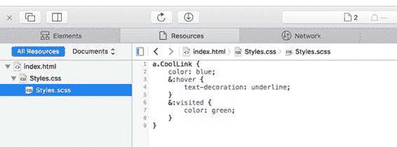

  

代码 41：index.html - /wwwroot/index.html

```
<!DOCTYPE html>
<html lang="en">
<head>

  <meta charset="UTF-8">

  <title>Sourcemaps</title>

  <link rel="stylesheet" href="css/Styles.css">
</head>
<body>

  <a href="http://www.krisvandermast.com" class="CoolLink">This is a cool link</a>

  <a href="#">This is not a cool link</a>
</body>
</html>

```

屏幕上的输出就不足为奇了。当您打开浏览器的所谓 F12 工具时，会发生有趣的部分。打开**资源**窗格并查看正在进行的映射。但请注意，每个浏览器在显示时都有所不同。

苹果浏览器：



图 26：Safari 中的源图