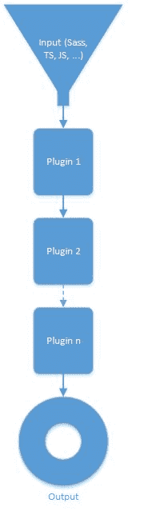

## Gulp 流量

读取文件，处理它们，然后编写结果是任务运行器的基础。与其他人不同，Gulp 处理内存中任务的流，而不是将每个步骤的结果写入磁盘。这使它更有效率和高效。处理本身由插件完成，这是一个小的专用任务，它们对接收到的内容执行专用逻辑，然后将其传递。已经有很多，如果你愿意，你可以创建新的。在撰写本文时，已经有 [1,533 插件](http://gulpjs.com/plugins/)可用。

让我们通过易于理解的流程图将其可视化：

图 1：吞咽流量