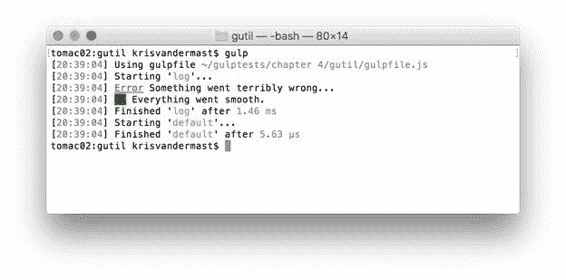

  

代码 50：gulp-util 的 gulpfile.js - /gulpfile.js

```
var gulp = require('gulp'),
      gutil
  = require('gulp-util');

gulp.task('log', function () {

  gutil.beep();

  gutil.log(gutil.colors.red.underline('Error'),
  'Something went
  terribly wrong...');

  gutil.log(gutil.colors.bgGreen('OK'), 'Everything went smooth.');
});

gulp.task('default', ['log']);

```

我无法在本书中提供“嘟嘟”声，但彩色输出如下所示：



图 28：使用 gulp-util 的彩色输出

|  | 注意：可用的颜色不多。 gulp-util 利用 Chalk npm 模块。颜色可以在下表中找到。 |