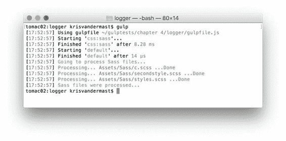

  

| gulp-util 颜色 |
| 胆大 | 暗淡 | 斜体 | 强调 |
| 逆 | 黑色 | 删除线 | 红色 |
| 绿色 | 黄色 | 蓝色 | 品红 |
| 青色 | 白色 | 灰色 | bgBlack |
| b gRade | bgGreen | bgYellow | bgBlue |
| bgMagenta | bgCyan | bgWhite |  |

可以将这些颜色链接在一起以获得另一种效果。正如我们在 demo gulpfile 中看到的那样，下划线被连接成红色，从而产生带下划线的红色文本。请注意，下划线可能无法在您的计算机上运行，​​例如，在 Windows 中，因为 Windows 中的每个终端都不允许使用带下划线的文本。

### gulp-logger

这是第三个日志记录帮助组件。其目的是记录我们提供给它的流中每个项目的当前任务的进度。看看下面的 Gulp 文件：

代码 51：gulp-logger 的 gulpfile.js - /gulpfile.js

```
var gulp = require('gulp'),
      sass
  = require('gulp-sass'),
      logger
  = require('gulp-logger');

gulp.task('css:sass', function () {

  gulp.src('./Assets/Sass/**/*.scss')
            .pipe(logger({

  before: 'Going to
  process Sass files...',

  after: 'Sass files
  were processed...',

  beforeEach: 'Processing...
  ',

  afterEach: ' ...Done'
            }))
            .pipe(sass())
            .pipe(gulp.dest('./wwwroot/css'));
});

gulp.task('default', ['css:sass']);

```

通过选项，我们可以操纵 gulp-logger 模块的行为方式。在这个例子中，我们只使用了四个，但还有更多可以派上用场。请务必查看该组件的[文档](https://www.npmjs.com/package/gulp-logger)，以了解这些额外的选项设置。

输出可以在下图中看到。请注意彩色消息。默认情况下，颜色选项设置为 true 。如果您想通过将其设置为 false ，可以将其关闭。



图 29：设置了额外选项的 gulp-logger 模块的输出