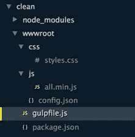
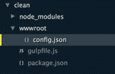

## 清理

Gulp 很擅长生成输出，并覆盖之前的输出。在您的应用程序中设置 Gulp 架构时，您可能会在每一步都进行测试。这可能最终会给出您可能不再需要的输出文件，或者只是变得压载。潜在地，您可能将剩余物集成到现实生活中的解决方案中，降低性能，或者更糟，导致错误。

因此，在执行 Gulp 魔法之前，最好先启动一个干净的平板并清理输出文件夹及其子文件夹。通常这是作为默认任务的依赖任务完成的，如：

gulp.task（'default'，['clean'，'build'，'watch'，'connect']）;

我们会发现，有可用于清理的 Gulp 插件。但是，这是一个很好的案例，表明它并不总是你想要使用的普通插件。在这种情况下，微不足道的是 gulp-clean 。当我们看一下[文档](https://www.npmjs.com/package/gulp-clean)时，我们会看到以下消息：

不推荐使用 [gulp-rimraf](https://github.com/robrich/gulp-rimraf) 代替！

好的，在该链接之后，我们打开 gulp-rimraf 的[文档](https://www.npmjs.com/package/gulp-rimraf)页面。在那里我们看到以下消息：

不赞成 [https://github.com/gulpjs/gulp/blob/master/docs/recipes/delete-files-folder.md](https://github.com/gulpjs/gulp/blob/master/docs/recipes/delete-files-folder.md)

所以我们直接从 node.js 得到 del 模块。这样做的展示是，尽管每天都有为 Gulp 制作的新插件，但是现有的插件也被删除了，而不是更好的插件。在开始时找到这些可能是一个挑战，但你很快就会找到适合你的好东西。

使用 Gulp 文件中的 del 模块很简单，如下面的演示所示，我们有一个带有 css 和 js 子文件夹的 wwwroot 文件夹，其中包含文件。



图 30：清洁前的项目概述

我们只想删除 css 和 js 下的文件及其文件夹，而不是 config.json 文件，因为它可能包含重要信息。我们可以通过放置来删除所有内容时发生异常！ 在路径前面排除文件。

代码 52：gulpfile.js 清理 - /gulpfile.js

```
"use
  strict";

var gulp = require('gulp'),
      del
  = require('del');

gulp.task('clean', function () {

  return del(['./wwwroot/css', './wwwroot/js', '!./wwwroot/config.json']);
});

gulp.task('build', function () {

  console.log('Building
  stuff - using less and coffeescript');
});

gulp.task('default', ['clean', 'build']);

```

请注意这个样本我们没有使用 gulp.src ，因为我们之前已经看过很多次了。我们直接调用 del 模块并传入一个路径数组来删除：all，但 config.json 文件除外。运行默认任务后，我们在项目中保留以下结构：



图 31：清理 wwwroot 文件夹后的项目