  

代码 57：gruntfile.js - /gruntfile.js

```
module.exports
  = function (grunt) {

  grunt.initConfig({

   pkg: grunt.file.readJSON('package.json'),

  concat: {

  options: {

  separator: ';'

  },

  dist: {

  src: ['src/**/*.js'],

  dest: 'dist/<%=
  pkg.name %>.js'

  }

    },

  uglify: {

  options: {

  banner: '/*! <%=
  pkg.name %> <%= grunt.template.today("dd-mm-yyyy") %>
  */\n'

  },

  dist: {

  files: {

  'dist/<%= pkg.name
  %>.min.js': ['<%= concat.dist.dest %>']

  }

  }

  },

  qunit: {

  files: ['test/**/*.html']

  },

  jshint: {

  files: ['Gruntfile.js', 'src/**/*.js', 'test/**/*.js'],

  options: {

  // options here to
  override JSHint defaults

  globals: {

  jQuery: true,

  console: true,

  module: true,

  document: true

  }

  }

  },

      watch: {

  files: ['<%=
  jshint.files %>'],

  tasks: ['jshint', 'qunit']

  }

  });

  grunt.loadNpmTasks('grunt-contrib-uglify');

  grunt.loadNpmTasks('grunt-contrib-jshint');

  grunt.loadNpmTasks('grunt-contrib-qunit');

  grunt.loadNpmTasks('grunt-contrib-watch');

  grunt.loadNpmTasks('grunt-contrib-concat');

  grunt.registerTask('test', ['jshint', 'qunit']);

  grunt.registerTask('default', ['jshint', 'qunit', 'concat', 'uglify']);

};

```

如您所见，由于各种配置设置，与 Gulp 文件相比，Grunt 文件可能会变得非常快。

### Gulp

在 ASP.NET 5 的开发过程中，社区要求微软用 Gulp 取代 Grunt。这是出于各种原因：它是一种更快，更好，即将推出的技术，每天都有越来越多的粉丝，并拥有健康的插件生态系统。在过去几年中，Microsoft，尤其是 ASP.NET 背后的团队，已采用开源方法，并积极倾听其用户群。

#### Grunt 代码与 Gulp 代码

Grunt 完全是关于配置而不是编码，而 Gulp 则是关于通过代码进行配置。下一个示例将显示要运行的相同任务，但两者都以各自的风格编写。

代码 58：gruntfile.js - /gruntfile.js

```
module.exports
  = function (grunt) {

  grunt.initConfig({

  less: {

  development: {

  files: {

  "wwwroot/css/app.css": "Assets/*.less"

  }

  }

  },

  autoprefixer: {

  options: {

  browsers: ['last 2
  version']

  },

  single_file: { 

  src: 'wwwroot/css/app.css', 

  dest: 'wwwroot/css/single_file.css' 

  }, 

  }

  });

  grunt.loadNpmTasks('grunt-contrib-less');

  grunt.loadNpmTasks('grunt-autoprefixer');

  grunt.registerTask('css:less', ['less', 'autoprefixer']);
};

```

代码 59：gulpfile.js - /gulpfile.js

```
var gulp = require('gulp'),

  less = require('gulp-less'),

  prefix = require('gulp-autoprefixer')

gulp.task('css:less', function () {

  gulp.src('./Assets/*.less')

  .pipe(less())

  .pipe(prefix({ browsers: ['last 2 versions'], cascade: true }))

  .pipe(gulp.dest('./wwwroot/css/'));
});

```

您可以看到 Grunt 文件可以变得非常快，并且可能需要一些相当大的配置步骤。 Gulp 快速，易于编写，易于理解且语法较少。最重要的是，Gulp 几乎每天都会看到新插件的增加，这使它成为一个很好的工具。

### 编辑

微软最着名的编辑器是 Visual Studio，目前品牌为 Visual Studio 2015.有一个免费的社区版本，对于繁重的企业开发和架构，你可能想要选择使用完整的旗舰版： [Visual Studio 2015 企业版](https://www.visualstudio.com/?Wt.mc_id=DX_38656)。

鲜为人知的是免费提供的 Visual Studio Code 版本。这不仅仅是 Visual Studio 2015 的精简版，而是一个单独的编辑器。最好的部分是可用的三个主要 OS 平台中的每一个都有一个版本：Windows，Mac OS X 和 Linux。

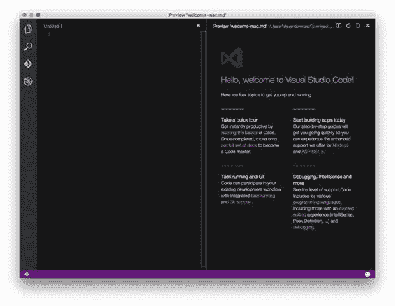

图 32：Mac OS X 上的 Visual Studio 代码

### 档案新项目

这一次，我们正在迁移到安装了 Windows 和 [Visual Studio 2015](https://www.visualstudio.com/?Wt.mc_id=DX_38656) 的计算机。有不同的口味可供选择，例如企业版的免费社区版本。

启动 Visual Studio 2015（图 33）后，或者使用菜单并选择 **File** ＆gt; **新项目**，或者在打开 Visual Studio 2015 后看到的第一页上的**启动**下单击**新项目**。

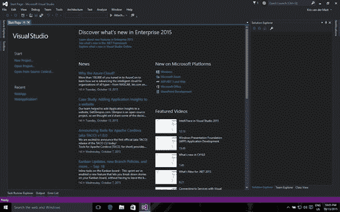

图 33：Visual Studio 2015 开始屏幕

从下一个出现的模态窗口（图 34）中，选择 **ASP.NET Web 应用程序**。给它一个有意义的名称，然后在你的机器上选择一个路径。确保选中**创建解决方案目录**的选项。

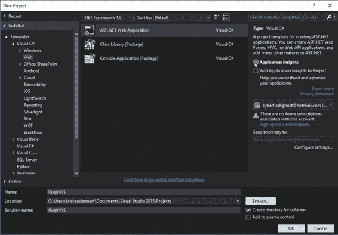

图 34：选择 ASP.NET Web 应用程序

单击 **OK** 按钮后，您将看到如图 35 所示的窗口。从 ASP.NET 5 预览模板中选择第三个选项， **Web 应用程序**。单击**确定**。

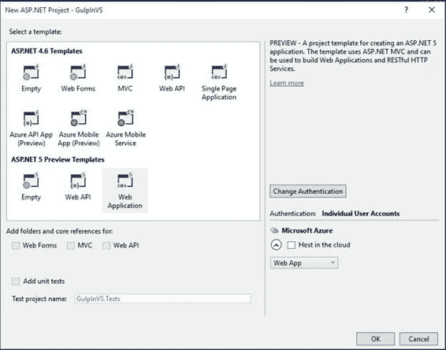

图 35：选择要从中开始的 ASP.NET 模板

Visual Studio 2015 现在将基于所选模板创建新解决方案。在 Visual Studio 2015 中打开解决方案资源管理器时，您将看到类似于以下内容的内容：

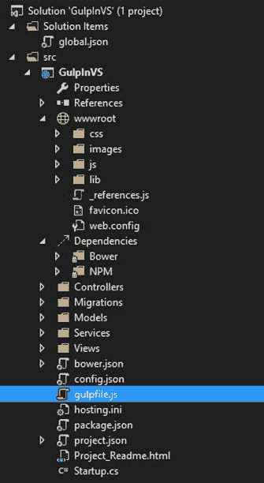

图 36：新创建的解决方案

在项目 **GulpInVS** 的根目录中，您可以看到文件 gulpfile.js 也被添加到解决方案中。它已经设置了一些初始代码以方便您使用。接下来我们会看到。

### 开箱即用的东西

创建新的 ASP.NET 5 Web 应用程序后，解决方案中已经有一个 gulpfile.js，其中包含以下内容：

代码清单 60：新创建的 ASP.NET 5 应用程序的 gulpfile.js 内容 - /gulpfile.js

```
///
  <binding Clean='clean' />

var gulp = require("gulp"),

  rimraf = require("rimraf"),

  concat = require("gulp-concat"),
    cssmin
  = require("gulp-cssmin"),

  uglify = require("gulp-uglify"),

  project = require("./project.json");

var paths = {

  webroot: "./" + project.webroot + "/"
};

paths.js
  = paths.webroot + "js/**/*.js";
paths.minJs
  = paths.webroot + "js/**/*.min.js";
paths.css
  = paths.webroot + "css/**/*.css";
paths.minCss
  = paths.webroot + "css/**/*.min.css";
paths.concatJsDest
  = paths.webroot + "js/site.min.js";
paths.concatCssDest
  = paths.webroot + "css/site.min.css";

gulp.task("clean:js", function (cb) {
    rimraf(paths.concatJsDest,
  cb);
});

gulp.task("clean:css", function (cb) {

  rimraf(paths.concatCssDest, cb);
});

gulp.task("clean", ["clean:js", "clean:css"]);

gulp.task("min:js", function () {

  gulp.src([paths.js, "!" + paths.minJs], { base: "." })

  .pipe(concat(paths.concatJsDest))

  .pipe(uglify())

  .pipe(gulp.dest("."));
});

gulp.task("min:css", function () {

  gulp.src([paths.css, "!" + paths.minCss])

  .pipe(concat(paths.concatCssDest))

  .pipe(cssmin())

  .pipe(gulp.dest("."));
});

gulp.task("min", ["min:js", "min:css"]);

```

快速浏览一下前 Gulp 文件，向我们展示了 Gulp 和不同插件的定义（ rimraf ， concat ， ] cssmin 和 uglify ）。我们也看到了一些特殊的东西：

project = require（“./ project.json”）;

由于 node.js v0.5.2 已经发布，因此可以通过 require 将.json 文件加载并缓存到变量中。这样可以将配置放在另一个文件中。在这种情况下，project.json。

Gulp 文件中的下一个内容是声明路径，以便在一个方便的位置需要时可以轻松地在 Gulp 文件的其余部分进行更改。注意 project.webroot 用法。 webroot 是我们之前加载的 project.json 文件的参数。

我们看到的前三个任务涉及清理文件夹，一个用于 CSS，一个用于 JavaScript。请注意，两者都有一个传入的回调变量， cb ，用于通知调用任务他们的作业在运行后已完成。

接下来的最后三个任务都是关于 JavaScript 和 CSS 文件的连接和缩小。请注意，它不使用 globbing，而是专门处理一个文件。特别是 site.js 和 site.css。

project.webroot 来自 project.json 文件，它通过 require 语句加载。在该文件中，定义如下：  “webroot”：“wwwroot” 。这是 ASP.NET 5 中的一个新子文件夹，其中放置了所有静态项目，这些项目在发布到服务器或云时需要公开可用。此特定设置具有一定意义，因为它也显示在另一个窗口中。您可以通过右键单击解决方案资源管理器中的 Web 项目并选择**属性**来查看它。这将打开如图 37 所示的窗口：

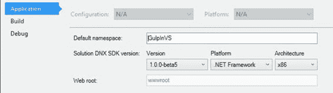

图 37：Web 根参数

奇怪的是，人们无法在此屏幕中更改它，但只能在 project.json 文件中更改它。

### 在 ASP.NET 5 和 Visual Studio 2015 中使用 Gulp

多年来，Visual Studio 一直被认为是一个很棒的 IDE。其中一个原因是 Visual Studio 中的“visual”一词：开发人员可以利用菜单或专用窗口或窗格来完成任务。到目前为止，在本书中，我们已经从控制台窗口运行了 Gulp。这与开发人员习惯在 Visual Studio 中工作的方式并不完全一致。

对于 Gulp，Visual Studio 中有一个专用窗格，可以通过以下几种方式访问​​：

*   通过菜单：首先在解决方案资源管理器中选择 **gulpfile.js** 文件，然后转到**工具**＆gt; **Task Runner Explorer** 。
*   右键单击解决方案资源管理器中的 **gulpfile.js** ，然后从上下文菜单中选择 **Task Runner Explorer** 。

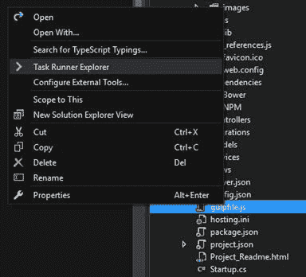

图 38：打开 Task Runner Explorer

一旦使用这些方法中的任何一个来打开 Task Runner Explorer，我们就可以看到已经有了一个 Clean 动作的绑定：

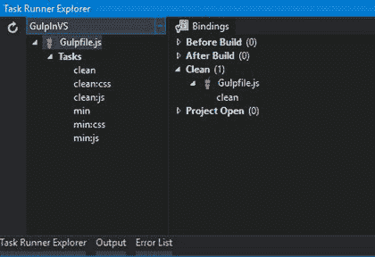

图 39：Task Runner Explorer

在左侧，我们可以看到带有 Gulp 图标的 Gulpfile.js，以及我们在代码清单 59 中看到的六个不同的任务。在右侧，我们可以看到一些绑定。这与我们到目前为止所使用的有些不同，并且在 Visual Studio 中是典型的。

我们现在看到的唯一绑定是 Clean 绑定，一旦执行，它将运行 Gulp clean 任务。为此，请使用菜单并选择 **Build** ＆gt; **清洁溶液**。

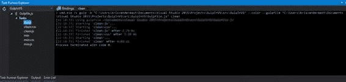

图 40：Gulp 清理任务已运行。

另一种运行相同任务的方法是右键单击左窗格中的任务，然后选择**运行**。

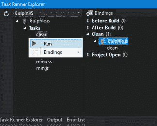

图 41：直接运行 Gulp 清理任务

再看一下代码清单 60，您将在文件顶部看到以下行：

///＆lt; binding Clean ='clean'/＆gt;

这看起来很熟悉，是的，这一行弥补了工具能够将任务绑定到 Visual Studio 的 Task Runner Explorer 中的绑定。在这种特定情况下，它将 Gulp clean 任务绑定到 Clean 绑定。您可以通过取出 gulpfile.js 文件中的行，保存它并再次打开 Task Runner Explorer 来轻松测试。绑定将消失。通过将其放回 gulpfile.js 文件并保存它，将恢复绑定。

您可以通过更改 gulpfile.js 文件或右键单击 Task Runner Explorer 中的 Gulp 任务并从上下文菜单中选择 **Bindings** ＆gt;来添加新绑定。并选择以下四种可能之一：

表 1：Visual Studio Task Runner Explorer 中的绑定

| 绑定 |
| 在构建之前 | 在构建过程开始之前运行 Gulp 任务 |
| 建成之后 | 构建过程完成后运行 Gulp 任务 |
| 清洁 | 执行清洁解决方案时运行 Gulp 任务 |
| 项目开放 | Visual Studio 打开项目时运行 Gulp 任务 |

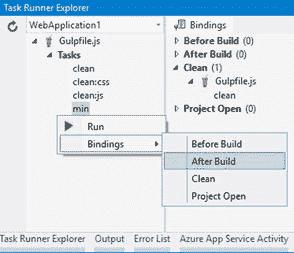

图 42：在 Task Runner Explorer 中添加绑定到 Gulp 任务